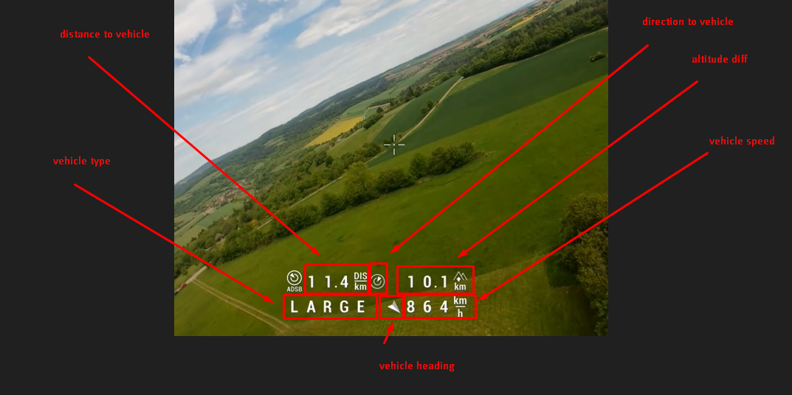
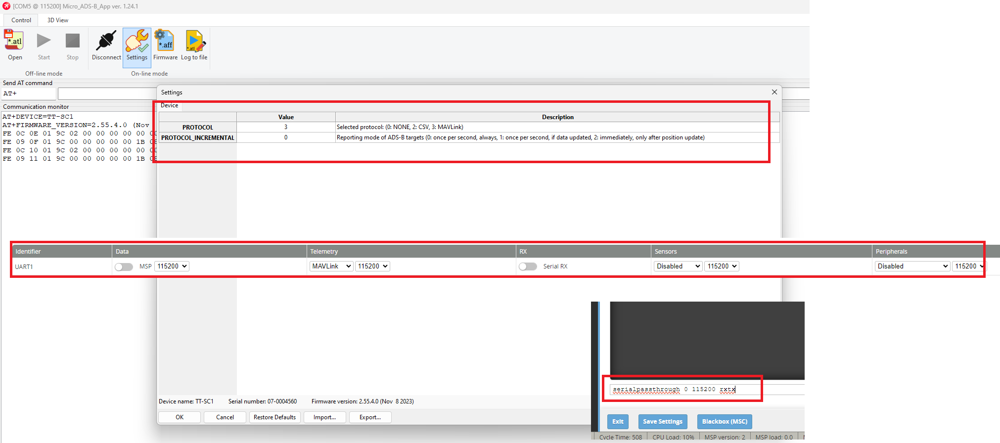

# ADS-B

[Automatic Dependent Surveillance Broadcast](https://en.wikipedia.org/wiki/Automatic_Dependent_Surveillance%E2%80%93Broadcast)
is an air traffic surveillance technology that enables aircraft to be accurately tracked by air traffic controllers and other pilots without the need for conventional radar.

## Current state

OSD can be configured to shows the closest aircraft.

## OSD element
OSD can be configured to simple view (one line) or to extended view (two lines) by \
`set osd_adsb_warning_style=EXTENDED`

### Simple view
`{distance to vehicle} {direction to vehicle} {altitude diff}`

### Extended view
`{distance to vehicle} {direction to vehicle} {altitude diff}` \
`{Emiter Type} {Vehicle direction} {Vehicle Speed}`




## Hardware

All ADSB receivers which can send Mavlink [ADSB_VEHICLE](https://mavlink.io/en/messages/common.html#ADSB_VEHICLE) message are supported 

* [PINGRX](https://uavionix.com/product/pingrx-pro/) (not tested)
* [TT-SC1](https://www.aerobits.pl/product/aero/) (tested)
* [ADSBee1090](https://pantsforbirds.com/adsbee-1090/) (tested)

## TT-SC1 settings
* download software for ADSB TT-SC1 from https://www.aerobits.pl/product/aero/ , file Micro_ADSB_App-vX.XX.X_win_setup.zip and install it
* connect your ADSB to FC, connect both RX and TX pins
* in INAV configurator ports TAB set telemetry MAVLINK, and baudrate 115200
* go to CLI in inav configurator and set serialpassthrough for port you connected ADSB ```serialpassthrough [PORT_YOU_SELECTED - 1] 115200 rxtx``` and close configurator
* open ADSB program you installed, got to settings and set "telemetry" = MAVLINK,

PCB board for TT-SC1-B module https://oshwlab.com/error414/adsb-power-board


## ADSBee 1090 settings
* connect to ADSBee1090 via USB and set COMMS_UART to mavlink2 \
``
AT+PROTOCOL=COMMS_UART,MAVLINK2
``\
``
AT+BAUDRATE=COMMS_UART,115200
``\
It's recommended to turn of wifi \
``
AT+ESP32_ENABLE=0
``\
``
AT+SETTINGS=SAVE
``
* in INAV configurator ports TAB set telemetry MAVLINK, and baudrate 115200
* https://pantsforbirds.com/adsbee-1090/quick-start/

