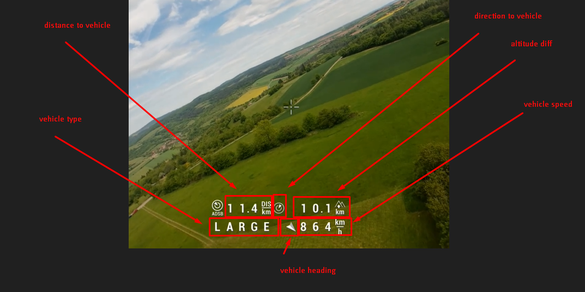
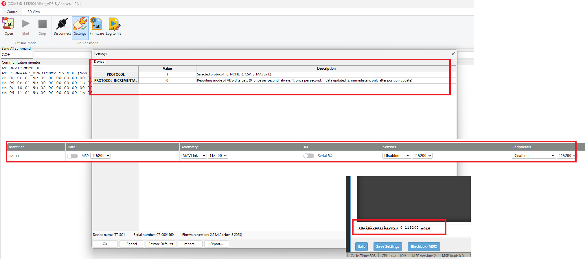
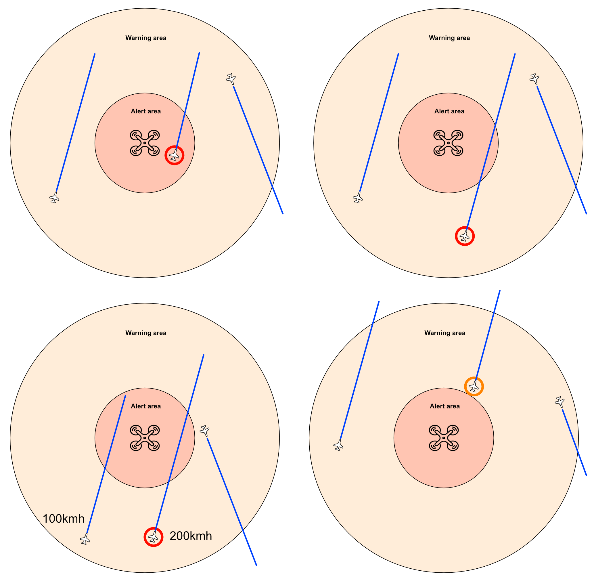

# ADS-B

[Automatic Dependent Surveillance Broadcast](https://en.wikipedia.org/wiki/Automatic_Dependent_Surveillance%E2%80%93Broadcast)
is an air traffic surveillance technology that enables aircraft to be accurately tracked by air traffic controllers and other pilots without the need for conventional radar.

## Current state

OSD can be configured to shows the closest aircraft.

## OSD ADSB Info element
* "-" no ADSB device detected
* "H" IMU heading is not valid 
* "G" no GPS fix or less than 4 stats
* "[Number]" count of ADSB aircrafts

## OSD ADSB Warning element
OSD can be configured to simple view (one line) or to extended view (two lines) by \
`set osd_adsb_warning_style=EXTENDED`

### Simple view
`{distance to vehicle} {direction to vehicle} {altitude diff}`

### Extended view
`{distance to vehicle} {direction to vehicle} {altitude diff}` \
`{Emiter Type} {Vehicle direction} {Vehicle Speed}`




## Hardware

All ADSB receivers which can send Mavlink [ADSB_VEHICLE](https://mavlink.io/en/messages/common.html#ADSB_VEHICLE) message are supported 

* [PINGRX](https://uavionix.com/product/pingrx-pro/) (not tested)
* [TT-SC1](https://www.aerobits.pl/product/aero/) (tested)
* [ADSBee1090](https://pantsforbirds.com/adsbee-1090/) (tested)

## TT-SC1 settings
* download software for ADSB TT-SC1 from https://www.aerobits.pl/product/aero/ , file Micro_ADSB_App-vX.XX.X_win_setup.zip and install it
* connect your ADSB to FC, connect both RX and TX pins
* in INAV configurator ports TAB set telemetry MAVLINK, and baudrate 115200
* go to CLI in inav configurator and set serialpassthrough for port you connected ADSB ```serialpassthrough [PORT_YOU_SELECTED - 1] 115200 rxtx``` and close configurator
* open ADSB program you installed, got to settings and set "telemetry" = MAVLINK,

PCB board for TT-SC1-B module https://oshwlab.com/error414/adsb-power-board


## ADSBee 1090 settings
* connect to ADSBee1090 via USB and set COMMS_UART to mavlink2 \
``
AT+PROTOCOL=COMMS_UART,MAVLINK2
``\
``
AT+BAUDRATE=COMMS_UART,115200
``\
It's recommended to turn of wifi \
``
AT+ESP32_ENABLE=0
``\
``
AT+SETTINGS=SAVE
``
* in INAV configurator ports TAB set telemetry MAVLINK, and baudrate 115200
* https://pantsforbirds.com/adsbee-1090/quick-start/

---

---

## Alert and Warning
The ADS-B warning/alert system supports two operating modes, controlled by the parameter adsb_calculation_use_cpa (ON or OFF).

---

### ADS-B Warning and Alert Messages (CPA Mode OFF)
The ADS-B warning/alert system supports two operating modes, controlled by the parameter **adsb_calculation_use_cpa** (ON or OFF).

When **adsb_calculation_use_cpa = OFF**, the system evaluates only the **current distance between the aircraft and the UAV**. The aircraft with the **shortest distance** is always selected for monitoring.

- If the aircraft enters the **warning zone** (`adsb_distance_warning`), the corresponding **OSD element is displayed**.
- If the aircraft enters the **alert zone** (`adsb_distance_alert`), the **OSD element starts blinking**, indicating a higher-priority alert.

This mode therefore provides a simple proximity-based warning determined purely by real-time distance.

---

### ADS-B Warning and Alert Messages (CPA Mode ON)

When **adsb_calculation_use_cpa = ON**, the system evaluates aircraft using the **Closest Point of Approach (CPA)** and predicted trajectories, not only the current distance.

1. **Aircraft already inside the alert zone**  
   If one or more aircraft are currently inside the **alert zone** (`adsb_distance_alert`), the **closest aircraft** to the UAV is selected and the **OSD element blinks**.

2. **Aircraft in the warning zone, none predicted to enter the alert zone**  
   If aircraft are present in the **warning zone** (`adsb_distance_warning`), but none of them are predicted to enter the **alert zone** (their CPA distance is greater than `adsb_distance_alert`), the **closest aircraft to the UAV** is selected and the **OSD element remains steady** (no blinking).

3. **Aircraft in the warning zone, one predicted to enter the alert zone**  
   If at least one aircraft in the **warning zone** is predicted to enter the **alert zone**, that aircraft is selected and the **OSD element blinks**.

4. **Aircraft in the warning zone, multiple predicted to enter the alert zone**  
   If multiple aircraft are predicted to enter the **alert zone**, the system selects the aircraft that will **reach the alert zone first**, and the **OSD element blinks**.

