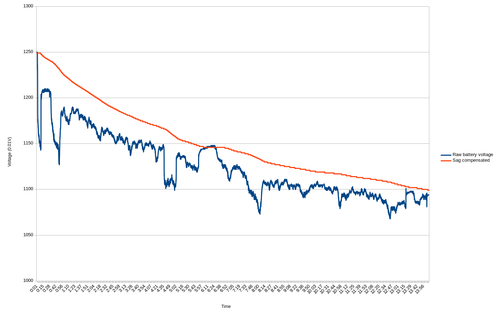

# Battery Monitoring

INAV has a battery monitoring feature.  The voltage of the main battery can be measured by the system and used to trigger a low-battery warning [buzzer](Buzzer.md), on-board status LED flashing and LED strip patterns.

Low battery warnings can:

* Help ensure you have time to safely land the aircraft
* Help maintain the life and safety of your LiPo/LiFe batteries, which should not be discharged below manufacturer recommendations

Minimum and maximum cell voltages can be set, and these voltages are used to auto-detect the number of cells in the battery when it is first connected.

Per-cell monitoring is not supported, as we only use one ADC to read the battery voltage.

## Supported targets

All targets support battery voltage monitoring unless stated.

## Connections

When dealing with batteries **ALWAYS CHECK POLARITY!**

Measure expected voltages **first** and then connect to the flight controller.  Powering the flight controller with
incorrect voltage or reversed polarity will likely fry your flight controller. Ensure your flight controller
has a voltage divider capable of measuring your particular battery voltage.
On the first battery connection is always advisable to use a current limiter device to limit damages if something is wrong in the setup.

### Sparky

See the [Sparky board chapter](Board%20-%20Sparky.md).

## Voltage measurement

Enable the `VBAT` feature to enable the measurement of the battery voltage and the use of the voltage based OSD battery gauge, voltage based and energy based battery alarms.

### Calibration

`vbat_scale` - Adjust this setting to match actual measured battery voltage to reported value. Increasing this value increases the measured voltage.

### Voltage measurement source

Two voltage sources are available: raw voltage and sag compensated voltage. The raw voltage is the voltage directly measured at the battery while the sag compensated voltage is calculated by an algorithm aiming to provide a stable voltage source for gauges, telemetry and alarms. When the current drawn from a battery varies the provided voltage also varies due to the internal resistance of the battery, it is called sag. The sag can often trigger the battery alarms before the battery is empty and if you are relying on the battery voltage to know the charge state of your battery you have to land or cut the throttle to know the real, without load, battery voltage. The sag compensation algorithm simulates a battery with zero internal resistance and provides a stable reading independent from the drawn current.

You can select the voltage source used for battery alarms and telemetry with the `bat_voltage_source` setting. It can be set to either `RAW` for using raw battery voltage or `SAG_COMP` for using the calculated sag compensated voltage.

You can see an illustration of the sag compensation algorithm in action in the following graph:



### Voltage based OSD gauge and alarms

Up to 3 battery profiles are supported. You can select the battery profile from the GUI, OSD menu, [stick commands](Controls.md) and CLI command `battery_profile n`. Each profile stores the following voltage settings:

`bat_cells` - Specify the number of cells of your battery. Allows the automatic selection of the battery profile when set to a value greater than 0. Set to 0 (default) for auto-detecting the number of cells (see next setting)

`vbat_cell_detect_voltage` - Maximum voltage per cell, used for auto-detecting the number of cells of the battery. Should be higher than maximum cell voltage to take into account possible drift in measured voltage and keep cell count detection accurate (0.01V unit, i.e. 430 = 4.30V)

`vbat_max_cell_voltage` - Maximum voltage per cell when the battery is fully charged. Used for the OSD voltage based battery gauge (0.01V unit, i.e. 420 = 4.20V)

`vbat_warning_cell_voltage` - Cell warning voltage. A cell voltage bellow this value triggers the first (short beeps) voltage based battery alarm if used and also the blinking of the OSD voltage indicator if the battery capacity is not used instead (see bellow) (0.01V unit, i.e. 370 = 3.70V)

`vbat_min_cell_voltage` - Cell minimum voltage. A cell voltage bellow this value triggers the second (long beeps) voltage based battery alarm if used and the OSD gauge will display 0% if the battery capacity is not used instead (see bellow) (0.01V unit, i.e. 350 = 3.50V)

e.g.

```
battery_profile 1
set vbat_scale = 1100
set vbat_max_cell_voltage = 430
set vbat_warning_cell_voltage = 340
set vbat_min_cell_voltage = 330
```

# Current Monitoring

Current monitoring (amperage) is supported by connecting a current meter to the appropriate current meter ADC input (see the documentation for your particular board).

When enabled, the following values calculated and used by the telemetry and OLED display subsystems:
* Amps
* mAh used
* Capacity remaining

## Configuration

Enable current monitoring using the CLI command:

```
feature CURRENT_METER
```

Configure the current meter type using the `current_meter_type` settings here:

| Value | Sensor Type            |
| ----- | ---------------------- |
| 0     | None                   |
| 1     | ADC/hardware sensor    |
| 2     | Virtual sensor         |

Configure capacity using the `battery_capacity` setting, in mAh units.

If you're using an OSD that expects the multiwii current meter output value, then set `multiwii_current_meter_output` to `1` (this multiplies amperage sent to MSP by 10).

### ADC Sensor

The current meter may need to be configured so the value read at the ADC input matches actual current draw.  Just like you need a voltmeter to correctly calibrate your voltage reading you also need an ammeter to calibrate the current sensor.

Use the following settings to adjust calibration:

`current_meter_scale`
`current_meter_offset`

### Virtual Sensor

The virtual sensor uses the throttle position to calculate an estimated current value. This is useful when a real sensor is not available. The following settings adjust the virtual sensor calibration:

| Setting                       | Description                                              |
| ----------------------------- | -------------------------------------------------------- |
| `current_meter_scale`      | The throttle scaling factor [centiamps, i.e. 1/100th A]  |
| `current_meter_offset`     | The current at zero throttle (while disarmed) [centiamps, i.e. 1/100th A] |

There are two simple methods to tune these parameters:  one uses a battery charger and another depends on actual current measurements.

#### Tuning Using Actual Current Measurements
If you know your craft's current draw while disarmed (Imin) and at maximum throttle while armed (Imax), calculate the scaling factors as follows:
```
current_meter_scale = (Imax - Imin) * 100000 / (Tmax + (Tmax * Tmax / 50))
current_meter_offset = Imin * 100
```
Note: Tmax is maximum throttle offset (i.e. for `max_throttle` = 1850, Tmax = 1850 - 1000 = 850)

For example, assuming a maximum current of 34.2A, a minimum current of 2.8A, and a Tmax `max_throttle` = 1850:
```
current_meter_scale = (Imax - Imin) * 100000 / (Tmax + (Tmax * Tmax / 50))
                    = (34.2 - 2.8) * 100000 / (850 + (850 * 850 / 50))
                    = 205
current_meter_offset = Imin * 100 = 280
```
#### Tuning Using Battery Charger Measurement
If you cannot measure current draw directly, you can approximate it indirectly using your battery charger.  
However, note it may be difficult to adjust `current_meter_offset` using this method unless you can
measure the actual current draw with the craft disarmed.

Note:
+ This method depends on the accuracy of your battery charger; results may vary.
+ If you add or replace equipment that changes the in-flight current draw (e.g. video transmitter,
  camera, gimbal, motors, prop pitch/sizes, ESCs, etc.), you should recalibrate.

The general method is:

1. Fully charge your flight battery
2. Fly your craft, using >50% of your battery pack capacity (estimated)
3. Note INAV's reported mAh draw
4. Re-charge your flight battery, noting the mAh charging data needed to restore the pack to fully charged
5. Adjust `current_meter_scale` to according to the formula given below
6. Repeat and test

Given (a) the reported mAh draw and the (b) mAh charging data, calculate a new `current_meter_scale` value as follows:
```
current_meter_scale = (reported_draw_mAh / charging_data_mAh) * old_current_meter_scale
```
For example, assuming:
+ A INAV reported current draw of 1260 mAh
+ Charging data to restore full charge of 1158 mAh
+ A existing `current_meter_scale` value of 400 (the default)

Then the updated `current_meter_scale` is:
```
current_meter_scale = (reported_draw_mAh / charging_data_mAh) * old_current_meter_scale
                    = (1260 / 1158) * 400
                    = 435
```

## Power and Current Limiting

INAV includes an advanced power and current limiting system to protect your battery and ESCs from excessive discharge rates. This feature automatically reduces throttle output when current or power draw exceeds configured limits.

### Why Use Power Limiting?

Power and current limiting helps:
- **Protect batteries** from exceeding their C-rating and getting damaged
- **Prevent voltage sag** and brown-outs during high-throttle maneuvers
- **Extend battery lifespan** by avoiding excessive discharge rates
- **Improve safety** by preventing ESC or battery overheating
- **Comply with regulations** that may limit power output

### How It Works

The power limiter uses a PI (Proportional-Integral) controller to smoothly reduce throttle when current or power exceeds limits. It supports two operating modes:

1. **Continuous Limit**: The sustained current/power that can be drawn indefinitely
2. **Burst Limit**: A higher current/power allowed for a short duration before falling back to the continuous limit

This burst mode allows brief high-power maneuvers (like punch-outs or quick climbs) while protecting the battery during sustained high-throttle flight.

### Configuration

Power limiting requires a current sensor (`CURRENT_METER` feature). Power-based limiting additionally requires voltage measurement (`VBAT` feature).

#### Basic Settings (per battery profile)

| Setting | Description | Unit | Range |
|---------|-------------|------|-------|
| `limit_cont_current` | Continuous current limit | dA (deci-amps) | 0-2000 (0-200A) |
| `limit_burst_current` | Burst current limit | dA | 0-2000 (0-200A) |
| `limit_burst_current_time` | Duration burst is allowed | ds (deci-seconds) | 0-600 (0-60s) |
| `limit_burst_current_falldown_time` | Ramp-down duration from burst to continuous | ds | 0-600 (0-60s) |
| `limit_cont_power` | Continuous power limit | dW (deci-watts) | 0-20000 (0-2000W) |
| `limit_burst_power` | Burst power limit | dW | 0-20000 (0-2000W) |
| `limit_burst_power_time` | Duration burst power is allowed | ds | 0-600 (0-60s) |
| `limit_burst_power_falldown_time` | Ramp-down duration for power | ds | 0-600 (0-60s) |

**Note**: Set any limit to `0` to disable that specific limiter.

#### Advanced Tuning Settings

| Setting | Description | Default | Range |
|---------|-------------|---------|-------|
| `limit_pi_p` | Proportional gain for PI controller | 100 | 10-500 |
| `limit_pi_i` | Integral gain for PI controller | 15 | 10-200 |
| `limit_attn_filter_cutoff` | Low-pass filter cutoff frequency | 50 Hz | 10-200 |

### Example Configurations

#### Example 1: Simple Current Limiting (50A continuous)

Protect a 1500mAh 4S 50C battery (75A max burst, 50A continuous safe):

```
battery_profile 1

set limit_cont_current = 500         # 50A continuous
set limit_burst_current = 750        # 75A burst
set limit_burst_current_time = 100   # 10 seconds
set limit_burst_current_falldown_time = 20   # 2 second ramp-down
```

#### Example 2: Power Limiting for Racing (500W limit)

Limit total system power for racing class restrictions:

```
battery_profile 1

set limit_cont_power = 4500          # 450W continuous
set limit_burst_power = 5000         # 500W burst
set limit_burst_power_time = 50      # 5 seconds
set limit_burst_power_falldown_time = 10    # 1 second ramp-down
```

#### Example 3: Combined Current and Power Limiting

Protect both battery (current) and ESCs (power):

```
battery_profile 1

# Current limits (battery protection)
set limit_cont_current = 600         # 60A continuous
set limit_burst_current = 800        # 80A burst
set limit_burst_current_time = 100   # 10 seconds

# Power limits (ESC protection)
set limit_cont_power = 8000          # 800W continuous
set limit_burst_power = 10000        # 1000W burst
set limit_burst_power_time = 100     # 10 seconds
```

### Understanding Burst Mode

When you exceed the continuous limit, the system uses "burst reserve" (like a capacitor):
- **Burst reserve** starts full and depletes when current/power exceeds the continuous limit
- When reserve is empty, the limit drops to the continuous value
- The `falldown_time` setting creates a smooth ramp-down instead of an abrupt drop
- Reserve recharges when current/power drops below the continuous limit

**Example timeline** (60A continuous, 80A burst, 10s burst time, 2s falldown):
```
Time    Limit    Reason
----    -----    ------
0s      80A      Full burst reserve
5s      80A      Still have reserve (using 5s of 10s)
10s     80A      Reserve depleted
10-12s  80→60A   Ramping down over 2 seconds
12s+    60A      Continuous limit active
```

### OSD Elements

Three OSD elements display power limiting status:

- **`OSD_PLIMIT_REMAINING_BURST_TIME`**: Shows remaining burst time in seconds
- **`OSD_PLIMIT_ACTIVE_CURRENT_LIMIT`**: Shows current limit being enforced (blinks when limiting)
- **`OSD_PLIMIT_ACTIVE_POWER_LIMIT`**: Shows power limit being enforced (blinks when limiting)

Enable these in the OSD tab to monitor limiting during flight.

### Calibration Tips

1. **Find your battery's limits**: Check manufacturer specifications for continuous and burst C-ratings
   - Continuous limit = `battery_capacity_mAh × continuous_C_rating / 1000` (in dA)
   - Burst limit = `battery_capacity_mAh × burst_C_rating / 1000` (in dA)

2. **Test incrementally**: Start with conservative limits and increase gradually

3. **Monitor in flight**: Use OSD elements to see when limiting activates

4. **Calibrate current sensor**: Accurate current readings are critical - see "Current Monitoring" section above

5. **Tune PI controller**: If limiting feels abrupt or causes oscillation, adjust `limit_pi_p` and `limit_pi_i`:
   - Increase P for faster response (may cause oscillation)
   - Increase I for better steady-state accuracy
   - Decrease if throttle oscillates during limiting

### Notes

- Power limiting is part of the battery profile system - each profile can have different limits
- Both current and power limiting can be active simultaneously - the most restrictive applies
- Limiting is applied smoothly via PI controller to avoid abrupt throttle cuts
- The system uses instantaneous current/power readings for responsive limiting
- Set limits to `0` to disable a specific limiter while keeping others active

## Battery capacity monitoring

For the capacity monitoring to work you need a current sensor (`CURRENT_METER` feature). For monitoring energy in milliWatt hour you also need voltage measurement (`VBAT` feature). For best results the current and voltage readings have to be calibrated.

It is possible to display the remaining battery capacity in the OSD and also use the battery capacity thresholds (`battery_capacity_warning` and `battery_capacity_critical`) for battery alarms.

For the remaining battery capacity to be displayed users need to set the `battery_capacity` setting (>0) and the battery to be full when plugged in. If the `battery_capacity` setting is set to 0 the remaining battery capacity item in the OSD will display `NA` and the battery gauge will use an estimation based on the battery voltage otherwise it will display the remaining battery capacity down to the `battery_capacity_critical` setting (battery considered empty) and the battery gauge will be based on the remaining capacity. For the capacity thresholds to be used for alarms the `battery_capacity_warning` and `battery_capacity_critical` settings also needs to be set (>0) and the plugged in battery to be full when plugged in. The battery capacity settings unit can be set using the `battery_capacity_unit`. MilliAmpere hour and milliWatt hour units are supported. The value are absolute meaning that `battery_capacity_warning` is the battery capacity left when the battery is entering the `warning` state and `battery_capacity_critical` is the battery capacity left when the battery is considered empty and entering the `critical` state.

For the battery to be considered full the mean cell voltage of the battery needs to be above `vbat_max_cell_voltage - 140mV` (by default 4.1V). So a 3S battery will be considered full above 12.3V and a 4S battery above 16.24V. If the battery plugged in is not considered full the remaining battery capacity OSD item will show `NF` (Not Full).

For the remaining battery capacity and battery gauge to be the most precise (linear relative to throttle from full to empty) when using battery capacity monitoring users should use the milliWatt hour unit for the battery capacity settings.

### Example configuration

```
set battery_capacity_unit = MAH         // battery capacity values are specified in milliAmpere hour
set battery_capacity = 2200             // battery capacity is 2200mAh
set battery_capacity_warning = 660      // the battery warning alarm will sound and the capacity related OSD items will blink when left capacity is less than 660 mAh (30% of battery capacity)
set battery_capacity_critical = 440     // the battery critical alarm will sound and the OSD battery gauge and remaining capacity item will be empty when left capacity is less than 440 mAh (20% of battery capacity)
```

Note that in this example even though your warning capacity (`battery_capacity_warning`) is set to 30% (660mAh), since 440mAh (`battery_capacity_critical`) is considered empty (0% left), the OSD capacity related items will only start to blink when the remaining battery percentage shown on the OSD is below 12%: (`battery_capacity_warning`-`battery_capacity_critical`)*100/(`battery_capacity`-`battery_capacity_critical`)=(660-440)*100/(2200-440)=12.5


## Battery profiles

Up to 3 battery profiles are supported. You can select the battery profile from the GUI, OSD menu, [stick commands](Controls.md) and CLI command `battery_profile n`. Battery profiles store the following settings (see above for an explanation of each setting): 
- `bat_cells`
- `vbat_cell_detect_voltage`
- `vbat_max_cell_voltage`
- `vbat_warning_cell_voltage`
- `vbat_min_cell_voltage`
- `battery_capacity`
- `battery_capacity_warning`
- `battery_capacity_critical`
- `throttle_idle`
- `throttle_scale`
- `turtle_mode_power_factor`
- `nav_fw_cruise_thr`
- `nav_fw_min_thr`
- `nav_fw_max_thr`
- `nav_fw_pitch2thr`
- `nav_fw_launch_thr`
- `nav_fw_launch_idle_thr`
- `failsafe_throttle`
- `nav_mc_hover_thr`

To enable the automatic battery profile switching based on battery voltage enable the `BAT_PROF_AUTOSWITCH` feature. For a profile to be automatically selected the number of cells of the battery needs to be specified (>0).

### Battery profiles configuration examples

#### Simple example

In this example we want to use two different type of batteries for the same aircraft and switch manually between them. The first battery is a Li-Po (4.20V/cell) and the second battery is a Li-Ion (4.10V/cell).

```
battery_profile 1

set bat_cells = 0
set vbat_max_cell_voltage = 420
set vbat_warning_cell_voltage = 370
set vbat_min_cell_voltage = 340


battery_profile 2

set bat_cells = 0
set vbat_max_cell_voltage = 410
set vbat_warning_cell_voltage = 280
set vbat_min_cell_voltage = 250
```

#### Simple example with automatic profile switching

In this example we want to use two different batteries for the same aircraft and automatically switch between them when the battery is plugged in. The first battery is a Li-Po 2200mAh 3S and the second battery is a LiPo 1500mAh 4S. Since the INAV defaults for the cell detection voltage and max voltage are adequate for standard LiPo batteries they will not be modified. The warning and minimum voltage are not modified either in this example but you can set them to the value you like. Since we are using battery capacities only the warning voltage (kept at default in this example) will be used and only for triggering the battery voltage indicator blinking in the OSD.

```
feature BAT_PROF_AUTOSWITCH


battery_profile 1

set bat_cells = 3
set battery_capacity = 2200
set battery_capacity_warning = 440
set battery_capacity_critical = 220


battery_profile 2

set bat_cells = 4
set battery_capacity = 1500
set battery_capacity_warning = 300
set battery_capacity_critical = 150
```

#### Advanced automatic switching example

Profile 1 is for a 3S 2200mAh Li-Po pack (max 4.20V/cell), profile 2 for a 3S 4000mAh Li-Ion pack (max 4.10V/cell) and profile 3 for a 4S 1500mAh Li-Po pack (max 4.20V/cell).
With this configuration if the battery plugged in is less than 12.36V (3 x 4.12) the profile 2 will be automatically selected else if the battery voltage is less than 12.66V (3 x 4.22) the profile 1 will be automatically selected else if the battery voltage is less 17.20V (4 x 4.3) the profile 3 will be automatically selected. If a matching profile can't be found the last selected profile is used.

```
feature BAT_PROF_AUTOSWITCH


battery_profile 1

set bat_cells = 3
set vbat_cell_detect_voltage = 422
set vbat_max_cell_voltage = 420
set vbat_warning_cell_voltage = 350
set vbat_min_cell_voltage = 330
set battery_capacity = 2200
set battery_capacity_warning = 440
set battery_capacity_critical = 220


battery_profile 2

set bat_cells = 3
set vbat_cell_detect_voltage = 412
set vbat_max_cell_voltage = 410
set vbat_warning_cell_voltage = 300
set vbat_min_cell_voltage = 280
set battery_capacity = 4000
set battery_capacity_warning = 800
set battery_capacity_critical = 400


battery_profile 3

set bat_cells = 4
set vbat_cell_detect_voltage = 430
set vbat_max_cell_voltage = 420
set vbat_warning_cell_voltage = 350
set vbat_min_cell_voltage = 330
set battery_capacity = 1500
set battery_capacity_warning = 300
set battery_capacity_critical = 150
```

#### Change control profile based on battery profile

You can change the control profile, automatically, based on the battery profile. This allows for fine tuning of each power choice.

```
feature BAT_PROF_AUTOSWITCH


battery_profile 1

set bat_cells = 3
set controlrate_profile = 1

battery_profile 2

set bat_cells = 4
set controlrate_profile = 2
```

## Remaining flight time and flight distance estimation

The estimated remaining flight time and flight distance estimations can be displayed on the OSD (for fixed wing only for the moment). They are calculated from the GPS distance from home, remaining battery capacity and average power draw. They are taking into account the requested altitude change and heading to home change after altitude change following the switch to RTH. They are also taking into account the estimated wind if `osd_estimations_wind_compensation` is set to `ON`. When the timer and distance indicator reach 0 they will blink and you need to go home in a straight line manually or by engaging RTH. You should be left with at least `rth_energy_margin`% of battery left when arriving home if the cruise speed and power are set correctly (see bellow).

To use this feature the following conditions need to be met:
- The `VBAT`, `CURRENT_METER` and `GPS` features need to be enabled
- The battery capacity needs to be specified in mWh (`battery_capacity` setting > 0 and `battery_capacity_unit` set to `MWH`)
- The average ground speed of the aircraft without wind at cruise throttle needs to be set (`nav_fw_cruise_speed` setting in cm/s)
- The average power draw at zero throttle needs to be specified (`idle_power` setting in 0.01W unit)
- The average power draw at cruise throttle needs to be specified (`cruise_power` setting in 0.01W unit)
- The battery needs to be full when plugged in (voltage >= (`vbat_max_cell_voltage` - 100mV) * cells)

It is advised to set `nav_fw_cruise_speed` a bit lower than the real speed and `cruise_power` 10% higher than the power at cruise throttle to ensure variations in throttle during cruise won't cause the aircraft to draw more energy than estimated.

If `---` is displayed during flight instead of the remaining flight time/distance it means at least one of the above conditions aren't met. If the OSD element is blinking and the digits are replaced by the horizontal wind symbol it means that the estimated horizontal wind is too strong to be able to return home at `nav_fw_cruise_speed`.

## Automatic throttle compensation based on battery voltage

This features aims to compensate the throttle to get constant thrust with the same throttle request despite the battery voltage going down during flight. It can be used by enabling the `THR_VBAT_COMP` feature. This feature needs the sag compensated voltage which needs a current sensor (real or virtual) to be calculated.

It is working like this: `used_throttle = requested_throttle * (1 + (battery_full_voltage / sag_compensated_voltage - 1) * thr_comp_weight)`.

The default `thr_comp_weight` of 1 should be close to ideal but if you want to tune this feature you need to find the difference in throttle value to achieve the same thrust (same power) when your battery is full and when your battery is almost empty then set `thr_comp_weight` to `(empty_battery_throttle / full_battery_throttle - 1) / (battery_full_voltage / battery_empty_sag_compensated_voltage - 1)`

Example:
  If the drawn power is 100W when the battery is full (12.6V) with 53% throttle and the drawn power is 100W with 58% throttle when the battery is almost empty with the sag compensated voltage being 11.0V `thr_comp_weight` needs to be set to this value to compensate the throttle automatically:
  `(58 / 53 - 1) / (12.6 / 11.0 - 1) = 0.649`

Known limitation: it doesn't work in 3D mode (3D feature)
