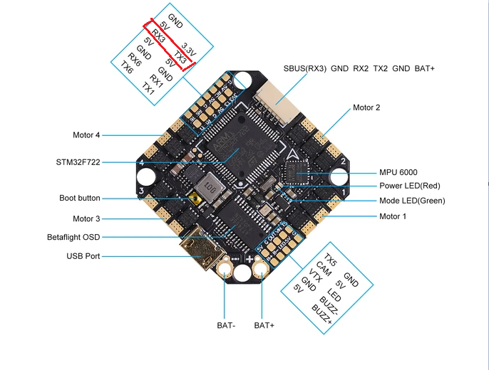

# BetaFPVF722

## I2C bus for magnetometer

BetFPVF722 does not have I2C pads broken out. I2C is shared with UART3

* TX3 - SCL
* RX3 - SDA

> I2C and UART3 can not be used at the same time! Connect the serial receiver to a different serial port when I2C device like MAG is used.

