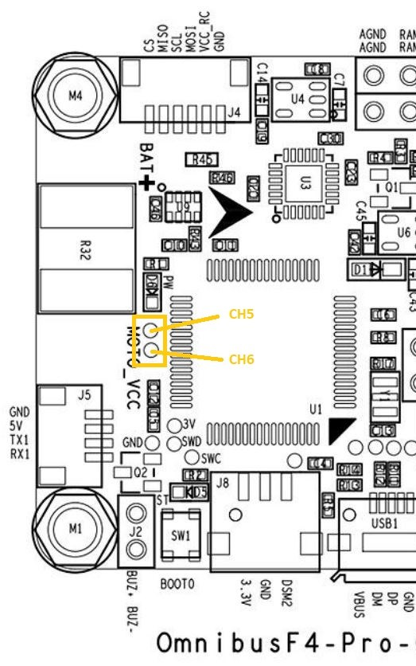
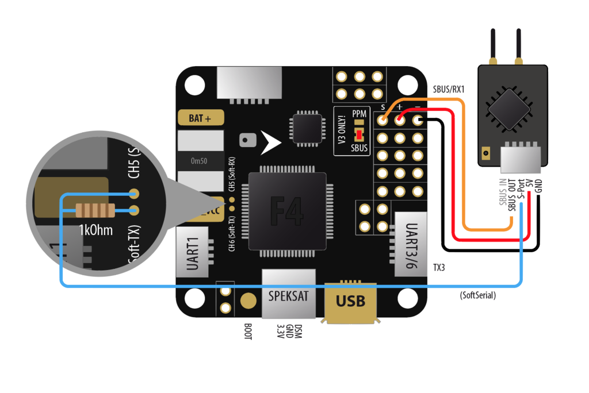
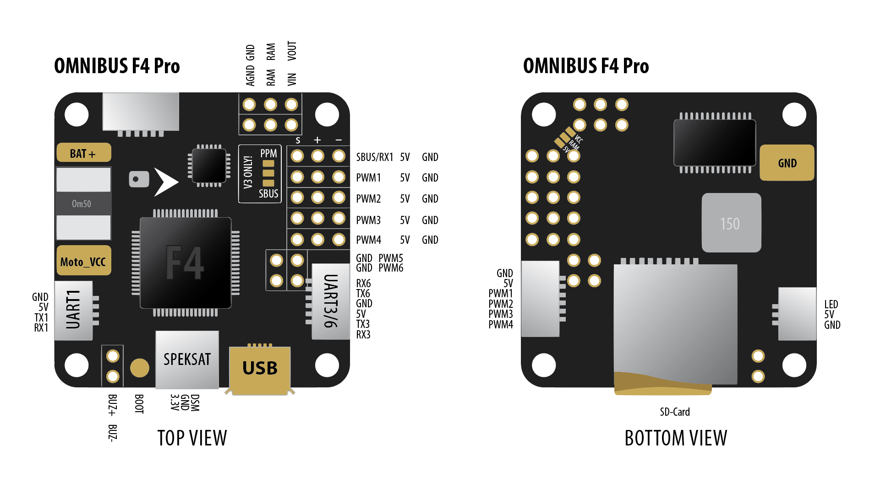
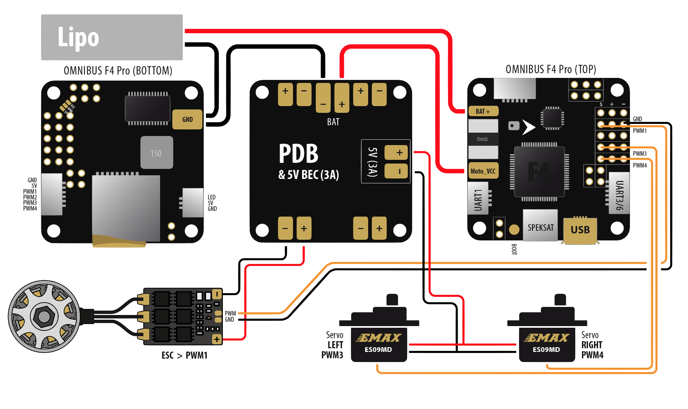
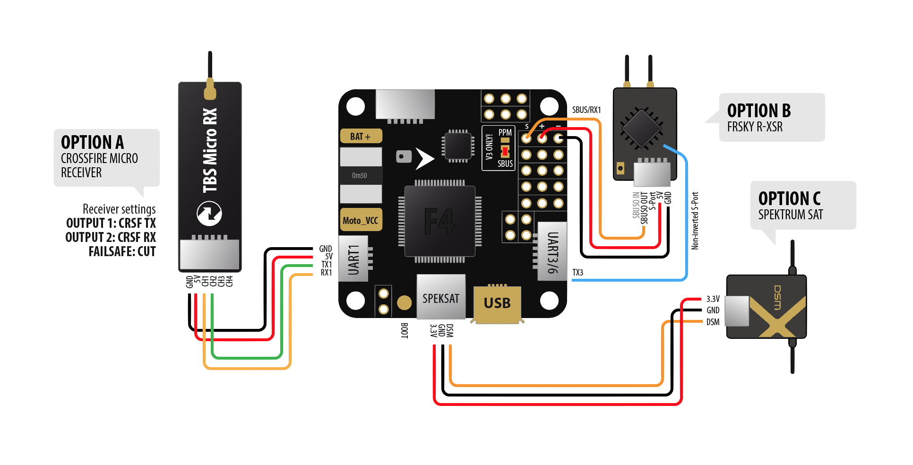
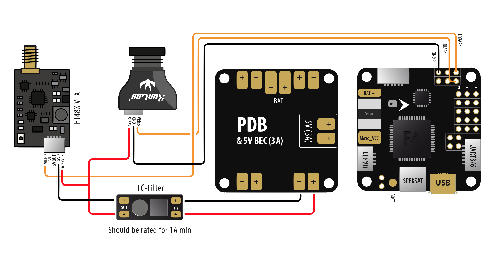
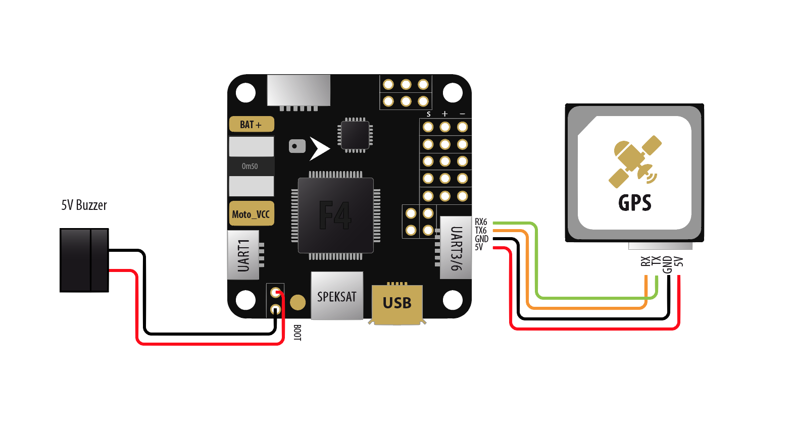

# Board - Omnibus F4

* For Omnibus F4 Pro (with BMP280 baro, current sensor and SD Card) use **OMNIBUSF4PRO** target (LED strip on dedicated connection)
* For Onnibus F4 Pro clones (Banggood, AliExpress, eBay, etc.) use **OMNIBUSF4PRO_LEDSTRIPM5** target (LED strip on M5 pin)
* For Omnibus F4 Pro Corner use **OMNIBUSF4PRO** target

## Features

* STM32F405 CPU
* Integrated Accelerometer/Gyro MPU6000 or MPU6500 via SPI bus
* 6 motor outputs
* 3 UART ports (UART1, UART3, UART6)
* External I2C bus, pins shared with UART3, cannot be used simultaneously
* Inverter for SBUS
* Blackbox via SDCard or integrated 128mbit flash memory
* BLHeli Passthrough
* Integrated BEC
* Buzzer connector
* Integrated OSD

## Hardware versions

### Omnibus F4 v1

* Linear voltage stabilizer, tends to overheat
* SBUS inverter connected to UART1
* PPM and UART1 can be used together when S.BUS jumper is removed (close to PPM/SBUS connector)
* 128mbit flash memory for Blackbox
* Uses target **OMNIBUSF4**

### Omnibus F4 v3

* Switching voltage regulator - solves problem of overheating BEC
* SD Card slot instead of flash memory
* SBUS inverter connected to UART6
* PPM and UART6 can be used together when S.BUS jumper is removed (close to PPM/SBUS connector)
* Uses target **OMNIBUSF4V3**

### Omnibus F4 v4

* Switching voltage regulator - solves problem of overheating BEC
* SD Card slot instead of flash memory
* SBUS inverter connected to UART6
* PPM and UART6 cannot be used together, there is no jumper to disconnect PPM input from UART6 RX
* Uses target **OMNIBUSF4V3**

### Omnibus F4 Pro

* Sometimes called Omnibus F4 v2 Pro, but also exists v3, v4 & v5 versions with no functional differences
* Switching voltage regulator - solves problem of overheating BEC
* LC filter for camera and VTX
* SD Card slot instead of flash memory
* SBUS inverter connected to UART1
* PPM and UART1 can be used together when S.BUS jumper is removed (close to PPM/SBUS connector)
* Integrated current meter
* Uses target **OMNIBUSF4PRO**
* Omnibus F4 Pro clones (Banggood, AliExpress, eBay, etc.) use **OMNIBUSF4PRO_LEDSTRIPM5** target (LED strip on M5 pin instead of incorrectly wired dedicated connection)

### Omnibus F4 Pro Corner

* Switching voltage regulator - solves problem of overheating BEC
* LC filter for camera and VTX
* SD Card slot instead of flash memory
* SBUS inverter connected to UART3
* Integrated current meter
* Uses target **OMNIBUSF4PRO**

## **NOT** supported

* HC-SR04 Rangefinder
* ServoTilt
* Channel Forwarding

## Radio Receivers

This board does not support Parallel PWM receiver connection. Only SerialRX, PPM and MSP receivers are supported.

SerialRX and PPM receivers should be connected to dedicated _PPM SBUS_ connector above _Motor 1_. MSP receivers should be connected to one of UARTs configured as MSP.

## Motors

| Motor     | pin   |
| ----      | ----  |
| 1         | PB0   |
| 2         | PB1   |
| 3         | PA3   |
| 4         | PA2   |
| 5         | PA1   |
| 6         | PA8   |

## USB

This board uses STM32 VCP and _not_ utilizes UART when USB is connected. STM32 VCP drivers might be required!

Flashing requires DFU mode and STM32 DFU drivers. Two options for installing the proper driver:

* [Zadig](http://zadig.akeo.ie) tool to install WinUSB driver on Windows.
* [ImpulseRC Driver Fixer](https://impulserc.com/pages/downloads) installs the STM32 DFU driver with a single click.

## Buzzer / Beeper

5V piezo buzzer should be connected directly to dedicated pins _BUZ +_ and _BUZ -_. No additional hardware is required.

## RSSI ADC

* Connected to pin PA0
* 3.3V tolerant, do not supply 5V

## Current Meter ADC

* Connected to pin PC1
* 3.3V tolerant, do not supply 5V

## Voltage monitoring

* Connected to pin PC2
* Connected to VBAT pins (both are the same) and integrated Voltage Stabilizer (LM7805M)

## Integrated voltage stabilizer (Omnibus F4 v1 only)

It is integrated with voltage monitoring and always powered when VBAT is connected to battery.
Because this is a **Linear Stabilizer**, it has a tendency to overheat, especially on 4S. Because of that,
avoid powering too many devices directly to 5V pins on the board. RX receiver (and board itself) is rather all
it can do without overeating (150mA on 4S gives 1.5W of waste heat!). OSD, LED Strip and other devices should powered from separate BEC if voltage monitoring is to be enabled.

## LED Strip

LED strip is enabled as indicated on flight controller silkscreen or schematics.
For INAV versions before v1.8.0, LED strip was shared with Motor 5 pin (PA1).
For Omnibus F4 Pro clones (Banggood, AliExpress, eBay, etc.) use **OMNIBUSF4PRO_LEDSTRIPM5** target for LED strip on M5 pin as the dedicated LED strip connection on these devices is typically wired incorrectly.

## SoftwareSerial

This board allows for single **SoftwareSerial** port on small soldering pads located on the bottom side of the board.
Please note that this is *not* the motor PWM5/PWM6 pins, but small surface mount pads CH5/CH6.

### Omnibus F4 Pro SoftwareSerial Connections

| Pad   | SoftwareSerial Role   |
| ----  | ----                  |
| CH5   | RX                    |
| CH6   | TX                    |

## SoftwareSerial

# Wiring diagrams for Omnibus F4 Pro

Following diagrams applies to _Pro_ version with integrated current meter and JST connectors only

## Board layout

## Flying wing motor and servos

## RX setup

## FPV setup

## GPS setup

_Diagrams created by Albert Kravcov (skaman82)_