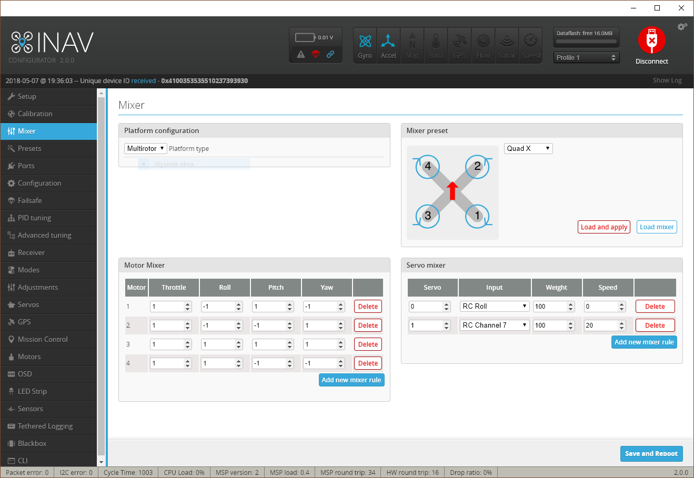

# Channel forwarding

Starting from INAV 2.0, _channel forwarding_ feature is removed. Channel forwarding functionality can be configured using _Mixer Configurator Tab_ instead.

Channel forwarding using mixer works for all flight controllers that supports servos in either multirotor or airplane configuration. Bear in mind, that some boards might not have any servo outputs in multirotor configuration. In this case, channel forwarding will just not work. Refer to the board documentation to find out if servos are available in multirotor configuration.

## How to setup channel forwarding

1. Open Mixer tab
1. Add new _servo rule_ for given servo index
1. Choose source as one of _RC Roll_, _RC Pitch_, _RC Yaw_, _RC Throttle_ or _RC Channel 5_ to _RC Channel 16_
1. When required, servo direction can be modified by applying negative weight
1. It is possible to limit servo speed. Refer to [Mixer documentation](Mixer.md)