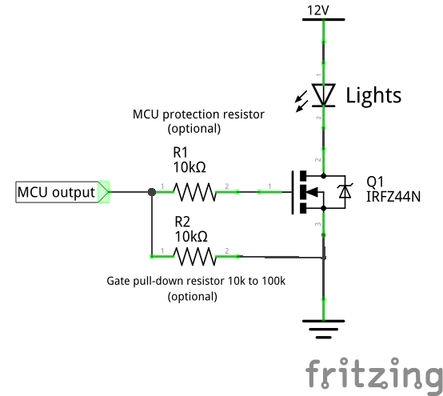

# Digital output for controlling lights

This features allows the control of generic non adressable lights with the `LIGHTS` flight mode. It also allows the FC to turn on or flash the lights in the case of a failsafe event.

## Custom firmware build

A custom build is required. The `USE_LIGHTS` macro must be defined in the `target.h` file corresponding to the FC this feature should be enabled on. Also the MCU pin to use as output for controlling the electronic power switch must be defined: `LIGHTS_PIN`.

Example:
```
#define USE_LIGHTS
#define LIGHTS_PIN      PA1 // Use PA1 pin as output
```

## Run-time configuration

Once a flight controller board is flashed with a custom build including the previously decribed changes a new `LIGHTS` flight mode will be available. When this mode is enabled the output pin will switch to a high state and output 3.3V otherwise the pin is in the low state and connected to ground.

The default settings will also make the lights flash in the case of a failsafe event. By default a 100ms flash every second (1Hz).

Settings associated with this feature:
- `failsafe_lights` can be `ON` or `OFF`
- `failsafe_lights_flash_period` in milliseconds
- `failsafe_lights_on_time` duration of the flash for every period in milliseconds

If `failsafe_lights_on_time` is greater or equal to `failsafe_lights_flash_period` the lights will stay continuously on during the failsafe event.

## Power driver

The MCU output pins cannot drive loads greater than a few milliamperes. You will need an electronic power switch to drive the lights like the following example circuit (Don't forget the current limiting resistor(s) if you are using LEDs which don't have built-in current limiting, not included in this schematic).

### Example schematic of a N-FET based power switch capable of driving higher than 10A loads

