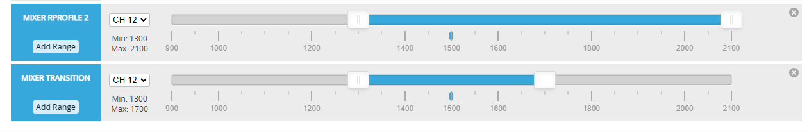

# MixerProfile

A MixerProfile is a set of motor mixer, servo-mixer and platform type configuration settings. It is designed for experienced inav users.

### For a tutorial of vtol setup, Read https://github.com/iNavFlight/inav/blob/master/docs/VTOL.md

Not limited to VTOL. air/land/sea mixed vehicle is also achievable with this feature. Model behaves according to current mixer_profile's platform_type and configured custom motor/servo mixer

Currently two profiles are supported on targets other than F411(due to resource constraints on F411). i.e VTOL transition is not available on F411.

For VTOL setup. one mixer_profile is used for multi-rotor(MR) and the other is used for fixed-wing(FW)
By default, switching between profiles requires reboot to take affect. However, using the RC mode: `MIXER PROFILE 2` will allow in flight switching for things like VTOL operation
. And will re-initialize pid and navigation controllers for current MC or FW flying mode.

Please note that this is an emerging / experimental capability that will require some effort by the pilot to implement.

## Mixer Transition input

Typically, 'transition input' will be useful in MR mode to gain airspeed.
The associated motor or servo will then move accordingly when transition mode is activated.
Transition input is disabled when navigation mode is activate

The use of Transition Mode is recommended to enable further features and future developments like fail-safe support. Mapping motor to servo output, or servo with logic conditions is **not** recommended

## Servo

`Mixer Transition` is the input source for transition input; use this to tilt motor to gain airspeed.

Example: Increase servo 1 output by +45 with speed of 150 when transition mode is activated for tilted motor setup:

```
# rule no; servo index; input source; rate; speed; activate logic function number
smix 6 1 38 45 150 -1
```

## Motor

The default `mmix` throttle value is 0.0, It will not show in `diff` command when throttle value is 0.0 (unused);

- 0.0<throttle<=1.0 : normal mapping
- -1.0<throttle<=0.0 : motor stop, default value 0, set to -1 to use a place holder for subsequent motor rules
- -2.0<throttle<-1.0 : spin regardless of throttle position at speed `abs(throttle)-1` when Mixer Transition is activated.

Example: This will spin motor number 5 (counting from 1) at 20%, in transition mode only, to gain speed for a "4 rotor 1 pusher" setup:

```
# motor number; throttle; roll; pitch; yaw
mmix 4 -1.200  0.000  0.000  0.000
```

## RC mode settings

It is recommend that the pilot uses a RC mode switch to activate modes or switch profiles.
Profile files Switching is not available until the runtime sensor calibration is done. Switching is NOT available when navigation mode is activate.

`mixer_profile` 1 will be used as default, `mixer_profile` 2 will be used when the `MIXER PROFILE 2` mode box is activated. 
Set `MIXER TRANSITION` accordingly when you want to use `MIXER TRANSITION` input for motors and servos. Here is sample of using these RC modes:



|  1000~1300 |  1300~1700  | 1700~2000 |
| :-- | :-- | :-- |
| FW(profile1) with transition off |  MC(profile2) with transition on  | MC(profile2) with transition off |

It is also possible to set it as 4 state switch by adding FW(profile1) with transition on.

## Automated Transition
This feature is mainly for RTH in a failsafe event. When set properly, model will use the FW mode to fly home efficiently, And land in the MC mode for easier landing.
`ON` for a mixer_profile\`s `mixer_automated_switch` means to schedule a Automated Transition when RTH head home(applies for MC mixer_profile) or RTH Land(applies for FW mixer_profile) is requested by navigation controller.
Set `mixer_automated_switch` to `ON` in mixer_profile for MC mode. Set `mixer_switch_trans_timer` in mixer_profile for MC mode for the time required to gain airspeed for your model before entering to FW mode.
When `mixer_automated_switch`:`OFF` is set for all mixer_profiles(defaults). Model will not perform automated transition at all.

## TailSitter (planned for INAV 7.1)
TailSitter is supported by add a 90deg offset to the board alignment. Set the board aliment normally in the mixer_profile for FW mode(`set platform_type = AIRPLANE`), The motor trust axis should be same direction as the airplane nose. Then, in the mixer_profile for takeoff and landing set `tailsitter_orientation_offset = ON ` to apply orientation offset. orientation offset will also add a 45deg orientation offset.

## Parameter list (Partial List)
####  Please be aware of what parameter is shared among FW/MC modes and what isn't. 
### Shared Parameters

- **Timer Overrides**
- **Outputs [Servo]:**
  - Servo min-point, mid-point, max-point settings
- **Motor Configuration:**
  - motor_pwm_protocol
  - motor_poles
- **Servo Configuration:**
  - servo_protocol
  - servo_pwm_rate
- **Board Alignment**
- ·······
### Profile-Specific Parameters in VTOL
- **Mixer Profile**
    - **Mixer Configuration:**
        - platform_type
        - motor_stop_on_low
        - tailsitter_orientation_offset
        - motor_direction_inverted, and more·······
    - **Motor Mixing (mmix)**
    - **Servo Mixing (smix)**
- **PID Profile**
  - PIDs for Roll, Pitch, Yaw
  - PIDs for Navigation Modes
  - TPA (Throttle PID Attenuation) Settings
  - Rate Settings
  - ·······

## Happy flying

Remember that this is currently an emerging capability:

* Test every thing on bench first.
* Try MR or FW mode separately see if there are any problems.
* Use the INAV Discord for help and setup questions; use the Github Issues for reporting bugs and unexpected behaviors. For reporting on Github, a CLI `diff all`, a DVR and a Blackbox log of the incident will assist investigation.
