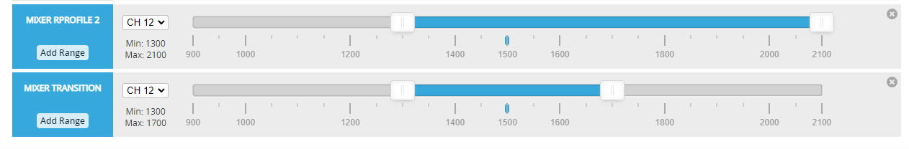

# MixerProfile

A MixerProfile is a set of motor mixer, servo-mixer and platform type configuration settings. It is designed for experienced inav users.

### For a tutorial of vtol setup, Read https://github.com/iNavFlight/inav/blob/master/docs/VTOL.md

Not limited to VTOL. air/land/sea mixed vehicle is also achievable with this feature. Model behaves according to current mixer_profile's platform_type and configured custom motor/servo mixer

Two mixer profiles and smooth VTOL auto-transition are available only on targets with enough flash space.
In standard INAV builds this means targets with more than 512 KB flash, compiled with `USE_AUTO_TRANSITION`.
Targets with 512 KB flash keep the older single-profile / legacy transition behavior and do not include the smooth auto-transition settings.

For VTOL setup. one mixer_profile is used for multi-rotor(MR) and the other is used for fixed-wing(FW)
By default, switching between profiles requires reboot to take affect. However, using the RC mode: `MIXER PROFILE 2` will allow in flight switching for things like VTOL operation
. And will re-initialize pid and navigation controllers for current MC or FW flying mode.

For consistency, this document uses the long-standing VTOL order:
- Profile 1 = fixed-wing (FW)
- Profile 2 = multicopter (MC)

The firmware can work with the profiles swapped, but the examples below keep this order so the switch logic is easier to follow.

Please note that this is an emerging / experimental capability that will require some effort by the pilot to implement.

## Mixer Transition input

`MIXER TRANSITION` is mainly used while the model is still in multicopter mode, so a forward motor or tilt servo can help the aircraft build forward speed before the switch to fixed-wing.

This feature is recommended for VTOL setups. It is normally blocked while navigation modes are active.
Mapping a motor to a servo output, or using servo logic conditions for this feature, is **not** recommended.

If `mixer_vtol_manualswitch_autotransition_controller = ON`, `MIXER TRANSITION` works like a start switch for one transition:

- Each time you move `MIXER TRANSITION` from OFF to ON, INAV starts one transition.
- The same switch can be used in both directions:
  - MC -> transition -> FW
  - FW -> transition -> MC
- After it starts, the transition keeps running until the speed target or timer target is reached.
- Leaving the switch ON does not keep restarting the transition.
- To start another transition, turn the switch OFF and then ON again.
- If you turn the switch OFF before the profile change happens, that transition request is cancelled.
- Optional extra protection: `vtol_fw_to_mc_auto_switch_airspeed_cm_s` can automatically start FW->MC if trusted pitot airspeed gets too low. During manual FW flight, INAV stays in MC until you deliberately command another manual profile change. During mission/RTH/failsafe, INAV keeps the current navigation task in MC after the safety switch.

This behavior is controlled by `mixer_vtol_manualswitch_autotransition_controller`.
Turn it ON in both mixer profiles if you want the same switch behavior in both directions.
If it is OFF, manual transition keeps the older behavior.

In Active Modes:

- `MIXER TRANSITION` shows that the internal transition logic is actually running.
- `MIXER PROFILE 2` shows that mixer profile 2 is currently active.
- During a smooth auto-transition, `MIXER TRANSITION` may remain active while INAV is still using the source profile, waiting for airspeed/timer completion, or finishing the safe output movement after the profile switch.
- During the same transition, `MIXER PROFILE 2` changes only when the actual active mixer profile changes. It is not a progress indicator.
- Mission, RTH, and LAND auto-transitions use the same internal transition state, so `MIXER TRANSITION` can appear active even when the RC `MIXER TRANSITION` switch was not used. Use the OSD system message or `DEBUG_VTOL_TRANSITION` when you need to see which internal transition state is active.

There are two separate manual paths:

- `MIXER PROFILE 2` is still a direct manual profile switch when `MIXER TRANSITION` is OFF.
- `MIXER TRANSITION` starts the smooth automatic transition sequence when `mixer_vtol_manualswitch_autotransition_controller = ON`.
- If both are ON together while the automatic transition controller is enabled, the controller temporarily owns the profile switching. When `MIXER TRANSITION` turns OFF again, direct `MIXER PROFILE 2` switching becomes active again.
- If low-speed protection switches the model from FW to MC, INAV keeps the MC profile until you deliberately command another manual profile change.

3-position switch example:

- This example assumes the usual VTOL order used in this document:
  - Profile 1 = FW
  - Profile 2 = MC
- One supported mapping is:
  - Pos1 = FW (`MIXER PROFILE 2` OFF, `MIXER TRANSITION` OFF)
  - Pos2 = Transition request (`MIXER PROFILE 2` ON, `MIXER TRANSITION` ON)
  - Pos3 = MC (`MIXER PROFILE 2` ON, `MIXER TRANSITION` OFF)
- Keep `mixer_vtol_manualswitch_autotransition_controller` ON in both profiles used by this mapping.
- If you intentionally swap the profile order, keep the same idea and swap the FW and MC end positions.

## Servo

`Mixer Transition` is the input source for transition input; use this to tilt motor to gain airspeed.

Example: Increase servo 1 output by +45 with speed of 150 when transition mode is activated for tilted motor setup:

```
# rule no; servo index; input source; rate; speed; activate logic function number
smix 6 1 38 45 150 -1
```

## Motor

The default `mmix` throttle value is 0.0, It will not show in `diff` command when throttle value is 0.0 (unused);

- 0.0<throttle<=1.0 : normal mapping
- -1.0<throttle<=0.0 : motor stop, default value 0, set to -1 to use a place holder for subsequent motor rules
- -2.0<throttle<-1.0 : spin regardless of throttle position at speed `abs(throttle)-1` when Mixer Transition is activated.

Airmode type should be set to "STICK_CENTER". Airmode type must NOT be set to "THROTTLE_THRESHOLD". If set to throttle threshold the (-) motor will spin till throttle threshold is passed. 

Example: This will spin motor number 5 (counting from 1) at 20%, in transition mode only, to gain speed for a "4 rotor 1 pusher" setup:

```
# motor number; throttle; roll; pitch; yaw
mmix 4 -1.200  0.000  0.000  0.000
```

For smooth VTOL auto-transition, prefer configuring the forward motor as a normal positive-throttle motor in the FW mixer profile and reserving the same motor index in the MC profile with a placeholder. Use `throttle = -1.000` as the placeholder if Configurator removes zero-throttle motor rules. Values below about `-1.05` are treated as the older transition helper motor style, not as a plain placeholder.

## RC mode settings

It is recommend that the pilot uses a RC mode switch to activate modes or switch profiles.
Profile files Switching is not available until the runtime sensor calibration is done. Switching is NOT available when navigation mode is activate.

`mixer_profile` 1 will be used as default, `mixer_profile` 2 will be used when the `MIXER PROFILE 2` mode box is activated. 
Set `MIXER TRANSITION` accordingly when you want to use `MIXER TRANSITION` input for motors and servos.

Another supported mapping is where one switch position turns ON both `MIXER PROFILE 2` and `MIXER TRANSITION`.
With `mixer_vtol_manualswitch_autotransition_controller = OFF`, `MIXER TRANSITION` is used as a live transition input.
With `mixer_vtol_manualswitch_autotransition_controller = ON`, that same overlap position is used as a controller-owned transition position.



|  1000~1300 |  1300~1700  | 1700~2000 |
| :-- | :-- | :-- |
| FW(profile1) with transition off |  MC(profile2) with transition on  | MC(profile2) with transition off |

It is also possible to set it as 4 state switch by adding FW(profile1) with transition on.

If `mixer_vtol_manualswitch_autotransition_controller = ON` and this overlap position is active:
- the smooth transition controller runs while `MIXER TRANSITION` stays ON
- direct `MIXER PROFILE 2` switching is deferred during that time
- when `MIXER TRANSITION` turns OFF, `MIXER PROFILE 2` again decides which stable mixer profile should be active

This overlap style is supported too.

## Automated Transition
This feature is mainly used for RTH and failsafe.
When set up correctly, the aircraft can use fixed-wing for the efficient flight home and then return to multicopter for easier landing.

If `mixer_automated_switch = ON` in a mixer profile, INAV is allowed to run an automated transition when the navigation logic asks for it.

- Use `mixer_automated_switch = ON` in the MC mixer profile if you want automated MC->FW transition during the head-home part of RTH.
- Use `mixer_automated_switch = ON` in the FW mixer profile if you want automated FW->MC transition for the landing part.
- Set `mixer_switch_trans_timer` in each profile to a sensible backup time for that direction.

If `mixer_automated_switch = OFF` in all mixer profiles, automated VTOL transition is disabled.

### Unified VTOL transition controller

Manual `MIXER TRANSITION` and mission-requested VTOL transition both use the same internal transition controller.
That means the same airspeed checks, timer fallback, and smooth power changes are reused in both cases.

This section applies only to targets with more than 512 KB flash, compiled with `USE_AUTO_TRANSITION`.

Direct manual `MIXER PROFILE 2` switching is still a separate path when you want an immediate profile change.

The OSD system message field reports the internal transition state for manual, mission, RTH, LAND, retry, abort, timeout, and completion events. This is useful because Active Modes show RC mode/profile state, while the OSD message describes what the auto-transition controller is doing.

### Airspeed-first completion

When valid pitot airspeed is available, INAV uses airspeed to decide when the transition is complete:

- `vtol_transition_to_fw_min_airspeed_cm_s` for MC->FW
- `vtol_transition_to_mc_max_airspeed_cm_s` for FW->MC

If trusted hardware pitot is not available, not healthy, or the threshold is set to `0`, INAV uses `mixer_switch_trans_timer` instead. `PITOT_VIRTUAL` is treated as timer-based for VTOL transition completion.
Ground speed is not used for transition completion/progress.

The three timer settings do different jobs:

- `mixer_switch_trans_timer` is the original VTOL transition timer. It is still the backup completion timer when trusted hardware pitot airspeed is not being used.
- `mixer_vtol_transition_airspeed_timeout_ms` is only a maximum wait time for the required airspeed while trusted hardware pitot is still usable. It does not complete the transition by itself; it aborts that airspeed-controlled attempt.
- If hardware pitot becomes unavailable during transition, INAV stops using the airspeed timeout and falls back to `mixer_switch_trans_timer`.
- For pitot-based setups, use a non-zero `mixer_switch_trans_timer` as a sensible backup time, typically `40..60` (`4..6s`).

### Smooth power changes during transition (optional)

When `mixer_vtol_transition_dynamic_mixer = ON`, INAV can smoothly change:

- forward motor power,
- lift motor power,
- multicopter stabilisation strength,
- fixed-wing control strength.

Default is OFF to preserve existing behavior.
With it ON, you can configure `INPUT_AUTOTRANSITION_TARGET_STABILIZED_*` servo rules in the MC mixer profile.
During MC->FW they give those servos a preview of the fixed-wing stabilisation that will take over after the profile switch.
This preview uses the target fixed-wing PID bank, rates, angle limits, heading-hold limits, and turn-assist gains, but it still follows the current transition stick shaping until the actual profile switch.
During FW->MC the same MC mixer rules mark which FW servo outputs should reduce fixed-wing correction while motor stabilisation comes back in.
At the same time, target MC motor rules can come in before the switch and use a target MC PID preview, so lift motors are not driven by the active FW/PIFF controller.
These inputs are active only while the smooth auto-transition controller is running. If `mixer_vtol_transition_dynamic_mixer = OFF`, they stay at full authority while the controller is active. If `mixer_vtol_transition_dynamic_mixer = ON`, they follow the normal fixed-wing authority scaling.
`INPUT_MIXER_TRANSITION` remains available for tilt/helper servo movement. With `mixer_vtol_transition_dynamic_mixer = ON`, it follows `mixer_vtol_transition_scale_ramp_time_ms`. With it OFF, it keeps the older fixed transition behavior while the auto controller only decides the profile switch timing. If a profile switch or direct switch changes a transition-linked servo output, INAV starts a fresh full `mixer_vtol_transition_scale_ramp_time_ms` movement from the servo's current output instead of using a separate fixed servo delay.

The smooth auto-transition controller owns the transition while it is running. It can therefore use target-profile transition rules even before the RC switch position would normally select that target profile. This is useful for FW->MC tilt-rotor setups where the FW profile has no tilt-servo rules, but the target MC profile has `INPUT_MIXER_TRANSITION` rules for those servo outputs.

Forward motor setup for smooth auto-transition:

- Preferred setup: configure the forward motor as a normal positive-throttle motor in the FW mixer profile.
- Reserve the same motor index in the MC mixer profile with a placeholder if that motor is not used in MC flight. Use `throttle = -1.000`, `roll = 0`, `pitch = 0`, `yaw = 0` if Configurator removes zero-throttle motor rules.
- During MC->FW, INAV can bring that target FW motor rule in before the profile switch.
- For FW->MC, configure the lift motors as normal positive-throttle motors in the MC mixer profile. If those motor indexes are not used in FW flight, reserve them in the FW mixer profile with placeholders.
- During FW->MC, INAV can bring those target MC lift motor rules in before the profile switch and use target MC stabilisation for their roll/pitch/yaw correction. If a target MC lift motor was idle in the FW profile, INAV captures the current real motor output and moves from that value toward the target MC lift output over `mixer_vtol_transition_scale_ramp_time_ms`.
- The older `-2.0 <= throttle <= -1.05` transition motor rule still works as a legacy/helper path, but it is not the preferred setup for smooth auto-transition.
- If a helper such as `throttle = -1.200` is used before the MC->FW switch, smooth auto-transition moves from that helper output to the real FW mixer output after the profile switch.
- If the same physical tilt motor is configured with positive throttle in both profiles on the same index, INAV blends the base throttle between the MC and FW mixer rules instead of adding both throttles together. The current-profile stabilisation is reduced while the target-profile stabilisation is increased.

How `mixer_vtol_transition_scale_ramp_time_ms` works:

- Time-based motor/power and transition-servo movement:
  - MC->FW: forward motor power ramps from `0 -> 100%` over this time.
  - After the MC->FW profile switch, lift motors that are not used by the FW profile move to idle over this same time instead of stopping immediately.
  - FW->MC: forward motor power ramps from `100% -> 0%`, while lift power and MC stabilisation ramp from their configured minimums back to `100%` over this time.
  - FW->MC target lift motors that exist only in the MC profile start from their current real output and move toward the target MC lift output over this time.
  - After the FW->MC profile switch, a forward motor that is not used by the MC profile keeps moving to idle and cannot be reintroduced by FW throttle.
  - `INPUT_MIXER_TRANSITION` uses this ramp when `mixer_vtol_transition_dynamic_mixer = ON`; with dynamic mixer OFF it keeps the older fixed transition endpoint behavior.
  - If a profile switch or direct switch changes a transition-linked servo output, INAV captures the current servo output and starts a fresh full window from this value.
  - `= 0` (default): those time-based power changes happen immediately.
- For FW->MC tilt servos that exist only in the target MC profile, INAV can preview only the target `INPUT_MIXER_TRANSITION` plus `INPUT_MAX` movement from the servo's current real output. This means it adds the target transition movement and the target fixed offset when both rules exist. A `MAX` rule alone is not enough to identify a transition servo. Target yaw/roll/pitch stabilisation is not applied until the MC profile is active.
- This timer does not decide when the transition completes.
- Airspeed-based control scaling:
  - in MC->FW, lift power reduction, MC stabilisation reduction, and FW control increase follow airspeed when pitot is usable.
  - in FW->MC, FW control reduction follows airspeed when pitot is usable.
  - with valid pitot airspeed, they follow transition progress based on airspeed.
  - without trusted hardware pitot, they fall back to the normal transition timer/progress behavior (`mixer_switch_trans_timer`).
- In FW->MC, forward motor removal, lift power return, and MC motor stabilisation return use the time-based motor ramp so they do not wait for airspeed to fall first.

`vtol_transition_lift_min_percent` and `vtol_transition_mc_authority_min_percent` control different parts of the MC motor output:

- `vtol_transition_lift_min_percent` scales the lift motor base throttle.
- `vtol_transition_mc_authority_min_percent` scales the MC roll/pitch/yaw stabilisation correction mixed into those motors.

Pilot throttle still matters. In ALTHOLD/NAV, `nav_mc_manual_climb_rate` limits the climb/descent rate requested by the throttle stick. In pure manual throttle modes, the transition controller does not automatically convert a strong manual climb command into hover throttle, so avoid entering MC->FW while commanding an aggressive vertical climb.

Example:

- `mixer_switch_trans_timer = 50` (5s fallback completion timer)
- `mixer_vtol_transition_scale_ramp_time_ms = 1200`

Result:
- in MC->FW, the forward motor reaches full power in about `1.2s`,
- in FW->MC, the forward motor ramps down while lift power and MC stabilisation return in about `1.2s`,
- when pitot is working, airspeed-linked control scaling still follows airspeed,
- if hardware pitot stops being usable, airspeed-linked control scaling falls back to `mixer_switch_trans_timer`,
- transition completion still uses airspeed when trusted hardware pitot is working,
- backup completion time is still `5s` if trusted hardware pitot is not usable.

### Mission-authorized VTOL transition (waypoint User Action)

INAV can also change between MC and FW from the mission itself.
This is configured with:

- `nav_vtol_mission_transition_user_action` (`OFF`, `USER1`, `USER2`, `USER3`, `USER4`)
- `nav_vtol_mission_transition_min_altitude_cm` (optional, `0` disables minimum-altitude check)
- `vtol_transition_to_fw_min_airspeed_cm_s` (preferred MC->FW threshold)

Setting scope:

- Per-mixer-profile settings:
  - `mixer_automated_switch`
  - `mixer_switch_trans_timer`
  - `mixer_vtol_transition_dynamic_mixer`
  - `mixer_vtol_manualswitch_autotransition_controller`
  - `mixer_vtol_transition_airspeed_timeout_ms`
  - `mixer_vtol_transition_scale_ramp_time_ms`
- Global settings:
  - `vtol_transition_to_fw_min_airspeed_cm_s`
  - `vtol_transition_to_mc_max_airspeed_cm_s`
  - `vtol_fw_to_mc_auto_switch_airspeed_cm_s`
  - `vtol_transition_lift_min_percent`
  - `vtol_transition_mc_authority_min_percent`
  - `vtol_transition_fw_authority_min_percent`
  - `nav_vtol_mission_transition_user_action`
  - `nav_vtol_mission_transition_min_altitude_cm`

On each navigable mission waypoint (`WAYPOINT`, `POSHOLD_TIME`, `LAND`), the chosen USER flag tells INAV which flight mode should be active there:

- selected USER flag = `0` -> target MC / MULTIROTOR profile
- selected USER flag = `1` -> target FW / AIRPLANE profile
- This is set per waypoint. It is **not** a toggle command.
- If the aircraft is already in the requested mode, INAV does nothing and continues.

The mission pauses while transition is in progress and resumes after completion.

For MC->FW mission transitions, navigation uses a built-in straight acceleration run to build speed before the switch to fixed-wing.
Mission transition uses the same transition logic as manual transition: airspeed first, timer as backup.

Manual RC switching (`MIXER PROFILE 2`, `MIXER TRANSITION`) is still blocked during normal active navigation.
Mission VTOL transition still relies on the normal two-profile setup, so you must configure both mixer profiles and a valid `MIXER PROFILE 2` mode condition.

### Example test presets (VTOL ~1.0m wingspan, ~1720g AUW)

These are practical starting points for first validation flights. They are examples, not universal defaults.

#### Test 1 - Legacy-compatible baseline (manual transition check)

CLI:
- `set mixer_vtol_manualswitch_autotransition_controller = ON`
- `set mixer_vtol_transition_dynamic_mixer = OFF`
- `set mixer_switch_trans_timer = 45`
- `set vtol_transition_to_fw_min_airspeed_cm_s = 0`
- `set vtol_transition_to_mc_max_airspeed_cm_s = 900`
- `set mixer_vtol_transition_airspeed_timeout_ms = 0`
- `set mixer_vtol_transition_scale_ramp_time_ms = 0`
- `set nav_vtol_mission_transition_user_action = OFF`

Behavior:
- Keeps behavior close to the older transition setup.
- Good as a known-safe starting point before enabling the smoother power changes.

#### Test 2 - Airspeed-first + smooth power changes (manual tuning)

CLI:
- `set mixer_vtol_manualswitch_autotransition_controller = ON`
- `set mixer_vtol_transition_dynamic_mixer = ON`
- `set vtol_transition_to_fw_min_airspeed_cm_s = 1300`
- `set vtol_transition_to_mc_max_airspeed_cm_s = 850`
- `set mixer_switch_trans_timer = 50`
- `set mixer_vtol_transition_airspeed_timeout_ms = 6500`
- `set mixer_vtol_transition_scale_ramp_time_ms = 1200`
- `set vtol_transition_lift_min_percent = 30`
- `set vtol_transition_mc_authority_min_percent = 20`
- `set vtol_transition_fw_authority_min_percent = 20`
- `set nav_vtol_mission_transition_user_action = OFF`

Behavior:
- Uses pitot airspeed first, with timer fallback only if pitot is not usable.
- Adds smoother forward-motor, lift-motor, and control changes to reduce abrupt transitions.

#### Test 3 - Mission-authorized transition (mission integration)

CLI:
- `set mixer_vtol_manualswitch_autotransition_controller = ON`
- `set mixer_vtol_transition_dynamic_mixer = ON`
- `set vtol_transition_to_fw_min_airspeed_cm_s = 1300`
- `set vtol_transition_to_mc_max_airspeed_cm_s = 850`
- `set mixer_switch_trans_timer = 50`
- `set mixer_vtol_transition_airspeed_timeout_ms = 6500`
- `set mixer_vtol_transition_scale_ramp_time_ms = 1200`
- `set vtol_transition_lift_min_percent = 30`
- `set vtol_transition_mc_authority_min_percent = 20`
- `set vtol_transition_fw_authority_min_percent = 20`
- `set nav_vtol_mission_transition_user_action = USER1`
- `set nav_vtol_mission_transition_min_altitude_cm = 1200`

Behavior:
- Uses USER1 as the per-waypoint target selector (`clear = MC`, `set = FW`).
- Pauses mission progression during transition and resumes only after transition completion.

### Validation Matrix (PR / SITL / HITL)

- MC->FW manual, pitot healthy/available.
- MC->FW manual, no pitot (timer fallback).
- FW->MC manual, pitot healthy/available.
- FW->MC manual, no pitot (timer fallback).
- `MIXER TRANSITION` held ON after completion (no repeated starts).
- `MIXER TRANSITION` OFF before profile change (safe abort).
- Mission transition with selected USER bit = `1` (TO_FW).
- Mission transition with selected USER bit = `0` (TO_MC).
- Failsafe/disarm during active transition (abort and no blind mission resume).

### VTOL transition debug mode (Blackbox / OSD debug)

For transition troubleshooting, use:

- `set debug_mode = VTOL_TRANSITION`
- `save`

Debug channels:

- `debug[0]` = transition phase (`0=IDLE`, `1=TRANSITION_INITIALIZE`, `2=TRANSITIONING`, `3=after-switch smoothing`)
- `debug[1]` = active request (`MIXERAT_REQUEST_*` enum value), with transition direction packed in bits `8..15` and wait reason packed in bits `16..23`
    - wait reason `0`: none
    - wait reason `1`: FW->MC is close to the MC speed threshold, but is still waiting
    - wait reason `2`: no trusted hardware pitot speed is available, so timer-based completion is being used
    - wait reason `3`: FW->MC is waiting because trusted pitot airspeed is still clearly above `vtol_transition_to_mc_max_airspeed_cm_s`

For display only, reason `3` means the trusted pitot value is more than about `1 m/s` above the MC switch threshold. The actual FW->MC switch condition is still `airspeed <= vtol_transition_to_mc_max_airspeed_cm_s`.
- `debug[2]` = packed transition flags:
    - bits 0-1: transition direction (`0=NONE`, `1=TO_FW`, `2=TO_MC`)
    - bit2: auto-transition controller active
    - bit3: transition mixing output active (`isMixerTransitionMixing`)
    - bit4: RC `MIXERTRANSITION` mode active
    - bit5: airspeed-controlled path in use
    - bit6: profile change done
    - bit7: transition aborted
    - bit8: manual VTOL auto-transition controller enabled in current mixer config
    - bit9: dynamic transition mixer enabled in current mixer config
    - bits 10-11: current mixer profile index
    - bits 12-13: next mixer profile index
    - bit14: manual transition currently allowed by navigation state
    - bit15: mission mode active
    - bit16: transition mixing requested (`isMixerTransitionMixing_requested`)
    - bit17: failsafe mode active
    - bit18: manual VTOL auto-transition controller effective after mission gating
    - bit19: RC `MIXERPROFILE` mode active
    - bit20: manual transition session is latched
    - bits 21-24: active platform type
    - bits 25-26: active PID type (`pidIndexGetType(PID_ROLL)`)
    - bits 27-28: target preview mode (`0=none`, `1=manual FW`, `2=target FW PID`, `3=target MC PID`)
    - bit29: after-switch smoothing active
    - bit30: legacy manual transition session active
- `debug[3]` = progress x1000 (`0..1000`)
- `debug[4]` = pusher scale x1000 (`0..1000`)
- `debug[5]` = lift scale x1000 (`0..1000`)
- `debug[6]` = packed scales:
    - low 16 bits: MC stabilisation scale x1000 (`0..1000`)
    - high 16 bits: FW control scale x1000 (`0..1000`)
- `debug[7]` = packed progress values:
    - bits 0-9: progress used for airspeed-linked scaling (`0..1000`)
    - bits 10-19: motor ramp progress (`0..1000`)
    - bits 20-29: after-switch smoothing progress (`0..1000`)

Final motor outputs are available in the normal Blackbox motor traces. During after-switch smoothing, the old lift or pusher motor output should move smoothly toward idle there.

## TailSitter (planned for INAV 7.1)
TailSitter is supported by add a 90deg offset to the board alignment. Set the board aliment normally in the mixer_profile for FW mode(`set platform_type = AIRPLANE`), The motor trust axis should be same direction as the airplane nose. Then, in the mixer_profile for takeoff and landing set `tailsitter_orientation_offset = ON ` to apply orientation offset. orientation offset will also add a 45deg orientation offset.

## Parameter list (Partial List)
####  Please be aware of what parameter is shared among FW/MC modes and what isn't. 
### Shared Parameters

- **Timer Overrides**
- **Outputs [Servo]:**
  - Servo min-point, mid-point, max-point settings
- **Motor Configuration:**
  - motor_pwm_protocol
  - motor_poles
- **Servo Configuration:**
  - servo_protocol
  - servo_pwm_rate
- **Board Alignment**
- ·······
### Profile-Specific Parameters in VTOL
- **Mixer Profile**
    - **Mixer Configuration:**
        - platform_type
        - motor_stop_on_low
        - tailsitter_orientation_offset
        - motor_direction_inverted, and more·······
    - **Motor Mixing (mmix)**
    - **Servo Mixing (smix)**
- **Control Profile**
  - PIDs for Roll, Pitch, Yaw
  - PIDs for Navigation Modes
  - TPA (Throttle PID Attenuation) Settings
  - Rate Settings
  - ·······

### TailSitter support
TailSitter is supported by add a 90deg offset to the board alignment. Set the board aliment normally in the mixer_profile for FW mode(`set platform_type = AIRPLANE`), The motor trust axis should be same direction as the airplane nose. Then, in the mixer_profile for takeoff and landing `set platform_type = TAILSITTER`. The `TAILSITTER` platform type is same as `MULTIROTOR` platform type, expect for a 90 deg board alignment offset. In `TAILSITTER` mixer_profile, when motor trust/airplane nose is pointing to the sky, 'airplane bottom'/'multi rotor front' should facing forward in model preview. Set the motor/servo mixer according to multirotor orientation, Model should roll around geography's longitudinal axis, the roll axis of `TAILSITTER` will be yaw axis of `AIRPLANE`. In addition, When `MIXER TRANSITION` input is activated, a 45deg offset will be add to the target angle for angle mode.

## Happy flying

Remember that this is currently an emerging capability:

* Test every thing on bench first.
* Try MR or FW mode separately see if there are any problems.
* Use the INAV Discord for help and setup questions; use the Github Issues for reporting bugs and unexpected behaviors. For reporting on Github, a CLI `diff all`, a DVR and a Blackbox log of the incident will assist investigation.
