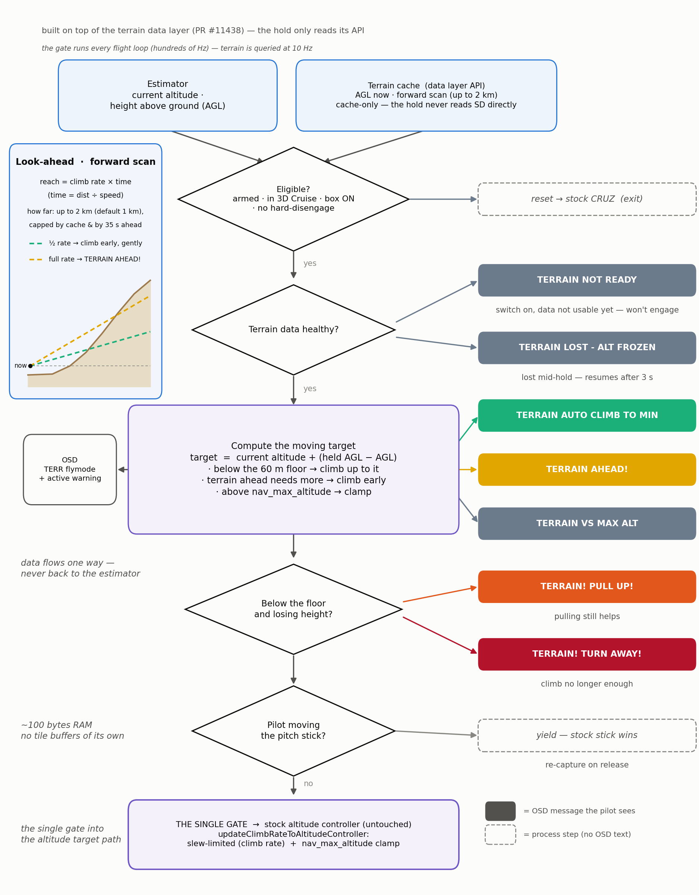

# Terrain AGL Hold

Terrain AGL Hold is INAV's **terrain-following** mode for fixed wing. It is a **3D Cruise** enhancement that holds a set height **above the ground** instead of above the take-off point — *Cruise with a moving target*. As the ground rises and falls under you, the altitude target rides with it, so the aircraft keeps its clearance over hills and valleys with no stick input: downhill it descends with the valley, uphill it climbs with the ridge.

It reads the ground elevation from the terrain elevation data on the SD card (see **[Terrain](Terrain.md)** for generating and loading tiles); it never uses a physical rangefinder. With the mode switched off, the aircraft flies exactly like stock 3D Cruise — everything here is opt-in, and **the pitch stick always wins** (the mode box is an instant in-flight kill switch).

## How it works



*One navigation cycle — inputs, health gate, the moving target, the alarm ladder, and the single gate into the altitude target path (the stock controller, untouched).*

## Requirements

- A flight controller with terrain support (SD card + barometer): **STM32H7, STM32F7 (F745 / F746 / F765), or AT32F43x**. F4 boards are not enabled for terrain by default.
- **Fixed-wing only.** A valid **GPS fix** and a **barometer**.
- **Terrain tiles** (`.TER`) on the SD card, **including the tile for your take-off site** — see [Terrain](Terrain.md).
- **3D Cruise must be active.** At this stage Terrain AGL Hold works **only together with NAV CRUISE** — this is a mandatory safety condition for now, not just a recommendation.

## Not the same as copter SURFACE mode

Multirotor **SURFACE** mode follows the ground *reactively* from a physical rangefinder — the instantaneous distance straight below. Terrain AGL Hold is the fixed-wing equivalent taken from the SD terrain map, and crucially it is **predictive**: it scans **up to 2 km ahead** along your track and climbs/warns *early* for terrain rising in front of you — something a downward rangefinder cannot do. The two never stack (this mode refuses to engage while SURFACE is active), and SURFACE mode itself is multirotor-only.

## What it does

- **Captures** your current height above ground when you switch it on, and holds it. Move the **pitch stick** to set a new height; centre the stick and it holds the new one.
- Engage **below the safety floor** → it climbs smoothly up to the floor first.
- **Looks ahead** along your track (up to 2 km, 1 km by default) with a per-airframe **escape test** — *"at this speed, with your configured climb rate, will you clear what's ahead?"* — and warns you **early, while there's still time**.
- If the terrain data is lost mid-flight, it **holds the last valid altitude target and warns** on the OSD — it never descends on dead data.
- The stock 3D Cruise altitude controller is **untouched**; this only feeds it a moving target.
- **Not used for autonomous navigation.** RTH and waypoint missions do **not** use it yet — the mode yields to them and they fly stock (terrain-blind).

## Setup

1. **Prepare and enable terrain data** — see **[Terrain](Terrain.md)**: generate `.TER` tiles for your area (include the take-off tile), copy them to the SD card root, then in the CLI:
   ```
   set terrain_enabled = ON
   save
   ```
2. **Assign the mode.** In the Configurator **Modes** tab (or via CLI `aux`), put **TERRAIN AGL HOLD** on a spare, **deliberately guarded** switch — not next to ARM. It is active only inside 3D Cruise.
   > **Hint (once you are confident with the mode):** you *can* put **NAV CRUISE** and **TERRAIN AGL HOLD** on the **same switch** so one flip arms both. This is **not** the recommended default — keeping them on **separate** switches lets you enter Cruise first, confirm it, and engage terrain hold as a deliberate second step.
3. **Set the floor and look-ahead** if you want (defaults are sensible — see *Settings*).
4. **OSD:** add the **Rangefinder** element to see your height above ground (AGL) in flight. The flight-mode field shows **TERR** while the hold is engaged.
5. **Fly** in 3D Cruise, then flip the switch — it captures and holds your current AGL. **Panic rule: box off = stock cruise instantly; the pitch stick always wins.**

## Settings

| Setting | Default | Range | Meaning |
|---|---|---|---|
| `terrain_nav_min_agl` | 60 m | 50 – 120 m | The **safety floor** — the lowest height above ground the mode will hold. Engage below it and it climbs up to it. (Stored in centimetres: 6000 = 60 m.) |
| `terrain_nav_lookahead` | 1000 m | 0 – 2000 m | How far ahead along your track the **forward scan** looks for rising terrain. `0` disables the early *TERRAIN AHEAD!* warning, leaving only the reactive floor. |

> **NB — keep your climb rates honest.** The climb authority is your existing **`nav_fw_auto_climb_rate`** — there is no separate terrain climb setting, and the *TERRAIN AHEAD!* escape warning **trusts that number**, so set it to a rate your model genuinely sustains. Keep **`nav_fw_manual_climb_rate` at least equal to `nav_fw_auto_climb_rate`** (they default to 300 / 500) — or **greater**, if you want pulling the stick to actually add climb. If `nav_fw_manual_climb_rate` is **lower** than `nav_fw_auto_climb_rate`, grabbing pitch during an auto-climb commands the lower rate: the nose visibly eases and it can even **slow** the climb.

## Behaviour in the air

- **Engage at or above the floor** → captures your current AGL and holds it.
- **Engage below the floor** → climbs to the floor (*TERRAIN AUTO CLIMB TO MIN*).
- **Pitch stick** → sets a new held AGL. The stick always wins: it pauses the hold the moment it moves (smooth blend, no jump); centre it and the current height is re-captured.
- **Hands off over a hill** → the target rides the terrain up and back down.
- **Sharp turns while riding the floor** clip the safety margin — bank with height in hand.

## OSD messages — the alarm ladder

The mode narrates itself on the OSD. Higher-priority messages take the slot; while the autopilot is auto-climbing under a warning, the two alternate so you always see both the danger and the action.

| Message | Kind | Meaning | What to do |
|---|---|---|---|
| **TERRAIN! TURN AWAY!** | Warning | Too low **and** climbing can no longer save you (full climb still loses, or you're sinking, or pinned at your altitude ceiling). | **Turn away immediately** (manual + full throttle). Don't count on pulling up. |
| **TERRAIN! PULL UP!** | Warning | Too low, but climbing **still works**. | Release the stick — the autopilot climbs at full rate — or pull **if `nav_fw_manual_climb_rate` > `nav_fw_auto_climb_rate`**; if in doubt, turn as well. |
| **TERRAIN AHEAD!** | Caution | The forward scan says that at this speed the slope ahead beats a full-rate climb — **you have time now**. | Turn, slow down, or climb early — while it's cheap. |
| **TERRAIN VS MAX ALT** | Caution | The terrain needs more altitude than your `nav_max_altitude` ceiling allows (only if a ceiling is set). | Raise/remove the ceiling, or accept reduced clearance at the wall. |
| **TERRAIN AUTO CLIMB TO MIN** | Info | The autopilot is already climbing you to the floor. | Nothing — it's handled. |
| **TERRAIN NOT READY** | Info | Engagement refused — no usable terrain data yet. | Fly stock cruise; check tiles / SD card if it persists. |
| **TERRAIN LOST - ALT FROZEN** | Caution | Data lost mid-hold — the altitude target is **frozen at the last valid value**. | Never descend blind; navigate out on the frozen altitude (it resumes after a few seconds of good data). |
| **TERRAIN LOOKAHEAD OFF** | Info | The forward scan is unavailable (no heading estimate). | Only the reactive floor guards you now. |

> **About `nav_max_altitude`:** that ceiling is **barometric altitude above your Home point** — it is *not* terrain-AGL aware. So over rising ground the terrain can legitimately need more altitude than the ceiling allows; that is exactly when *TERRAIN VS MAX ALT* appears.

## Safety & limitations

- **Fixed-wing only.** It never runs on multirotors, rovers, or boats, and it works **only inside 3D Cruise** (mandatory at this stage).
- **Not for autonomous navigation yet.** RTH and waypoint missions do not use it — the mode **yields cleanly to stock behaviour** (hands the aircraft back) during launch, autoland, emergency landing, RTH, and waypoint missions, and on **GPS loss**. Stock RTH is terrain-blind: it does not follow the ground.
- The **floor is deliberately high** (default 60 m, minimum 50 m). Terrain data and GPS each carry a few metres of error, so keep clearance in hand — don't set the floor low.
- **Not a rangefinder replacement.** The value is the ground elevation at your GPS position from the map — it does **not** see trees, buildings, wires, or the actual nearest object below you.
- **Never stacks with the rangefinder** — it refuses to engage while SURFACE mode is active.
- If terrain data is lost while engaged, the target **freezes at the last valid altitude** (*TERRAIN LOST - ALT FROZEN*) — it never descends on dead data.
