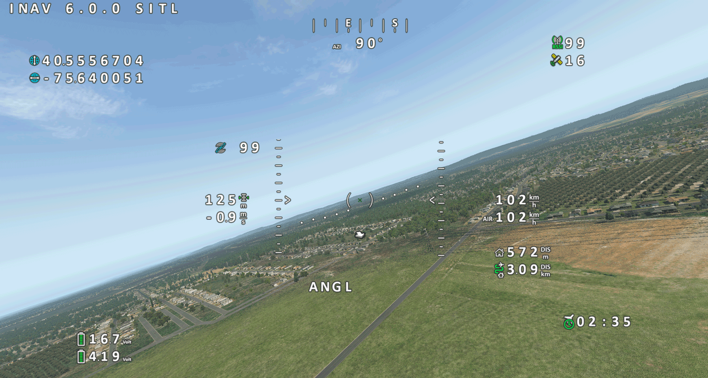
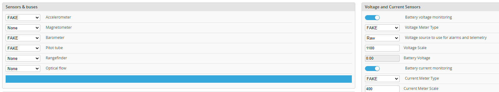
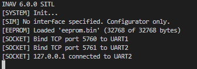
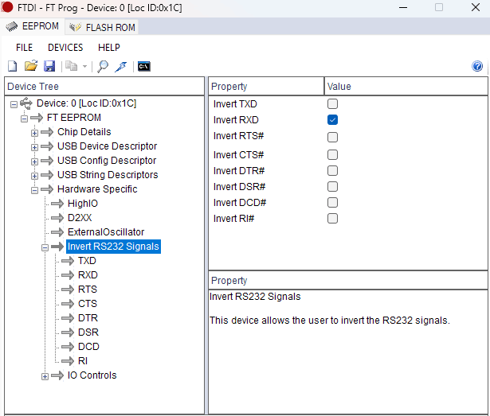

# SITL



## ATTENTION!
SITL is currently still under development.

SITL (Software in the loop) allows to run INAV completely in software on the PC without using a flight controller and simulate complete FPV flights.
For this, INAV is compiled with a normal PC compiler.

The sensors are replaced by data provided by a simulator.
Currently supported are
- RealFlight  https://www.realflight.com/
- X-Plane https://www.x-plane.com/

INAV SITL communicates for sensor data and control directly with the corresponding simulator, see the documentation of the individual simulators and the Configurator or the command line options.

## Sensors
The following sensors are emulated:
- IMU (Gyro, Accelerometer)
- GPS
- Pitot
- Magnetometer (Compass)
- Rangefinder
- Barometer
- Battery (current and voltage), depending on simulator



Select "FAKE" as type for all mentioned, so that they receive the data from the simulator. 

## Serial ports+
UARTs are replaced by TCP starting with port 5760 ascending. UART 1 port 5760, UART2 6761, ...
By default, UART1 and UART2 are available as MSP connections. 
To connect the Configurator to SITL: Select TCP and connect to ```127.0.0.1:5760``` (if SITL is running on the same machine).

The assignment and status of user UART/TCP connections is displayed on the console.



All other interfaces (I2C, SPI, etc.) are not emulated.

## Remote control
Joystick (via simulator) or serial receiver via USB/Serial interface are supported. 

### Joystick interface
Only 8 channels are supported. 
Select "SIM (SITL)" as the receiver and set up a joystick in the simulator, details of which can be found in the documentation for the individual simulators.  

### Serial Receiver via USB
Connect a serial receiver (e.g. SBUS) to the PC via a UART/USB adapter. Configure the receiver in the Configurator as usual.

The Configurator offers a built-in option for forwarding the serial data to the SITL TCP port, if SITL is started manually the following option can be used:

The connection can then be established with a programme that forwards the serial data unaltered to TCP, e.g. with the Python script tcp_serial_redirect.py (https://github.com/Scavanger/TCP-Serial-Redirect)
If necessary, please download the required runtime environment from https://www.python.org/.
Please use the linked version, which has a smaller buffer, otherwise the control response is relatively slow.

### Example SBUS:
For this you need a FT232 module. With FT-Prog (https://ftdichip.com/utilities/) the signals can be inverted: Devices->Scan and Parse, then Hardware Specific -> Invert RS232 Signals -> Invert RXD.



For SBUS, the command line arguments of the python script are: 
```python tcp_serial_redirect.py --parity E --stopbits 2 -c 127.0.0.1:[INAV-UART-PORT] COMXX 100000``` 

Note: Telemetry via return channel through the receiver is not supported by SITL (yet).

## OSD
For the OSD the program INAV-Sim-OSD is available: https://github.com/Scavanger/INAV-SIM-OSD.
For this, activate MSP-Displayport on a UART/TCP port and connect to the corresponding port.

Note: INAV-Sim-OSD only works if the simulator is in window mode. 

## Command line
The command line options are only necessary if the SITL executable is started by hand, e.g. when debugging.
For normal use, please use the SITL tab in the configurator. 

The following SITL specific command line options are available:

If SITL is started without command line options, only the Configurator can be used.

```--path``` Full path and file name to config file, if not present, eeprom.bin in the current directory is used. Example: ```C:\INAV_SITL\flying-wing.bin```

```--sim=[sim]``` Select the simulator. xp = X-Plane, rf = RealFlight. Example: ```--sim=xp```

```--simip=[ip]``` IP address of the simulator, if you specify a simulator with "--sim" and omit this option localhost (127.0.0.1) will be used. Example: ```--simip=172.65.21.15```

```--simport=[port]``` Port number of the simulator, not necessary for all simulators. Example: ```--simport=4900```

```--useimu``` Use IMU sensor data from the simulator instead of using attitude data directly from the simulator. Not recommended, use only for debugging.

```--chanmap=[chanmap]``` The channelmap to map the motor and servo outputs from INAV to the virtual receiver channel or control surfaces around simulator.
Syntax: (M(otor)|S(ervo)<INAV-OUT>-<RECEIVER_OUT>),..., all numbers must have two digits.
Example:
To assign motor1 to virtual receiver channel 1, servo 1 to channel 2, and servo2 to channel 3:
```--chanmap:M01-01,S01-02,S02-03```
Please also read the documentation of the individual simulators.

```--help``` Displays help for the command line options.

## Running SITL
It is recommended to start the tools in the following order:
1. Simulator, aircraft should be ready for take-off
2. INAV-SITL
3. OSD
4. serial redirect for RC input

## Compile

### Linux:
Almost like normal, ruby, cmake and make are also required.
With cmake, the option "-DSITL=ON" must be specified. 

```
mkdir build_SITL
cd build_SITL
cmake -DSITL=ON ..
make
```

### Windows:
Compile under cygwin, then as in Linux. 
Copy cygwin1.dll into the directory, or include cygwin's /bin/ directory in the environment variable PATH.
