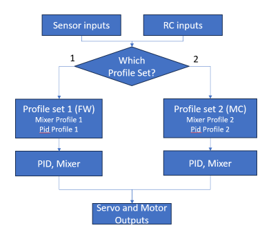
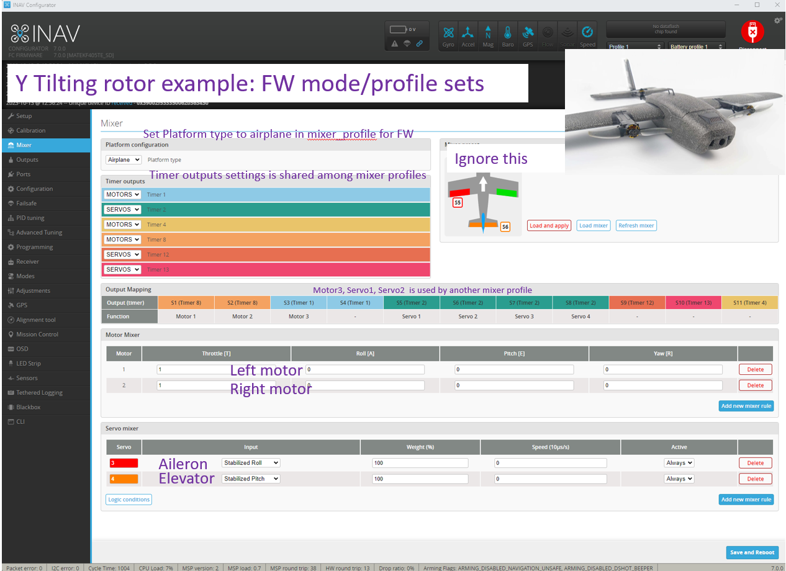
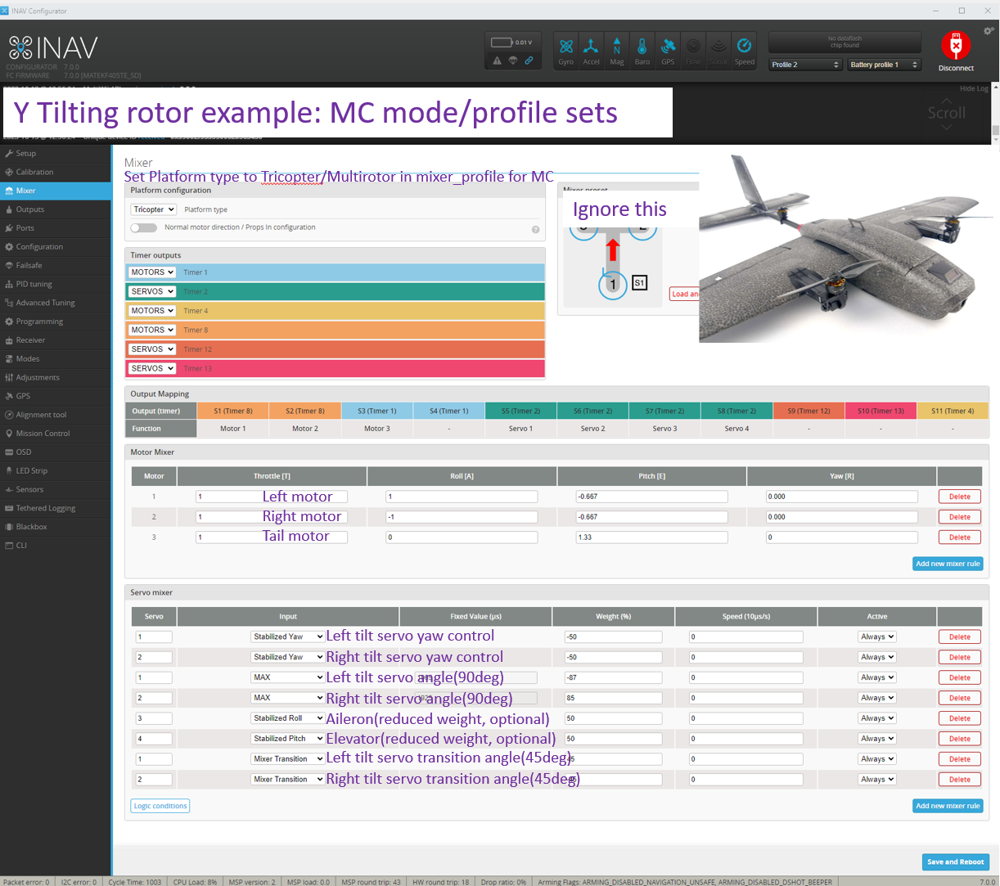
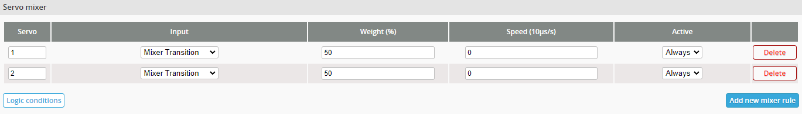
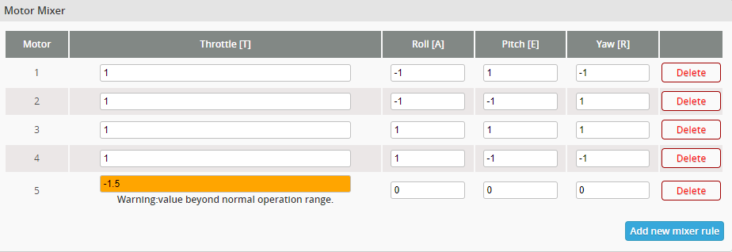

# Welcome to INAV VTOL

Thank you for trying the INAV VTOL. Read every line in this tutorial. Your patience can save both time and potential repair costs for the model.

## Who Should Use This Tutorial?

This tutorial is designed for individuals who 
- have prior experience with **both INAV multi-rotor and INAV fixed-wing configurations/operations.** 
- know how to create a custom mixer for their model. 
- know basic physics of vtol operation

## Firmware Status

The firmware is in a flyable state, but it hasn't undergone extensive testing yet. This means there may be potential issues that have not yet been discovered.

## Future Changes

Please be aware that both the setup procedure and firmware may change in response to user feedback and testing results. 
## Your Feedback Matters

We highly value your feedback as it plays a crucial role in the development and refinement of INAV VTOL capabilities. Please share your experiences, suggestions, and any issues you encounter during testing. Your insights are invaluable in making INAV VTOL better for everyone.

# VTOL Configuration Steps

### The VTOL functionality is achieved by switching/transitioning between two configurations stored in the FC. VTOL specific configurations are Mixer Profiles with associated control profiles. One profile set is for fixed-wing(FW) mode, One is for multi-copter(MC) mode. Configuration/Settings other than Mixer/control profiles are shared among two modes

This guide uses the long-standing VTOL setup order:
- Profile 1 = fixed-wing (FW)
- Profile 2 = multicopter (MC)

The firmware can work with the profiles swapped, but keeping one order in the guide makes the setup steps easier to follow.


0. **Find a DIFF ALL file for your model and start from there if possible**
   - Be aware that `MIXER PROFILE 2` RC mode setting introduced by diff file can get your stuck in a mixer_profile. remove or change channel to proceed
1. **Setup Profile 1:**
   - Configure it as your normal fixed-wing setup.

2. **Setup Profile 2:**
   - Configure it as your normal multicopter setup.

3. **Mode Tab Settings:**
   - Set up switching in the mode tab.

4. *(Recommended)* **Transition Mixing (Multi-Rotor Profile):**
   - Configure transition mixing to gain airspeed in the multi-rotor profile.

5. *(Optional)* **Automated Switching (RTH):**
   - Optionally, set up automated switching in case of failsafe.

# STEP 0: Load parameter preset/templates
Find a working diff file if you can and start from there. If not, select keep current settings and apply following parameter in cli but read description about which one to apply.

```
set small_angle = 180
set gyro_main_lpf_hz = 80
set dynamic_gyro_notch_min_hz = 50
set dynamic_gyro_notch_mode = 3D
set motor_pwm_protocol = DSHOT300 #Try dshot first and see if it works
set airmode_type = STICK_CENTER_ONCE


set nav_disarm_on_landing = OFF  #band-aid for false landing detection in NAV landing of multi-copter
set nav_rth_allow_landing = FS_ONLY
set nav_wp_max_safe_distance = 500
set nav_fw_control_smoothness = 2
set nav_fw_launch_max_altitude = 5000

set servo_pwm_rate = 160 #If model using servo for stabilization in MC mode and servo can tolerate it 
set servo_lpf_hz = 30 #If model using servo for stabilization in MC mode


## profile 1 as airplane and profile 2 as multi rotor
mixer_profile 1

set platform_type = AIRPLANE
set model_preview_type = 26
set motorstop_on_low = ON
set mixer_pid_profile_linking = ON

mixer_profile 2

set platform_type = TRICOPTER
set model_preview_type = 1
set mixer_pid_profile_linking = ON

profile 1 #control profile
set dterm_lpf_hz = 10
set d_boost_min =  1.000
set d_boost_max =  1.000
set fw_level_pitch_trim =  5.000
set roll_rate = 18
set pitch_rate = 9
set yaw_rate = 3
set fw_turn_assist_pitch_gain = 0.4
set max_angle_inclination_rll = 450
set fw_ff_pitch = 80
set fw_ff_roll = 50
set fw_p_pitch = 15
set fw_p_roll = 15

profile 2
set dterm_lpf_hz = 60
set dterm_lpf_type = PT3
set d_boost_min =  0.800
set d_boost_max =  1.200
set d_boost_gyro_delta_lpf_hz = 60
set antigravity_gain =  2.000
set antigravity_accelerator =  5.000
set smith_predictor_delay =  1.500
set tpa_rate = 20
set tpa_breakpoint = 1200
set tpa_on_yaw = ON #If model using control surface/tilt mechanism for stabilization in MC mode
set roll_rate = 18
set pitch_rate = 18
set yaw_rate = 9
set mc_iterm_relax = RPY

save
```

# STEP 1: Configuring as a normal fixed-wing in Profile 1

1. **Select the first Mixer Profile and Control Profile:**
   - In the CLI, switch to the mixer_profile and control_profile you wish to set first. You can also switch
     mixer_profile/control_profile through gui with aforementioned presets loaded.
     ```
     mixer_profile 1 #in this example, we set profile 1 first
     set mixer_pid_profile_linking = ON  # Let the mixer_profile handle the control profile (formerly pid_profile) switch on this mixer_profile
     set platform_type = AIRPLANE
     save
     ```

2. **Configure the fixed-wing:**
   - Configure your fixed-wing as you normally would, or you can copy and paste default settings to speed things up.
   - Dshot esc protocol availability might be limited depends on outputs and fc board you are using. change the motor wiring or use oneshot/multishot esc protocol and calibrate throttle range.
   - You can use throttle = -1 as a placeholder for the motor you wish to stop if the motor isn't the last motor
   - Consider conducting a test flight to ensure that everything operates as expected. And tune the settings, trim the servos.



You must also assign the tilting servos values using the MAX values.  If you don't do this the motors will point in the direction assigned by the transition mode.

# STEP 2: Configuring as a Multi-Copter in Profile 2

1. **Switch to Another Mixer Profile with Control Profile:**
   - In the CLI, switch to another mixer_profile along with the appropriate control profile. You can also switch
     mixer_profile/control_profile through gui with aforementioned presets loaded.
     ```
     mixer_profile 2
     set mixer_pid_profile_linking = ON
     set platform_type = MULTIROTOR/TRICOPTER
     save
     ```

2. **Configure the multicopter/tricopter:**
   - Set up your multicopter/tricopter as usual, this time for mixer_profile 2 and control_profile 2.
   - Utilize the 'MAX' input in the servo mixer to tilt the motors without altering the servo midpoint.
   - At this stage, focus on configuring profile-specific settings. You can streamline this process by copying and pasting the default PID settings.
   - you can set -1 in motor mixer throttle as a place holder: this will disable that motor but will load following the motor rules
   - compass is required to enable navigation modes for multi-rotor profile.
   - Consider conducting a test flight to ensure that everything operates as expected. And tune the settings.
   - It is advisable to have a certain degree of control surface (elevon / elevator) mapping for stabilization even in multi-copter mode. This helps improve control authority when airspeed is high. It might be unable to recover from a dive without them.



5. **Tailsitters:planned for INAV 7.1**
   - Configure the fixed-wing mode/profile sets normally. Use MultiCopter platform type for tail_sitting flying mode/profile sets. 
   - The baseline board aliment is FW mode (ROLL axis is the thrust axis). Set `tailsitter_orientation_offset = ON ` in the tail_sitting MC mode.
   - Configure mixer ROLL/YAW mixing according to tail_sitting orientation in the tail_sitting MC mode. YAW axis is the thrust axis.
   - Conduct a bench test and see the orientation of the model changes in inav-configurator setup tab


# STEP 3: Mode Tab Settings:
### We recommend using an 3-pos switch on you radio to activate these modes, So the pilot can jump in or bail out at any moment.

### Here is a example, in the bottom of inav-configurator Modes tab:

|  1000~1300 |  1300~1700  | 1700~2000 |
| :-- | :-- | :-- |
| Profile1(FW) with transition off |  Profile2(MC) with transition on  | Profile2(MC) with transition off |

- This is one supported mapping, where one switch position turns ON both `MIXER PROFILE 2` and `MIXER TRANSITION`.
- With `mixer_vtol_manualswitch_autotransition_controller = OFF`, `MIXER TRANSITION` is used as a live transition input.
- With `mixer_vtol_manualswitch_autotransition_controller = ON`, that same overlap position is used as a controller-owned transition position.
- While both are ON, the smooth transition controller runs and direct `MIXER PROFILE 2` switching is deferred.
- When `MIXER TRANSITION` turns OFF again, `MIXER PROFILE 2` once more decides which stable mixer profile should be active.

- Profile file switching becomes available after completing the runtime sensor calibration (15-30s after booting). And It is **not available** when a navigation mode or position hold is active.

- By default, `mixer_profile 1` is used. `mixer_profile 2` is used when the `MIXER PROFILE 2` mode is activate. Once configured successfully, you will notice that the profiles and model preview changes accordingly when you refresh the relevant INAV Configurator tabs. 

- Use the `MIXER TRANSITION` mode to gain airspeed in MC profile, set `MIXER TRANSITION` accordingly.

Conduct a bench test on the model (without props attached). The model can now switch between fixed-wing and multi-copter modes while armed. Furthermore, it is capable of mid-air switching, resulting in an immediate stall upon entering fixed-wing profile


# STEP 4: Tilting Servo Setup (Recommended)
### Setting up the tilting servos to operate correctly is crucial for correct yaw control of the craft. Using the default setup works, but will most likely result in your craft crawling forward with evey yaw input.
The steps below describe how you can fine-tune the tilting servos to obtian the optimum result.


1. **Set the tilt servos at 45 degrees:**
   - Connect and power the tilting servos with your flight controller.
   - Enter transition mode (your switch should be in the mid-position).
   - Check the Outputs tab and make sure that the tilt servo channels are exactly at 1500μs.
   - In this mode, your tilt servos should be at the 45-degree position and you can now mount the motor and prop to your tilt servo such that the angle of the motor mounting plate is at 45 degrees upwards.
   - NOTE 1: If you have dedicated tilt servos, you may have engraved indices on the servos and tilting motor assembly to help you with this step. If the servos don't end up exactly at 45 degrees due to the teeth on the servo and the control arm/plate, don't worry, this will be automatically adjusted after completing the other steps below.
   - NOTE 2: If you are using control rods to adjust the tilt of the servos, adjust the lenth of your control rod and the position of the control arm to position the control arm as close as possible to the mid position. It will depend on the oriatation of the servo, but generally speaking, the control arm of the servo should be pointed perpendicular to the fuselage when the motor mounts are at the 45 degree setting.

2. **Switch to Multicopter/Tricopter:**
   - Assuming that you have set up your mixer similar to STEP1 and STEP2, you can now switch to the tricopter/multicopter mode and your servos should be tilting the motors upwards. If this is not the case, reverse the servo(s) in the Outputs tab such that the servo(s) is/are pointed upwards.
   - It is OK for the servos not to point exactly 90 degrees upwards, but they should be as close as possible to that position.
   - Also, ensure that your MAX values in the Mixer tab are at 100 and -100, so that your servo will move to the maximum position, as shown in the screenshots in STEP1 and STEP2.

3. **Adjust the maximum throws for the Multicopter/Tricopter mode:**
   - While in tricopter mode, navigate to the Outputs tab and adjust the MIN and MAX endpoint values to position the motors slightly backward.
   - Rotate the prop such that it is pointed backwards towards the wing/motor mount and ensure that the gap is the same on both sides by adjusting the MIN and MAX values for the tilt servo channels.
   - NOTE: You can check the distance with calipers or gauge blocks. Alternatively, you can adjust the MIN and MAX for your tilting servos such that the props are just touching the top of the wing or motor mount, and then you can increase/decrease the MIN and MAX values for each channel by the same ammount for both servos. This should ensure that you have the same gap between the tip of the prop and the wing or motor mount for both sides.

4. **Adjust the minimum position for the Fixed-wing mode:**
   - Repeat the same step as point 3 with the model in fixed-wing mode, where the servos are tilted forwards.
   - For this step, you just have to make sure that the motors are pointed exactly forwards.
   - You can do this by adjusting the respective MIN and MAX values in the Output tab for the tilt servo channels while in fixed-wing mode.
   - NOTE: Ensuring that your servos are tilted exactly forward is a crucial step as it can cause the plane to roll slightly if that it is not the case. However, ensuring the exact aligment will depend on your specific setup. If you are using dedicated tilting motor servos rather than standard servos with control arms and pushrods, you can make sure that you are exact by measuring the distance between the front edge of the tilting servo and the of the motor mounting plate. If the disances are the uniform across each mount and same on both motors, your servos are pointed forwads correctly.

5. **Adjsut the vertival position of the tilt servos:**
   - Switch back to multicopter/tricopter mode and open the Mixer tab.
   - Start adjusting the `MAX` mixer lines from STEP2 such that the servos are pointed exactly upwards. In other words, start reducing the values of 100 and -100 to something like 80 and -80 until the motors are are pointed exaxctly upwards.
   - You will have to `Save & reboot` for adjustement for the changes to take effect, so be patient, take your time and don't forget to `Save & reboot`.
   - Move the YAW stick to either extreme position and ensure that the servos are tilting the motors both forwards and backwards.
   - NOTE: When yawing fully left, the left motor should tilt backwards and the right motor should tilt forwards. 
  
6. **Adjsut the throws of the tilt servos:**
   - The final step is to adjust the throws of the servos such that they are the same in both directions.
   - To do this, move back to the Mixer tab while in multicopter/tricopter mode and start adjusting the previously set up 50 and -50 values from the Stabilised Yaw lines.
   - You can try with lower values of about 30 and -30 and then increase the values until you reach the maximum travel point.
   - NOTE: The maximum is reached when both servos are moving the same ammount in oposite directions and one servo does not continue to move after the other has stopped. 

7. **Check correct operation and direction:**
   - Cycle back and forth between the plane, transition and tricopter modes to make sure that your servos are maintaining the same setting.
   - For the fixed wing setting, your tilt servos should point the motors exactly forwards.
   - For the multicoper/tricopter mode, the tilt servos should point the motors exactly upwards and when moving the yaw stick, both servos should tilt the motors the same ammount in opposite directions.

Optional Setup Step for Tilt Servos:

8. **Reversing tilt servos and mixer signs:**
If you have set up the mixer as suggested in STEP1 and STEP2, you may have to deal with negative values for the mixer. You may wish to reverese a servo so that you don't have to deal with the negative signs. In that case, you may have to adjust the MIN and MAX values from point 4 again, so that your tilt servos are operating correctly. Check the operation of the servos once again for the YAW control in multicopter/tricipter mode as well as the horizontal position of the tilt servos in fixed-wing mode.


# STEP 5: Transition Mixing (Multi-Rotor Profile)(Recommended)
### Transition Mixing is typically useful in multi-copter profile to gain airspeed in prior to entering the fixed-wing profile. When the `MIXER TRANSITION` mode is activated, the associated motor or servo will move according to your configured Transition Mixing. 

Please note that manual transition input is disabled when a navigation mode is active. Mission-authorized VTOL transition (via configured waypoint User Action) still works through the automated transition state.
## Servo 'Transition Mixing': Tilting rotor configuration.
Add new servo mixer rules, and select 'Mixer Transition' in input. Set the weight/rate according to your desired angle. This will allow tilting the motor for tilting rotor model.



## Motor 'Transition Mixing': Dedicated forward motor configuration
In motor mixer set:
- -2.0 < throttle < -1.0: The motor will spin regardless of the radio's throttle position at a speed of `abs(throttle) - 1` multiplied by throttle range only when Mixer Transition is activated.
- Airmode type should be set to "STICK_CENTER". Airmode type must NOT be set to "THROTTLE_THRESHOLD". If set to throttle threshold the (-) motor will spin until the throttle threshold is passed.
  


## TailSitter 'Transition Mixing': 
No additional settings needed, 45 deg offset will be added to target pitch angle for angle mode in the firmware.

### With aforementioned settings, your model should be able to enter fixed-wing profile without stalling.

# Automated Switching (RTH) (Optional):
### This is one of the least tested features. This feature is primarily designed for Return to Home (RTH) in the event of a failsafe. 
When configured correctly, the model will use the Fixed-Wing (FW) mode to efficiently return home and then transition to Multi-Copter (MC) mode for easier landing.

To enable this feature, type following command in cli

1. In your MC mode mixer profile (e.g., mixer_profile 2), set `mixer_automated_switch` to `ON`. leave it to `OFF` if burning remaining battery capacity on the way home is acceptable.
```
mixer_profile 2or1
set mixer_automated_switch= ON
```

2. Set `mixer_switch_trans_timer` ds in cli in the MC mode mixer profile to specify the time required for your model to gain sufficient airspeed before transitioning to FW mode. 
```
mixer_profile 2or1
set mixer_switch_trans_timer = 30 # 3s, 3000ms
```
3. In your FW mode mixer profile (e.g., mixer_profile 1), also set `mixer_automated_switch` to `ON`. leave it to `OFF` if automated landing in fixed-wing is acceptable.
```
mixer_profile 1or2
set mixer_automated_switch = ON
```
4. Save your settings. type `save` in cli. 

If you set `mixer_automated_switch` to `OFF` for all mixer profiles (the default setting), the model will not perform automated transitions. You can always enable navigation modes after performing a manual transition.

## Unified VTOL Transition Controller (Manual + Mission)

This feature is available only on targets with more than 512 KB flash.
In standard INAV builds those targets are compiled with `USE_AUTO_TRANSITION`.
Targets with 512 KB flash keep the older VTOL mixer transition behavior and do not include the smooth auto-transition settings.

INAV now uses one internal VTOL transition controller for both:
- manual `MIXER TRANSITION` requests, and
- mission-authorized VTOL transitions.

This keeps one safety boundary for profile changes and avoids separate transition implementations.

### Behavior summary

- iNAV always tracks transition progress internally.
- If valid pitot airspeed is available, airspeed is the main way iNAV decides when transition is complete.
- If pitot is not available, iNAV falls back to a timer.
- Ground speed is not used for transition completion.
- Mission VTOL transition uses the same controller and does not directly drive the motors by itself.
- During normal waypoint navigation, manual `MIXER PROFILE` and `MIXER TRANSITION` switching is still blocked.
- `MIXER PROFILE 2` is still a direct manual profile switch when you are flying manually.
- Smooth automatic transition is started by `MIXER TRANSITION` when the manual auto-controller is ON, or by a mission transition request.

### Manual transition semantics

This does not remove the older manual behavior. The older behavior is still available if you want it.

With `mixer_vtol_manualswitch_autotransition_controller = ON`:
- Turn this ON in both mixer profiles if you want the same behavior in both directions.
- Each time `MIXER TRANSITION` moves from OFF to ON, iNAV starts one transition.
- After it starts, the transition keeps running until the speed target or timer target is reached.
- Leaving the switch ON does not keep restarting the transition.
- To start another transition, turn the switch OFF and then ON again.
- If you turn the switch OFF before the profile change happens, that transition request is cancelled.
- Optional extra protection: set `vtol_fw_to_mc_auto_switch_airspeed_cm_s > 0` if you want FW->MC to start automatically when pitot airspeed becomes too low. After that switch, iNAV stays in MC until you deliberately command another manual profile change.

With `mixer_vtol_manualswitch_autotransition_controller = OFF`:
- the older manual behavior is preserved.

Typical 3-position switch workflow:
- Position 1: FW
- Position 2: Transition request
- Position 3: MC

Operational example:
- fly in MC (pos3) -> move to Transition (pos2) to start automatic MC->FW transition -> after completion move to FW (pos1)
- reverse the order for FW->MC

Important RC mapping constraint:
- One supported mapping is:
  - Pos1 = FW (`MIXER PROFILE 2` OFF, `MIXER TRANSITION` OFF)
  - Pos2 = Transition trigger (`MIXER PROFILE 2` OFF, `MIXER TRANSITION` ON)
  - Pos3 = MC (`MIXER PROFILE 2` ON, `MIXER TRANSITION` OFF)
- Keep `mixer_vtol_manualswitch_autotransition_controller` ON in both profiles used by this mapping.
- Another supported mapping is the overlap version: while both `MIXER PROFILE 2` and `MIXER TRANSITION` are ON, the transition controller owns the switching until `MIXER TRANSITION` turns OFF again.

### Mission-authorized transition semantics

Mission transition is configured with `nav_vtol_mission_transition_user_action`.

- `OFF`: feature disabled.
- `USER1`..`USER4`: the selected USER flag becomes the flight-mode selector on navigable waypoints.
- selected flag `0` -> target MC profile
- selected flag `1` -> target FW profile
- when this feature is ON, every navigable waypoint should intentionally have that USER flag either clear or set
- Mission progression pauses during transition and resumes only after completion.
- If the aircraft is already in the requested mode, iNAV does nothing and continues.

For MC -> FW mission transition:
- guidance uses a straight acceleration run,
- normal waypoint advancement is paused during transition.

### Airspeed-first completion logic

MC -> FW:
- `vtol_transition_to_fw_min_airspeed_cm_s` is the target airspeed.
- If pitot stops being usable, or if this is `0`, MC->FW uses `mixer_switch_trans_timer` instead.

FW -> MC:
- `vtol_transition_to_mc_max_airspeed_cm_s` is the airspeed that must be reached or lower.
- If pitot stops being usable, or if this is `0`, FW->MC uses `mixer_switch_trans_timer` instead.

Timeout:
- `mixer_switch_trans_timer` is the original VTOL transition timer. It is still the backup completion timer when trusted pitot airspeed is not being used.
- `mixer_vtol_transition_airspeed_timeout_ms` is only a maximum wait time for the required airspeed while pitot is still usable. It does not complete the transition by itself; it aborts that airspeed-controlled attempt.
- If pitot stops being usable, iNAV stops using the airspeed timeout and falls back to `mixer_switch_trans_timer`.
- For pitot-based setups, use a non-zero `mixer_switch_trans_timer` as a sensible backup time, typically `40..60` (`4..6s`).

### Smooth power changes during transition

When `mixer_vtol_transition_dynamic_mixer = ON`, iNAV can smoothly change:
- forward motor power,
- lift motor power,
- multicopter stabilisation strength,
- fixed-wing control strength.

When `mixer_vtol_transition_dynamic_mixer = OFF`, the older static behavior is preserved.
When it is ON, you can configure `INPUT_AUTOTRANSITION_TARGET_STABILIZED_*` servo rules in the MC mixer profile.
During MC->FW they give those servos a preview of the fixed-wing stabilisation that will take over after the hot-switch.
This preview uses the target fixed-wing PID bank, rates, angle limits, heading-hold limits, and turn-assist gains, but it still follows the current transition stick shaping until the actual profile switch.
During FW->MC the same MC mixer rules mark which FW servo outputs should fade down as fixed-wing authority is reduced and motor stabilisation comes back in.
These inputs are active only while the smooth autotransition controller is running. If `mixer_vtol_transition_dynamic_mixer = OFF`, they stay at full authority while the controller is active. If `mixer_vtol_transition_dynamic_mixer = ON`, they follow the normal fixed-wing authority scaling.
`INPUT_MIXER_TRANSITION` remains available for transition-progress servo movement such as tilt or helper servos.

`mixer_vtol_transition_scale_ramp_time_ms` controls motor ramp-in timing when this feature is ON.
It does not decide when the transition completes.

How `mixer_vtol_transition_scale_ramp_time_ms` works:
- Motor ramp-in:
  - MC->FW: forward motor power ramps from `0 -> 100%` over this time.
  - FW->MC: lift motor power ramps from `vtol_transition_lift_min_percent -> 100%` over this time.
  - `= 0` (default): those motor-power changes happen immediately.
- Lift motor reduction in MC->FW, plus MC/FW control handoff in both directions:
  - with valid pitot airspeed, they still follow airspeed-based transition progress.
  - if pitot is not usable, they fall back to the normal transition timer/progress behavior (`mixer_switch_trans_timer`).

Example:
- `mixer_switch_trans_timer = 50` (5s fallback completion timer)
- `mixer_vtol_transition_scale_ramp_time_ms = 1200`

Result:
- in MC->FW, the forward motor reaches full power in about `1.2s`,
- in FW->MC, lift motor power returns to full in about `1.2s`,
- when pitot is working, control handover still follows airspeed,
- if pitot is not usable, handover falls back to `mixer_switch_trans_timer`,
- transition completion still uses airspeed when pitot is working,
- backup completion time is still `5s` if pitot is not usable.

### Example test presets (VTOL ~1.0m wingspan, ~1720g AUW)

These are example starting points for initial testing. They are not universal values; tune after bench tests and short flight tests.

#### Test 1 - Legacy-compatible baseline (manual transition check)

Goal:
- Verify that the new controller does not change legacy behavior when smooth power changes are disabled.
- Good first test after flashing.

CLI:
- `set mixer_vtol_manualswitch_autotransition_controller = ON`
- `set mixer_vtol_transition_dynamic_mixer = OFF`
- `set mixer_switch_trans_timer = 45`
- `set vtol_transition_to_fw_min_airspeed_cm_s = 0`
- `set vtol_transition_to_mc_max_airspeed_cm_s = 900`
- `set mixer_vtol_transition_airspeed_timeout_ms = 0`
- `set mixer_vtol_transition_scale_ramp_time_ms = 0`
- `set nav_vtol_mission_transition_user_action = OFF`

What this does:
- Keeps transition mixing behavior close to legacy mode.
- Uses timer-driven completion when no trusted pitot threshold is configured.
- Uses conservative FW->MC completion threshold.
- Disables mission-authorized transition while validating manual behavior.

#### Test 2 - Airspeed-first + smooth power changes (manual transition tuning)

Goal:
- Enable the full new behavior: airspeed-first completion and smooth forward-motor and control handover.

CLI:
- `set mixer_vtol_manualswitch_autotransition_controller = ON`
- `set mixer_vtol_transition_dynamic_mixer = ON`
- `set vtol_transition_to_fw_min_airspeed_cm_s = 1300`
- `set vtol_transition_to_mc_max_airspeed_cm_s = 850`
- `set mixer_switch_trans_timer = 50`
- `set mixer_vtol_transition_airspeed_timeout_ms = 6500`
- `set mixer_vtol_transition_scale_ramp_time_ms = 1200`
- `set vtol_transition_lift_min_percent = 30`
- `set vtol_transition_mc_authority_min_percent = 20`
- `set vtol_transition_fw_authority_min_percent = 20`
- `set nav_vtol_mission_transition_user_action = OFF`

What this does:
- MC->FW completes primarily on pitot airspeed (1300 cm/s), with timer fallback only if pitot is unavailable/unhealthy.
- FW->MC completes when airspeed drops to 850 cm/s.
- In MC->FW, the forward motor ramps to full power in `1.2s` while lift power and control handover still follow airspeed progress.
- The pusher ramp is quick enough (1.2 s) to reduce step torque while still allowing strong acceleration.
- Timeout abort protects against staying too long in airspeed-controlled transition without reaching threshold.

#### Test 3 - Mission-authorized transition (end-to-end mission flow)

Goal:
- Validate mission User Action integration and pause/resume behavior.

CLI:
- `set mixer_vtol_manualswitch_autotransition_controller = ON`
- `set mixer_vtol_transition_dynamic_mixer = ON`
- `set vtol_transition_to_fw_min_airspeed_cm_s = 1300`
- `set vtol_transition_to_mc_max_airspeed_cm_s = 850`
- `set mixer_switch_trans_timer = 50`
- `set mixer_vtol_transition_airspeed_timeout_ms = 6500`
- `set mixer_vtol_transition_scale_ramp_time_ms = 1200`
- `set vtol_transition_lift_min_percent = 30`
- `set vtol_transition_mc_authority_min_percent = 20`
- `set vtol_transition_fw_authority_min_percent = 20`
- `set nav_vtol_mission_transition_user_action = USER1`
- `set nav_vtol_mission_transition_min_altitude_cm = 1200`

What this does:
- Uses USER1 as the absolute per-waypoint target selector:
  - USER1 bit clear -> target MC
  - USER1 bit set -> target FW
- Pauses mission progression during transition and resumes after completion.
- Uses a straight MC->FW acceleration segment (no loiter) before the switch to fixed-wing.
- Adds a minimum altitude gate (12 m) before mission transition starts.

### Detailed effect of the three percentage settings

These three settings are active only when `mixer_vtol_transition_dynamic_mixer = ON`.

1. `vtol_transition_lift_min_percent`
- Sets the lowest lift motor power used during transition.
- MC -> FW: lift power goes from `100%` at start down to `lift_min_percent`.
- FW -> MC: lift power goes from `lift_min_percent` at start up to `100%`.

Example (`vtol_transition_lift_min_percent = 20`):
- MC -> FW at 50% progress: lift power is about `60%`.
- FW -> MC at 50% progress: lift power is about `60%`.

2. `vtol_transition_mc_authority_min_percent`
- Sets the lowest multicopter stabilisation used during transition.
- MC -> FW: MC stabilisation goes from `100%` at start down to `mc_authority_min_percent`.
- FW -> MC: MC stabilisation goes from `mc_authority_min_percent` at start up to `100%`.

Example (`vtol_transition_mc_authority_min_percent = 30`):
- MC -> FW at 50% progress: MC stabilisation is about `65%`.
- FW -> MC at 50% progress: MC stabilisation is about `65%`.

3. `vtol_transition_fw_authority_min_percent`
- Sets the lowest fixed-wing control used during transition.
- MC -> FW: fixed-wing control goes from `fw_authority_min_percent` at start up to `100%`.
- FW -> MC: fixed-wing control goes from `100%` at start down to `fw_authority_min_percent`.
- During MC -> FW, this same setting also scales `INPUT_AUTOTRANSITION_TARGET_STABILIZED_*` servo rules configured in the MC mixer profile.
- During FW -> MC, the same setting scales down the matching FW servo stabilisation on the outputs marked by those MC mixer rules.

Example (`vtol_transition_fw_authority_min_percent = 25`):
- MC -> FW at 50% progress: fixed-wing control is about `62.5%`.
- FW -> MC at 50% progress: fixed-wing control is about `62.5%`.

Practical note:
- `vtol_transition_fw_authority_min_percent = 100` keeps full fixed-wing control through the whole transition.
- Lower values bring fixed-wing control in and out more gently.

## Setting Scope (Important)

The new VTOL settings are split into two groups:

### Per-mixer-profile settings

In the examples in this guide, mixer profile 1 is FW and mixer profile 2 is MC.
These settings can differ between the two mixer profiles:

- `mixer_automated_switch`
- `mixer_switch_trans_timer`
- `mixer_vtol_transition_dynamic_mixer`
- `mixer_vtol_manualswitch_autotransition_controller`
- `mixer_vtol_transition_airspeed_timeout_ms`
- `mixer_vtol_transition_scale_ramp_time_ms`

### Global settings

These are shared system-wide and are not profile-specific:

- `vtol_transition_to_fw_min_airspeed_cm_s`
- `vtol_transition_to_mc_max_airspeed_cm_s`
- `vtol_fw_to_mc_auto_switch_airspeed_cm_s`
- `vtol_transition_lift_min_percent`
- `vtol_transition_mc_authority_min_percent`
- `vtol_transition_fw_authority_min_percent`
- `nav_vtol_mission_transition_user_action`
- `nav_vtol_mission_transition_min_altitude_cm`

## CLI Commands (English)

Use these commands in CLI (`set ...`, then `save`):

- `set mixer_vtol_manualswitch_autotransition_controller = ON|OFF`
  - Makes `MIXER TRANSITION` start one automatic transition each time you turn it ON.

- `set mixer_vtol_transition_dynamic_mixer = ON|OFF`
  - Turns smooth transition power changes ON or OFF.

- `set vtol_transition_to_fw_min_airspeed_cm_s = <value>`
  - Preferred MC -> FW completion threshold (pitot airspeed).

- `set mixer_switch_trans_timer = <value>`
  - Backup transition time used when pitot airspeed is not available.

- `set vtol_transition_to_mc_max_airspeed_cm_s = <value>`
  - FW -> MC completion threshold (pitot airspeed).

- `set vtol_fw_to_mc_auto_switch_airspeed_cm_s = <value>`
  - Optional low-speed protection threshold for fixed-wing. After it switches to MC, iNAV stays in MC until you deliberately command another manual profile change (`0` disables).

- `set mixer_vtol_transition_airspeed_timeout_ms = <value>`
  - How long iNAV waits for required pitot airspeed before aborting.

- `set mixer_vtol_transition_scale_ramp_time_ms = <value>`
  - Ramp-in time for the MC->FW forward motor and the FW->MC lift motors.

- `set vtol_transition_lift_min_percent = <0..100>`
  - Lowest lift motor power used during transition.

- `set vtol_transition_mc_authority_min_percent = <0..100>`
  - Lowest multicopter stabilisation used during transition.

- `set vtol_transition_fw_authority_min_percent = <0..100>`
  - Lowest fixed-wing control used during transition.

- `set nav_vtol_mission_transition_user_action = OFF|USER1|USER2|USER3|USER4`
  - Selects which waypoint USER flag tells iNAV to use MC or FW at each waypoint.

- `set nav_vtol_mission_transition_min_altitude_cm = <value>`
  - Optional minimum altitude before mission transition may start (`0` disables).

Mission profile-switch dependency:
- Mission VTOL transition uses the existing profile-change path, so two valid mixer profiles and a configured `MIXER PROFILE 2` mode activation condition are required.


# Notes and Experiences 
## General
- VTOL model operating in multi-copter (MC) mode may encounter challenges in windy conditions. Please exercise caution when testing in such conditions.
- Make sure you can recover from a complete stall before trying the mid air transition
- It will be much safer if you can understand every line in diff all, read your diff all before maiden

## Tilting-rotor
- In some tilting motor models, you may experience roll/yaw coupled oscillations when `MIXER TRANSITION` is activated. To address this issue, you can try the following:
    1. Use prop blade meets at top/rear prop direction for tilting motors to balance the effects of torque and P-factor. 
    2. In addition to 1. Add a little yaw mixing(about 0.2) in tilt motors.
- There will be a time window that tilting motors is providing up lift but rear motor isn't. Result in a sudden pitch raise on the entering of the mode. Use the max speed or faster speed in tiling servo to reduce the time window. OR lower the throttle on the entering of the FW mode to mitigate the effect.
## Dedicated forward motor 
- Easiest way to setup a vtol. and efficiency can be improved by using different motor/prop for hover and forward flight

## Pitot-based transition logic (reference)

When pitot is healthy/available, transition progress is airspeed-driven (not timer-driven).

- MC -> FW:
  - progress = `constrain(airspeed / to_fw_threshold, 0..1)`
  - completion condition = `airspeed >= to_fw_threshold`

- FW -> MC:
  - capture `startAirspeed` when transition starts
  - progress = `constrain((startAirspeed - airspeed) / (startAirspeed - to_mc_threshold), 0..1)`
  - completion condition = `airspeed <= to_mc_threshold`

Smooth transition power changes (`mixer_vtol_transition_dynamic_mixer = ON`) use this progress:

- MC -> FW:
  - forward motor power ramps `0 -> 1`
  - lift motor power ramps `1 -> vtol_transition_lift_min_percent`
  - MC stabilisation ramps `1 -> vtol_transition_mc_authority_min_percent`
  - FW control ramps `vtol_transition_fw_authority_min_percent -> 1`

- FW -> MC:
  - forward motor power ramps `1 -> 0`
  - lift motor power ramps `vtol_transition_lift_min_percent -> 1`
  - MC stabilisation ramps `vtol_transition_mc_authority_min_percent -> 1`
  - FW control ramps `1 -> vtol_transition_fw_authority_min_percent`

Motor ramp-in and control handover are separate.
For MC->FW, forward motor power uses `mixer_vtol_transition_scale_ramp_time_ms`; if this is `0`, the motor goes to full power immediately.
For FW->MC, lift motor power uses the same timer to rise from `vtol_transition_lift_min_percent` back to full power; if this is `0`, that lift power returns immediately.
This timer does not decide when the transition completes.
Lift motor reduction in MC->FW, plus MC stabilisation and FW control handoff in both directions, still prefer pitot-based transition progress whenever pitot is working.
If pitot is not usable, those handoff changes fall back to the normal transition timer/progress behavior (`mixer_switch_trans_timer`).

For transition/pusher motors (`-2.0 < throttle < -1.0`), output is interpolated from idle to target:

`motor = idle + (target - idle) * pusherScale`

where:
- `target = -mixerThrottle * 1000`
- `idle = throttleRangeMin`

If pitot is unavailable/unhealthy, timer fallback is used (`mixer_switch_trans_timer`).
