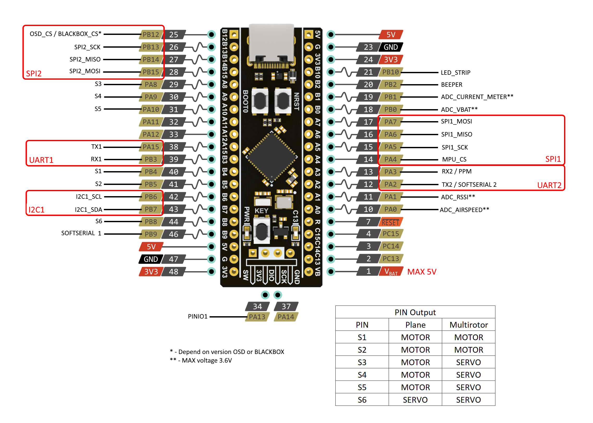

# Board - Blackpill F411 Developer Board
## Ports and pins

## Connect option
SPI1:
* MPU6000
* MPU6500
* MPU9250
-----------------
SPI2:

depend on version 
* BLACKBOX M25P16

OR
* OSD MAX7456
-----------------
I2C1:

Baro
* BMP080
* BMP280
* MS5611
* DPS310
* SPL06

Mag
* HMC5883
* QMC5883
* IST8310
* IST8308
* MAG3110
* LIS3MDL
* AK8975
## PINIO or SWDIO
Default PINIO is enabled. If you want use SWDIO just delete this lines from:

config.c:
```
#include "io/piniobox.h"
pinioBoxConfigMutable()->permanentId[0] = BOX_PERMANENT_ID_USER1;
```

target.h:
```
// *************** PINIO ***************************
#define USE_PINIO
#define USE_PINIOBOX
#define PINIO1_PIN                  PA13 // Camera switcher
```
