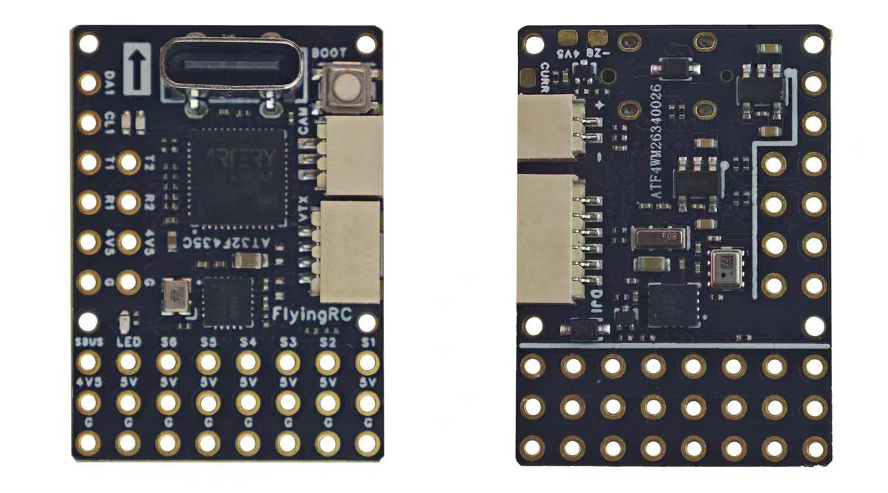
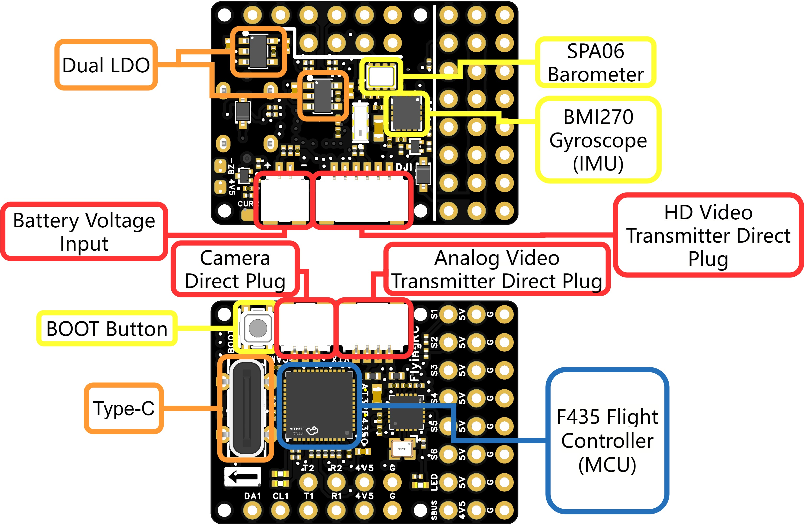

# Board - FlyingRC F435 Wing Mini

The FlyingRC F435 Wing Mini is a compact fixed-wing flight controller based on
the AT32F435 in a QFN48 package. Both the AT32F435CGU7 and AT32F435CMU7 hardware
variants use the same peripheral and connector layout.

## Firmware targets

| MCU | INAV target | Flash |
|---|---|---:|
| AT32F435CGU7 | `FLYINGRCF435WINGMINI` | 1 MiB |
| AT32F435CMU7 | `FLYINGRCF435WINGMINI_CMU7` | 4 MiB |

Board identifier: `FAM1`

## Board views

## Specifications

- BMI270 IMU
- SPA06 barometer
- MAX7456/AT7456E analog OSD
- Four full-duplex UARTs
- One external I2C bus
- Six motor/servo outputs
- USB virtual serial port
- Analog battery-voltage and current inputs
- External INA226 support on I2C1
- Two status LEDs, an addressable LED output, and a buzzer output
- No onboard SD card or flash storage

## Hardware overview

## Wiring example

The following manufacturer-provided diagram shows typical connections for an
analog video system, serial receivers, GPS, I2C airspeed sensor, DJI O4 Air Unit
and an external power module.

## Pinout

### Serial ports

| Port | TX | RX | Default use |
|---|---|---|---|
| UART1 | PA9 | PA10 | GPS |
| UART2 | PA2 | PA3 | Serial receiver (CRSF) |
| UART3 | PB10 | PB11 | Telemetry, VTX, or MSP |
| UART4 | PA0 | PA1 | General purpose |

### I2C1

| Signal | Pin |
|---|---|
| SCL | PB8 |
| SDA | PB9 |

The onboard SPA06 barometer uses I2C1. The same bus is available on the external
pads for magnetometers, airspeed sensors, rangefinders, additional barometers,
and INA226 battery monitors. The default INA226 address is `0x40`.

### Motor and servo outputs

| Output | Pin | Timer |
|---|---|---|
| OUT1 | PB12 | TMR5 CH1 |
| OUT2 | PH3 | TMR5 CH2 |
| OUT3 | PA15 | TMR2 CH1 |
| OUT4 | PB2 | TMR2 CH4 |
| OUT5 | PB6 | TMR4 CH1 |
| OUT6 | PB7 | TMR4 CH2 |

OUT4 shares PB2 with the MCU boot configuration function. The hardware keeps
the pin low during startup so that the normal firmware boot mode is selected.

### Battery monitoring

| Function | Pin | Notes |
|---|---|---|
| Battery voltage | PB1 | 200 kOhm / 10 kOhm divider (21:1) |
| Analog current | PB0 | Current-sensor analog output |

The default voltage scale is configured for the 200 kOhm / 10 kOhm divider.
Current can be measured using either the analog input or an external INA226 on
I2C1. Configure the INA226 address and shunt resistance in the INAV CLI.

### Indicators and other interfaces

| Function | Pin | Active level |
|---|---|---|
| Blue status LED | PB4 | Low |
| Green status LED | PB5 | Low |
| WS2812 LED output | PA8 | High |
| Buzzer | PH2 | Low |
| SWDIO | PA13 | - |
| SWCLK | PA14 | - |
| USB D- | PA11 | - |
| USB D+ | PA12 | - |

## IMU and OSD bus

The BMI270 and MAX7456/AT7456E share SPI1 and use independent chip-select pins.

| Signal | Pin |
|---|---|
| SPI1 SCK | PA5 |
| SPI1 MISO | PA6 |
| SPI1 MOSI | PA7 |
| BMI270 CS | PA4 |
| BMI270 interrupt | PC13 |
| MAX7456/AT7456E CS | PC14 |

The BMI270 alignment is defined by the target and does not require a board
alignment override in the configurator.

## Manufacturer

[FlyingRC F435 Wing Mini OSD product page](https://flyingrc-official.github.io/en/products/f435wing-mini-osd/)
