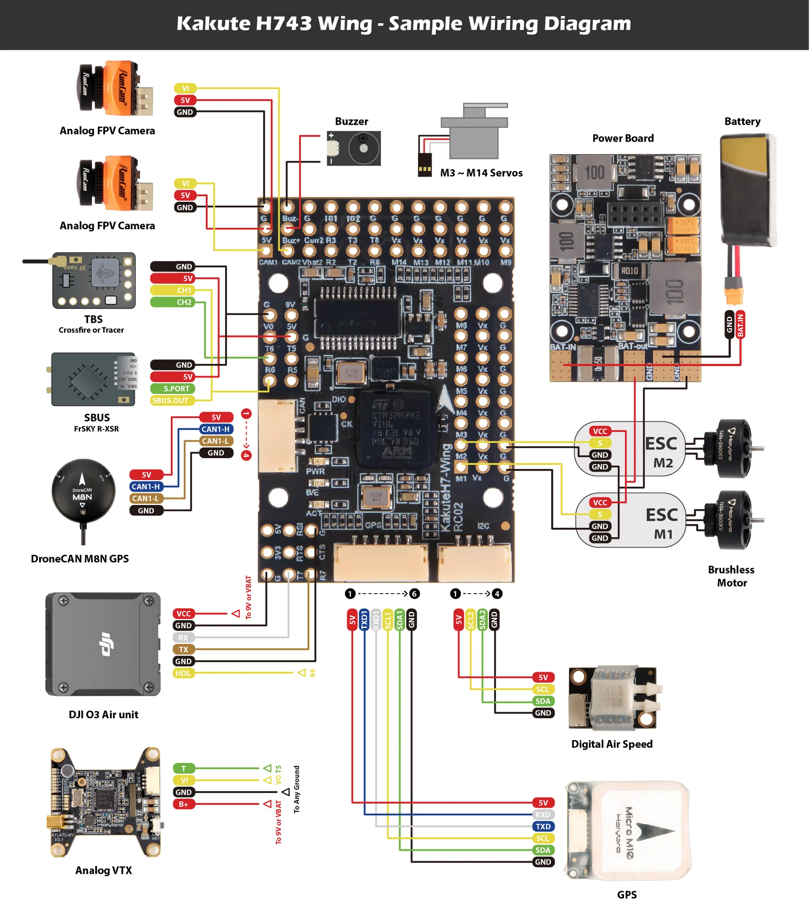

# Board - [KAKUTEH7WING](https://holybro.com/products/kakute-h743-wing)

[manufacturer manual](https://cdn.shopify.com/s/files/1/0604/5905/7341/files/Holybro_KakuteH743-Wing_Manual_v1.0_C.pdf?v=1693393206)

Note that this board has two i2c plugs.
The six-pin plug should be used for GPS and compass.
The 4-pin plug should be used for other i2c sesors such as i2c pitot (airspeed sensor), rangefinder, and external
temperature sensors.

