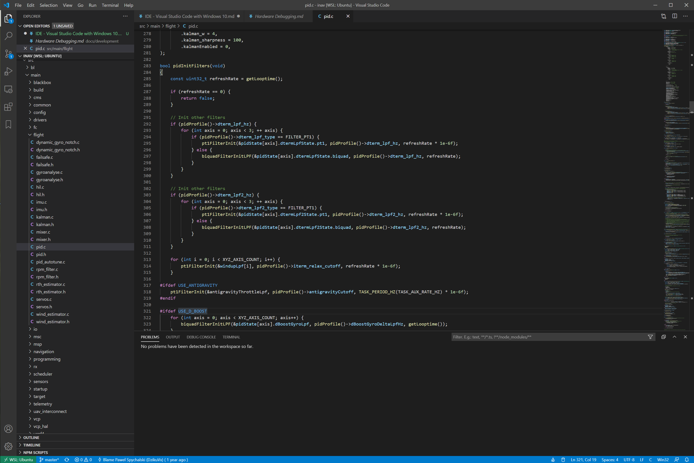

# IDE - Visual Studio Code with Windows 10



[Visual Studio Code](https://code.visualstudio.com/) is probably the best free option for all Windows 10 users. It provides almost seamless integration with WSL running Ubuntu, syntax highlighting, building, and hardware debugging.

## Setup

1. Setup build environment using [generic WSL guide](Building%20in%20Windows%2010%20with%20Linux%20Subsystem.md)
1. Download and install [Visual Studio Code](https://code.visualstudio.com/)
1. From the VS Code Extensions download [Remote - WSL](https://marketplace.visualstudio.com/items?itemName=ms-vscode-remote.remote-wsl) plugin
1. Open INAV folder
1. Use `Ctrl + Shift + P` to run option `Remote-WSL: Reopen Folder in WSL`
1. Allow firewall and other permissions if requested
1. Install plugins in WSL workspace:
    1. [C/C++ from Microsoft](https://marketplace.visualstudio.com/items?itemName=ms-vscode.cpptools) for C/C++ support
    1. [Bookmarks](https://marketplace.visualstudio.com/items?itemName=alefragnani.Bookmarks) for simpler navigation
1. Configure the environment using the following snippets as a base

### C propertiues

Edit file `./.vscode/c_cpp_properties.json` to setup enabled `defines`

```
{
    "configurations": [
        {
            "name": "Win32",
            "includePath": [
                "${workspaceRoot}",
                "${workspaceRoot}/src/main/**"
            ],
            "browse": {
                "limitSymbolsToIncludedHeaders": false,
                "path": [
                    "${workspaceRoot}/**"
                ]
            },
            "intelliSenseMode": "msvc-x64",
            "cStandard": "c11",
            "cppStandard": "c++17",
            "defines": [
                "USE_NAV",
                "NAV_FIXED_WING_LANDING",
                "USE_OSD",
                "USE_GYRO_NOTCH_1",
                "USE_GYRO_NOTCH_2",
                "USE_DTERM_NOTCH",
                "USE_ACC_NOTCH",
                "USE_GYRO_BIQUAD_RC_FIR2",
                "USE_D_BOOST",
                "USE_SERIALSHOT",
                "USE_ANTIGRAVITY",
                "USE_ASYNC_GYRO_PROCESSING",
                "USE_RPM_FILTER",
                "USE_GLOBAL_FUNCTIONS",
                "USE_DYNAMIC_FILTERS",
                "USE_IMU_BNO055",
                "USE_SECONDARY_IMU",
                "USE_DSHOT",
                "FLASH_SIZE 480",
                "USE_I2C_IO_EXPANDER",
                "USE_PCF8574",
                "USE_ESC_SENSOR"
            ]
        }
    ],
    "version": 4
}
```

### Tasks

Edit `./.vscode/tasks.json` to enable Building with `Ctrl + Shift + B` keyboard shortcut and from Command Console.

```
{
    // See https://go.microsoft.com/fwlink/?LinkId=733558
    // for the documentation about the tasks.json format
    "version": "2.0.0",
    "tasks": [
        {
            "label": "Build Matek F722-SE",
            "type": "shell",
            "command": "make MATEKF722SE",
            "group": "build",
            "problemMatcher": [],
            "options": {
                "cwd": "${workspaceFolder}/build"
            }
        },
        {
            "label": "Build Matek F722",
            "type": "shell",
            "command": "make MATEKF722",
            "group": {
                "kind": "build",
                "isDefault": true
            },
            "problemMatcher": [],
            "options": {
                "cwd": "${workspaceFolder}/build"
            }
        }
        ,
        {
            "label": "Install/Update CMAKE",
            "type": "shell",
            "command": "mkdir -p build && cd build && cmake ..",
            "group": "build",
            "problemMatcher": [],
            "options": {
                "cwd": "${workspaceFolder}"
            }
        }
    ]
}
```

