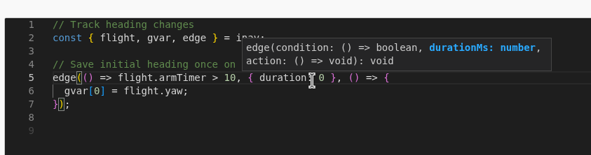
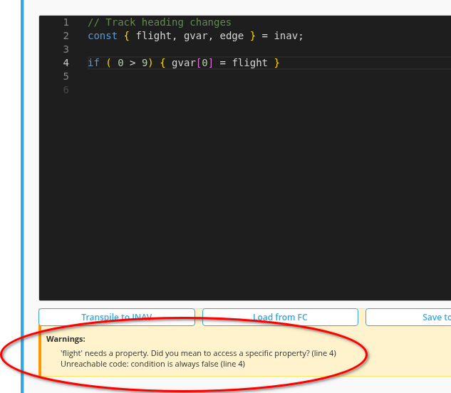
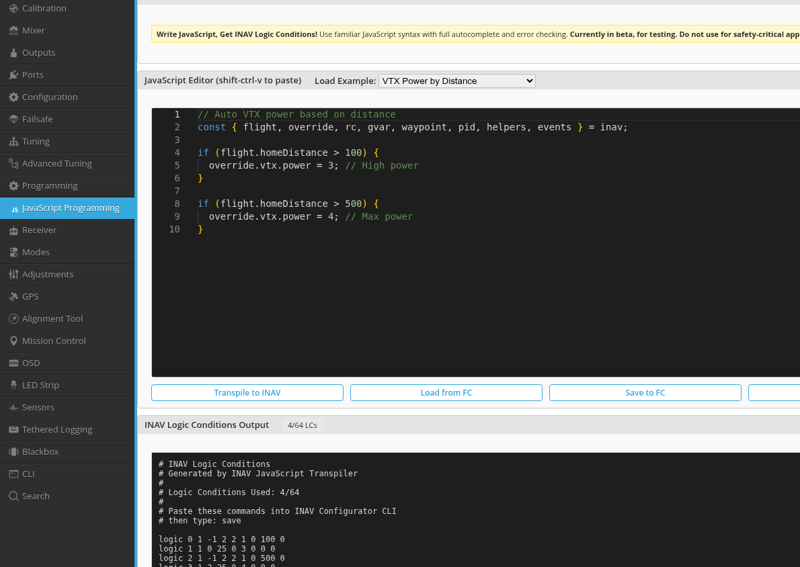
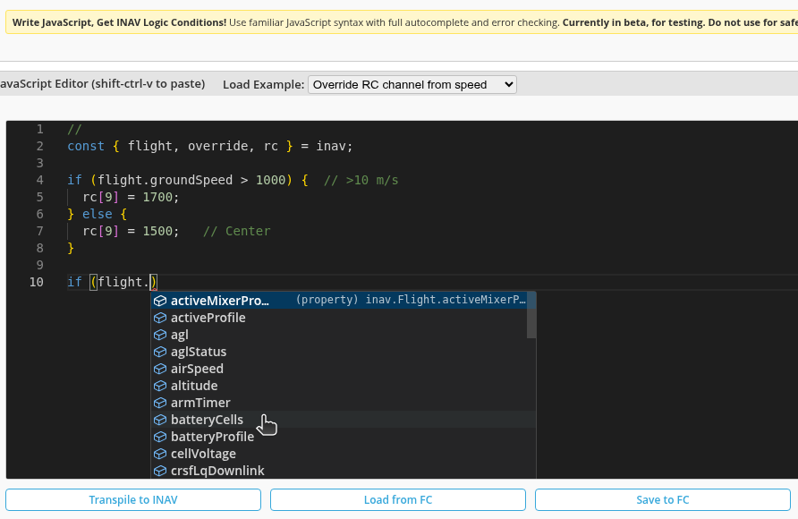

# INAV JavaScript Programming Documentation

Complete documentation for the INAV JavaScript transpiler that allows programming flight controller logic conditions in JavaScript.

## 📚 Table of Contents

- [Quick Start](#quick-start)
- [User Guides](#user-guides)
- [Developer Documentation](#developer-documentation)
- [Features](#features)

---

## Quick Start

The INAV JavaScript transpiler converts JavaScript code into INAV logic conditions, enabling you to program flight controller behavior using familiar JavaScript syntax instead of raw logic condition commands.

### Features at a Glance

**✨ Modern Development Experience**


*Real-time autocomplete with type information and documentation*


*Clear error messages with line numbers and suggestions*

### Basic Example

```javascript
const { flight, override } = inav;

// Increase VTX power when far from home
if (flight.homeDistance > 500) {
  override.vtx.power = 4;
}
```


*Complete example showing VTX power control based on distance*

### RC Channel Override Example


*Using RC channels to control behavior*

---

## User Guides

### 📖 [JavaScript Programming Guide](JAVASCRIPT_PROGRAMMING_GUIDE.md)
**Start here if you're new to INAV JavaScript programming**

Quick reference covering:
- Pattern guide: `if`, `edge()`, `sticky()`, `delay()`, `timer()`, `whenChanged()`
- Common patterns (initialization, event counting, debouncing)
- Key differences between patterns
- Available objects and APIs
- Debugging techniques

### 🔧 [Operations Reference](OPERATIONS_REFERENCE.md)
**Complete reference for all supported operations**

Comprehensive guide to all INAV logic condition operations:
- ✅ Arithmetic: `+`, `-`, `*`, `/`, `%`
- ✅ Comparisons: `===`, `>`, `<`, `approxEqual()`
- ✅ Logical: `&&`, `||`, `!`, `xor()`, `nand()`, `nor()`
- ✅ Math: `Math.min()`, `Math.max()`, `Math.sin()`, `Math.cos()`, `Math.tan()`, `Math.abs()`
- ✅ Scaling: `mapInput()`, `mapOutput()`
- ✅ Flow control: `edge()`, `sticky()`, `delay()`, `timer()`, `whenChanged()`
- ✅ Variables: `gvar[0-7]`, `let`, `var`
- ✅ Overrides: `override.vtx.*`, `override.throttle`, `override.armSafety`, etc.
- ✅ RC channel states: `rc[n].low`, `rc[n].mid`, `rc[n].high`, `rc[n].value`

Includes usage examples and notes for each operation.

### ⏱️ [Timer and WhenChanged Examples](TIMER_WHENCHANGED_EXAMPLES.md)
**Practical examples for time-based and change-detection patterns**

Examples covering:
- Timer patterns (blinking, cycling, periodic actions)
- Change detection (RSSI monitoring, altitude tracking)
- Combined patterns with multiple conditions
- Real-world use cases

---

## Developer Documentation

### 🏗️ [Technical Implementation Overview](implementation_summary.md)
**Architecture and design of the transpiler system**

Covers:
- System architecture and component interaction
- Transpiler pipeline (Parser → Analyzer → Optimizer → Codegen)
- Decompiler pattern recognition
- Key features and capabilities
- Integration with Monaco Editor

### 🧪 [Testing Guide](TESTING_GUIDE.md)
**How to test changes to the transpiler**

Essential reading before making changes:
- Which components need updates (parser, analyzer, codegen, decompiler)
- Round-trip testing template (JavaScript → CLI → JavaScript)
- Common issues and solutions
- Verification checklist
- Step-by-step example of adding a new operation

**Always use round-trip testing when modifying the transpiler!**

### 🔌 [API Definitions Summary](api_definitions_summary.md)
**Structure of the INAV API definitions**

Documents the API definition system:
- Available API objects (`flight`, `override`, `rc`, `gvar`, `waypoint`, etc.)
- Property types and metadata
- INAV operand mappings
- How definitions drive IntelliSense

### 🛠️ [API Maintenance Guide](api_maintenance_guide.md)
**How to add, modify, or maintain API definitions**

Step-by-step instructions for:
- Adding new properties to existing APIs
- Creating new API objects
- Updating operand mappings
- Testing API changes
- Common pitfalls

### ⏲️ [Timer and WhenChanged Implementation](TIMER_WHENCHANGED_IMPLEMENTATION.md)
**Technical details of TIMER and DELTA operations**

Implementation guide for:
- How TIMER operation works (operations 49)
- How DELTA operation works (operation 50)
- AST representation
- Code generation strategy
- Decompiler pattern recognition

### ⚙️ [Generate Constants README](GENERATE_CONSTANTS_README.md)
**How to regenerate INAV constants from firmware**

Instructions for:
- Extracting operation codes from firmware
- Regenerating `inav_constants.js`
- Keeping constants in sync with firmware
- What to do when firmware adds new operations

---

## Features

### Bidirectional Translation

- **Transpiler**: JavaScript → INAV Logic Conditions
- **Decompiler**: INAV Logic Conditions → JavaScript
- **Round-trip capable**: Code survives transpile/decompile cycles

### Development Experience

- **Monaco Editor Integration**: Full-featured code editor
- **IntelliSense**: Context-aware autocomplete with documentation
- **Real-time Validation**: Immediate feedback on syntax errors
- **Syntax Highlighting**: JavaScript syntax with INAV-specific extensions
- **Error Messages**: Clear, actionable error messages with line numbers

### Language Support

**All INAV Operations Supported:**
- Arithmetic operations
- Comparison and logical operations
- Math functions (trigonometry, min/max)
- Flow control (edge detection, sticky conditions, delays, timers)
- Variable management (global variables, let/var)
- RC channel access and state detection
- Flight parameter overrides
- Waypoint navigation

**JavaScript Features:**
- `const` destructuring: `const { flight, override } = inav;`
- `let` variables: compile-time constant substitution
- `var` variables: allocated to global variables
- Arrow functions: `() => condition`
- Object property access: `flight.altitude`, `rc[0].value`
- Binary expressions: `+`, `-`, `*`, `/`, `%`
- Comparison operators: `>`, `<`, `===`
- Logical operators: `&&`, `||`, `!`
- Math methods: `Math.min()`, `Math.max()`, `Math.sin()`, etc.

### Validation

- Property access validation against API definitions
- Range checking (gvar indices, heading values, etc.)
- Type checking for function arguments
- Dead code detection
- Uninitialized variable detection
- Helpful suggestions for common mistakes

### Optimization

- Common Subexpression Elimination (CSE)
- Efficient operand usage
- Optimized GVAR_INC/GVAR_DEC generation
- Minimal logic condition count

---

## File Organization

```
js/transpiler/
├── docs/                          # Documentation (this directory)
│   ├── index.md                   # This file - documentation index
│   ├── JAVASCRIPT_PROGRAMMING_GUIDE.md    # User guide
│   ├── OPERATIONS_REFERENCE.md            # All operations
│   ├── TIMER_WHENCHANGED_EXAMPLES.md      # Timer/change examples
│   ├── implementation_summary.md          # Technical overview
│   ├── TESTING_GUIDE.md                   # Testing workflow
│   ├── api_definitions_summary.md         # API structure
│   ├── api_maintenance_guide.md           # API maintenance
│   ├── GENERATE_CONSTANTS_README.md       # Constants generation
│   ├── TIMER_WHENCHANGED_IMPLEMENTATION.md # Implementation details
│   ├── intellisense.png                   # Screenshot: autocomplete
│   ├── warnings.png                       # Screenshot: errors
│   ├── example_vtx_power.png              # Screenshot: VTX example
│   └── example_override_rc.png            # Screenshot: RC example
├── api/                           # API definitions
│   └── definitions/               # INAV API object definitions
├── editor/                        # Monaco editor integration
│   ├── monaco_setup.js            # Editor configuration
│   ├── intellisense.js            # Autocomplete provider
│   └── diagnostics.js             # Real-time validation
├── transpiler/                    # Core transpiler
│   ├── index.js                   # Main transpiler entry point
│   ├── parser.js                  # JavaScript parser (Acorn wrapper)
│   ├── analyzer.js                # Semantic analysis
│   ├── optimizer.js               # Code optimization (CSE)
│   ├── codegen.js                 # INAV command generation
│   ├── decompiler.js              # INAV → JavaScript
│   ├── inav_constants.js          # Operation codes and types
│   ├── variable_handler.js        # let/var variable management
│   ├── arrow_function_helper.js   # Arrow function utilities
│   └── error_handler.js           # Error collection
└── tools/                         # Build tools
    └── generate-constants.js      # Extract constants from firmware
```

---

## Getting Help

### Common Questions

**Q: Which pattern should I use?**
- Use `if` for continuous control (checking every cycle)
- Use `edge()` for one-time actions when condition becomes true
- Use `sticky()` for latching conditions with hysteresis
- Use `delay()` for actions that need sustained conditions
- Use `timer()` for periodic toggling
- Use `whenChanged()` for detecting value changes

See the [JavaScript Programming Guide](JAVASCRIPT_PROGRAMMING_GUIDE.md) for detailed examples.

**Q: How do I debug my code?**
Use global variables to track state and view them in the OSD or configurator. See the debugging section in the [JavaScript Programming Guide](JAVASCRIPT_PROGRAMMING_GUIDE.md).

**Q: What operations are supported?**
All INAV logic condition operations! See [Operations Reference](OPERATIONS_REFERENCE.md) for the complete list.

**Q: How do I contribute?**
Read the [Testing Guide](TESTING_GUIDE.md) to understand the testing workflow, then make your changes ensuring all 4 components (parser, analyzer, codegen, decompiler) are updated and round-trip tested.

---

## Version History

**2025-11-25**: Complete implementation
- All INAV logic condition operations now supported
- RC channel state detection (LOW/MID/HIGH)
- XOR/NAND/NOR logical operations
- APPROX_EQUAL comparison
- MAP_INPUT/MAP_OUTPUT scaling
- Comprehensive documentation

**Last Updated**: 2025-11-25
