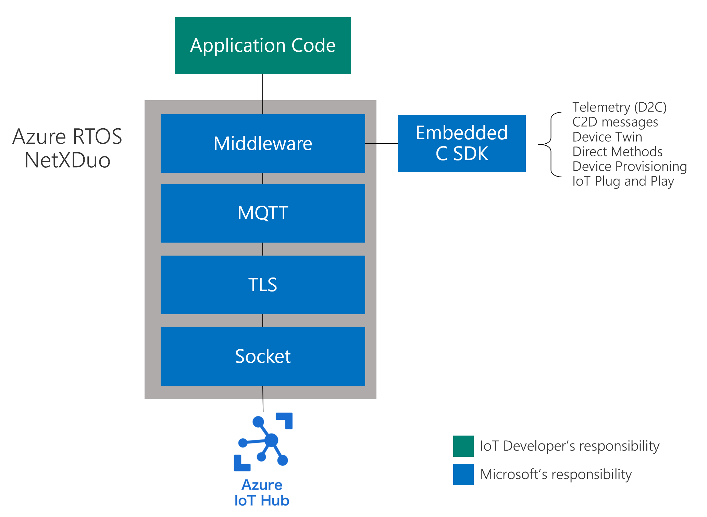

# Azure IoT Middleware for Azure RTOS

Azure IoT Middleware for Azure RTOS is a platform specific library that acts as a binding layer between the Azure RTOS and the [Azure SDK for Embedded C](https://github.com/Azure/azure-sdk-for-c). Goals of this layer are following:

* Expose smart client interfaces (IoTHub_Client, DeviceProvisioning_Client) for the customers, to be consumed in their application.
* Orchestrate the interaction between Embedded C SDK and platform.
* Provide Azure RTOS platform initialization.
* [IoT Plug and Play](https://learn.microsoft.com/azure/iot-develop/overview-iot-plug-and-play) support.
* Security capabilities.
* Resource limitation aware.
* Protocol support.

## Getting Started

See the following samples on how to get started on development boards with Azure IoT Middleware for Azure RTOS:

Manufacturer | Device | Samples |
| --- | --- | --- |
| STMicroelectronics | [STM32F746GDISCOVERY](https://www.st.com/en/evaluation-tools/32f746gdiscovery.html) | [IAR](https://aka.ms/azrtos-sample/f746g-iar) • [STM32Cube](https://aka.ms/azrtos-sample/f746g-cubeide)
| STMicroelectronics | [B-L4S5I-IOT01](https://www.st.com/en/evaluation-tools/b-l4s5i-iot01a.html) / [B-L475E-IOT01](https://www.st.com/en/evaluation-tools/b-l475e-iot01a.html) | [GCC/CMake](https://github.com/azure-rtos/getting-started/tree/master/STMicroelectronics/STM32L4_L4%2B) • [IAR](https://aka.ms/azrtos-sample/l4s5-iar) • [STM32Cube](https://aka.ms/azrtos-sample/l4s5-cubeide)
| NXP | [MIMXRT1060-EVK](https://www.nxp.com/design/development-boards/i-mx-evaluation-and-development-boards/mimxrt1060-evk-i-mx-rt1060-evaluation-kit:MIMXRT1060-EVK) | [GCC/CMake](https://github.com/azure-rtos/getting-started/tree/master/NXP/MIMXRT1060-EVK) • [IAR](https://aka.ms/azrtos-sample/rt1060-iar) • [MCUXpresso](https://aka.ms/azrtos-sample/rt1060-mcuxpresso)
| Renesas | [RX65N-RSK-2MB](https://www.renesas.com/us/en/products/microcontrollers-microprocessors/rx-32-bit-performance-efficiency-mcus/rx65n-2mb-starter-kit-plus-renesas-starter-kit-rx65n-2mb) | [GCC/CMake](https://github.com/azure-rtos/getting-started/tree/master/Renesas/RSK_RX65N_2MB) • [IAR](https://aka.ms/azrtos-samples/rx65n-rsk-2mb-iar) • [E2Studio CCRX](https://aka.ms/azrtos-samples/rx65n-rsk-2mb-ccrx) • [E2Studio GNURX](https://aka.ms/azrtos-samples/rx65n-rsk-2mb-gnurx)
| Renesas | [RX65N-Cloud-Kit](https://www.renesas.com/us/en/products/microcontrollers-microprocessors/rx-32-bit-performance-efficiency-mcus/rx65n-cloud-kit-renesas-rx65n-cloud-kit) | [E2Studio CCRX](https://aka.ms/azrtos-samples/rx65n-ck-ccrx) • [E2Studio GNURX](https://aka.ms/azrtos-samples/rx65n-ck-gnurx)
| Microchip | [ATSAME54-XPRO](https://www.microchip.com/developmenttools/productdetails/atsame54-xpro) | [GCC/CMake](https://github.com/azure-rtos/getting-started/tree/master/Microchip/ATSAME54-XPRO) • [IAR](https://aka.ms/azrtos-sample/e54-iar) • [MPLAB](https://aka.ms/azrtos-sample/e54-mplab)
| MXCHIP | [AZ3166](https://aka.ms/iot-devkit) | [GCC/CMake](https://github.com/azure-rtos/getting-started/tree/master/MXChip/AZ3166)

## Building

The Azure IoT Middleware for Azure RTOS is built as part of the NetX Duo. Make sure you have defined the following macros in the `CMakeLists.txt` or `nx_user.h` when building it:

Module | Macros |
| --- | --- |
| Azure IoT Middleware for Azure RTOS | `NX_ENABLE_EXTENDED_NOTIFY_SUPPORT`  `NX_SECURE_ENABLE`  `NXD_MQTT_CLOUD_ENABLE`
| Azure Defender for IoT security module | `NX_ENABLE_IP_PACKET_FILTER`

Follow [`nx_user_sample.h`](https://github.com/azure-rtos/netxduo/blob/master/common/inc/nx_user_sample.h) to see how to define these macros in the NetX user header file.

## Features

Azure IoT Middleware for Azure RTOS stays as an addon module for the Azure RTOS NetX Duo. It facilitates the MQTT and TLS stacks that are also as part of NetX Duo addons.

### Basic features 

* Connect to Azure IoT Hub via MQTT.
* Support of IoT Hub primitive data format: [device to cloud (D2C) message](https://learn.microsoft.com/azure/iot-hub/iot-hub-devguide-d2c-guidance), [Device Twins](https://learn.microsoft.com/azure/iot-hub/iot-hub-devguide-device-twins) and [Direct methods](https://learn.microsoft.com/azure/iot-hub/iot-hub-devguide-direct-methods).
* Support of IoT Plug and Play data format: Telemetry, Properties and Commands.
* Authentication: SAS Token and X.509 client certificate.
* JSON parsers.

### Device Update for IoT Hub

[Device Update for IoT Hub](https://learn.microsoft.com/azure/iot-hub-device-update/understand-device-update) is an Azure service that enables you to deploy over-the-air updates (OTA) for your IoT devices. The [Device Update for IoT Hub agent](https://learn.microsoft.com/azure/iot-hub-device-update/device-update-azure-real-time-operating-system) in the IoT Middleware provides simple APIs for device builders to integrate the OTA capability easily.

See the [samples](https://github.com/azure-rtos/samples) of semiconductor's hero development boards with detailed guides to learn configure, build and deploy the over-the-air (OTA) updates to the devices.

### Microsoft Defender for IoT

[Microsoft Defender for IoT](https://learn.microsoft.com/azure/defender-for-iot/device-builders/overview) provides a comprehensive security solution for Azure RTOS devices. The built-in [IoT Security Module](https://learn.microsoft.com/azure/defender-for-iot/device-builders/iot-security-azure-rtos) in IoT Middleware is enabled by default to detect common threats and potential malicious activities.

#### Opt-out

To disable (opt-out) the module for your application, you can choose one of these two options:
* Define `NX_AZURE_DISABLE_IOT_SECURITY_MODULE` in NetX Duo header file such as `nx_user.h` when building the project.
* Call [`UINT nx_azure_iot_security_module_disable(NX_AZURE_IOT *nx_azure_iot_ptr)`](https://docs.microsoft.com/azure/defender-for-iot/azure-rtos-security-module-api#disable-azure-iot-security-module) in your application code.

#### Data collection

By enabling the module, it analyzes inbound and outbound network activity on IPv4 and IPv6 with supported protocols of **TCP**, **UDP** and **ICMP**. And with below data collected:

* Local and remote address / port
* Bytes in / out

#### Footprint

IoT Security Module leverages existing Azure RTOS resources, and sends security messages in the background, without interfering with the user application, using the same connection to the IoT Hub.

The extra resource it will take on device and connection:

**Memory Footprint** (using default config - 4 unique monitored connection in IPv4 in an hour):
Toolchain | RAM | ROM |
| --- | --- | --- |
| IAR Embedded Workbench (iccarm) | 4Kb | 10Kb
| GNU ARM Embedded Toolchain (arm-gcc) | 4Kb | 13Kb

**Additional Connection**:
Connection Type | RAM | Network |
| --- | --- | --- |
| IPv4 | 52bytes | 36bytes
| IPv6 | 200bytes | 60bytes

So the total additional connection traffic will be:
*Total (in bytes) = Metadata (e.g. 300 bytes) + IPv4 Connections * 36 + IPv6 Connections * 60*

## APIs

* [nx_azure_iot](./azure_rtos_iot.md)    
* [nx_azure_iot_hub_client](./azure_rtos_iot_hub_client.md)
* [nx_azure_iot_hub_client_properties](./azure_rtos_iot_hub_client_properties.md)
* [nx_azure_iot_provisioning_client](./azure_rtos_iot_provisioning_client.md)
* [nx_azure_iot_json](./azure_rtos_iot_json.md)
* [nx_azure_iot_adu_agent](./azure_rtos_iot_adu_agent.md)
* [nx_azure_iot_security_module](../azure_iot_security_module/docs/nx_azure_iot_security_module.md)

## Need Help?

Find support channels in the [Resources](https://github.com/azure-rtos/netxduo#resources) list.

## Licensing

View [Licensing](https://github.com/azure-rtos/netxduo#licensing) of Azure RTOS NetX Duo.
