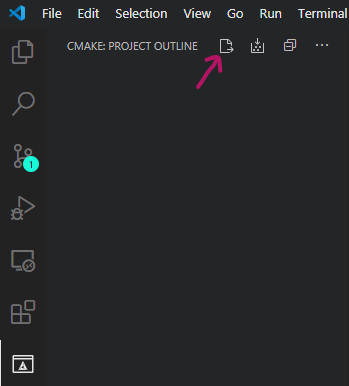

# Azure SDK for Embedded C

[](https://dev.azure.com/azure-sdk/public/_build/latest?definitionId=722&branchName=main)

The Azure SDK for Embedded C is designed to allow small embedded (IoT) devices to communicate with Azure services. Since we expect our client library code to run on microcontrollers, which have very limited amounts of flash and RAM, and have slower CPUs, our C SDK does things very differently than the SDKs we offer for other languages.

With this in mind, there are many tenets or principles that we follow in order to properly address this target audience:

- Customers of our SDK compile our source code along with their own.

- We target the C99 programming language and test with gcc, clang, & MS Visual C compilers.

- We offer very few abstractions making our code easy to understand and debug.

- Our SDK is non allocating. That is, customers must allocate our data structures where they desire (global memory, heap, stack, etc.) and then pass the address of the allocated structure into our functions to initialize them and in order to perform various operations.

- Unlike our other language SDKs, many things (such as composing an HTTP pipeline of policies) are done in source code as opposed to runtime. This reduces code size, improves execution speed and locks-in behavior, reducing the chance of bugs at runtime.

- We support microcontrollers with no operating system, microcontrollers with a real-time operating system (like [Azure RTOS](https://azure.microsoft.com/services/rtos/)), Linux, and Windows. Customers can implement custom platform layers to use our SDK on custom devices.  We provide some platform layers, and encourage the community to submit platform layers to increase the out-of-the-box supported platforms.

For higher level abstractions built on top of this repo, please see the following:

- [Azure IoT middleware for Azure RTOS](https://github.com/azure-rtos/netxduo/tree/master/addons/azure_iot) builds on top of the embedded SDK and tightly couples with the Azure RTOS family of networking and OS products. This gives you very performant and small applications for real-time, constrained devices.
- [Azure IoT middleware for FreeRTOS](https://github.com/Azure/azure-iot-middleware-freertos) builds on top of the embedded SDK and takes care of the MQTT stack while integrating with FreeRTOS. This maintains the focus on constrained devices and gives users a distilled Azure IoT feature set while allowing for flexibility with their networking stack.

## Table of Contents

- [Azure SDK for Embedded C](#azure-sdk-for-embedded-c)
  - [Table of Contents](#table-of-contents)
  - [Documentation](#documentation)
  - [The GitHub Repository](#the-github-repository)
    - [Services](#services)
    - [Structure](#structure)
    - [Main Branch](#main-branch)
    - [Release Branches and Release Tagging](#release-branches-and-release-tagging)
  - [Getting Started Using the SDK](#getting-started-using-the-sdk)
    - [CMake](#cmake)
    - [CMake Options](#cmake-options)
    - [Consume SDK for C as Dependency with CMake](#consume-sdk-for-c-as-dependency-with-cmake)
    - [Visual Studio Code](#visual-studio-code)
    - [Source Files (IDE, command line, etc)](#source-files-ide-command-line-etc)
  - [Running Samples](#running-samples)
    - [Storage Sample](#storage-sample)
    - [Libcurl Global Init and Global Clean Up](#libcurl-global-init-and-global-clean-up)
    - [IoT samples](#iot-samples)
    - [Development Environment](#development-environment)
      - [Third Party Dependencies](#third-party-dependencies)
      - [Build](#build)
    - [Using your own HTTP stack implementation](#using-your-own-http-stack-implementation)
    - [Link your application with your own HTTP stack](#link-your-application-with-your-own-http-stack)
  - [SDK Architecture](#sdk-architecture)
  - [Contributing](#contributing)
    - [Additional Helpful Links for Contributors](#additional-helpful-links-for-contributors)
    - [Community](#community)
    - [Reporting Security Issues and Security Bugs](#reporting-security-issues-and-security-bugs)
    - [License](#license)
    - [Trademarks](#trademarks)

## Documentation

We use [doxygen](https://www.doxygen.nl) to generate documentation for source code. You can find the generated, versioned documentation [here](https://azure.github.io/azure-sdk-for-c).

## The GitHub Repository

To get help with the SDK:

- File a [Github Issue](https://github.com/Azure/azure-sdk-for-c/issues/new/choose).
- Ask new questions or see others' questions on [Stack Overflow](https://stackoverflow.com/questions/tagged/azure+c) using the `azure` and `c` tags.

### Services

The Azure SDK for Embedded C repo has been structured around the service libraries it provides:

1. [IoT](https://github.com/Azure/azure-sdk-for-c/blob/main/sdk/docs/iot) - Library to connect Embedded Devices to Azure IoT services

### Structure

This repo is structured with two priorities:

1. Separation of services/features to make it easier to find relevant information and resources.
2. Simplified source file structuring to easily integrate features into a user's project.

`/sdk` - folder containing docs, sources, samples, tests for all SDK packages<br>
&nbsp;&nbsp;&nbsp;&nbsp;`/docs` - documentation for each service (iot, etc)<br>
&nbsp;&nbsp;&nbsp;&nbsp;`/inc` - include directory - can be singularly included in your project to resolve all headers<br>
&nbsp;&nbsp;&nbsp;&nbsp;`/samples` - samples for each service<br>
&nbsp;&nbsp;&nbsp;&nbsp;`/src` - source files for each service<br>
&nbsp;&nbsp;&nbsp;&nbsp;`/tests` - tests for each service<br>

For instructions on how to consume the libraries via CMake, please see [here](#cmake). For instructions on how consume the source code in an IDE, command line, or other build systems, please see [here](#source-files-ide-command-line-etc).

### Main Branch

The main branch has the most recent code with new features and bug fixes. It does **not** represent the latest General Availability (**GA**) release of the SDK.

### Release Branches and Release Tagging

When we make an official release, we will create a unique git tag containing the name and version to mark the commit. We'll use this tag for servicing via hotfix branches as well as debugging the code for a particular beta or stable release version. A release tag looks like this:

   `<package-name>_<package-version>`

 The latest release can be found in the [release section](https://github.com/Azure/azure-sdk-for-c/releases) of this repo.

 For more information, please see this [branching strategy](https://github.com/Azure/azure-sdk/blob/main/docs/policies/repobranching.md#release-tagging) document.

## Getting Started Using the SDK

The SDK can be conveniently consumed either via CMake or other non-CMake methods (IDE workspaces, command line, and others).

### CMake

1. Install the required prerequisites:
   - [CMake](https://cmake.org/download/) version 3.10 or later
   - C compiler: [MSVC](https://visualstudio.microsoft.com/downloads/#build-tools-for-visual-studio-2019), [gcc](https://gcc.gnu.org/) or [clang](https://clang.llvm.org/) are recommended
   - [git](https://git-scm.com/downloads) to clone our Azure SDK repository with the desired tag

2. Clone our Azure SDK repository, optionally using the desired version tag.

        git clone https://github.com/Azure/azure-sdk-for-c

        git checkout <tag_name>

    For information about using a specific client library, see the README file located in the client library's folder which is a subdirectory under the [`/sdk/docs`](https://github.com/Azure/azure-sdk-for-c/blob/main/sdk/docs) folder.

3. Ensure the SDK builds correctly.

   - Create an output directory for your build artifacts (in this example, we named it `build`, but you can pick any name).

          mkdir build

   - Navigate to that newly created directory.

          cd build

   - Run `cmake` pointing to the sources at the root of the repo to generate the builds files.

          cmake ..

   - Launch the underlying build system to compile the libraries.

          cmake --build .

   This results in building each library as a static library file, placed in the output directory you created (for example `build\sdk\core\az_core\Debug`). At a minimum, you must have an `Azure Core` library, a `Platform` library, and an `HTTP` library. Then, you can build any additional Azure service client library you intend to use from within your application (for example `build\sdk\iot\Debug`). To use our client libraries in your application, just `#include` our public header files and then link your application's object files with our library files.

4. Provide platform-specific implementations for functionality required by `Azure Core`. For more information, see the [Azure Core Porting Guide](https://github.com/Azure/azure-sdk-for-c/tree/main/sdk/docs/core#porting-the-azure-sdk-to-another-platform).

### CMake Options

By default, when building the project with no options, the following static libraries are generated:

- ``Libraries``:
  - az_core
    - az_span, az_http, az_json, etc.
  - az_iot
    - iot_provisioning, iot_hub, etc.
  - az_noplatform
    - A platform abstraction which will compile but returns `AZ_ERROR_DEPENDENCY_NOT_PROVIDED` from all its functions. This ensures the project can be compiled without the need to provide any specific platform implementation. This is useful if you want to use az_core without platform specific functions like `time` or `sleep`.
  - az_nohttp
    - Library that provides a no-op HTTP stack, returning `AZ_ERROR_DEPENDENCY_NOT_PROVIDED`. Similar to `az_noplatform`, this library ensures the project can be compiled without requiring any HTTP stack implementation. This is useful if you want to use `az_core` without `az_http` functionality.

The following CMake options are available for adding/removing project features.

<table>
<tr>
<td>Option</td>
<td>Description</td>
<td>Default Value</td>
</tr>
<tr>
<td>UNIT_TESTING</td>
<td>Generates Unit Test for compilation. When turning this option ON, cmocka is a required dependency for compilation.<br>After Compiling, use `ctest` to run Unit Test.</td>
<td>OFF</td>
</tr>
<tr>
<td>UNIT_TESTING_MOCKS</td>
<td>This option works only with GCC. It uses -ld option from linker to mock functions during unit test. This is used to test platform or HTTP functions by mocking the return values.</td>
<td>OFF</td>
</tr>
<tr>
<td>PRECONDITIONS</td>
<td>Turning this option OFF would remove all method contracts. This is typically for shipping libraries for production to make it as optimized as possible.</td>
<td>ON</td>
</tr>
<tr>
<td>TRANSPORT_CURL</td>
<td>This option requires Libcurl dependency to be available. It generates an HTTP stack with libcurl for az_http to be able to send requests thru the wire. This library would replace the no_http.</td>
<td>OFF</td>
</tr>
<tr>
<td>TRANSPORT_PAHO</td>
<td>This option requires paho-mqtt dependency to be available. Provides Paho MQTT support for IoT.</td>
<td>OFF</td>
</tr>
<tr>
<td>AZ_PLATFORM_IMPL</td>
<td>This option can be set to any of the next values:<br>- No_value: default value is used and no_platform library is used.<br>- "POSIX": Provides implementation for Linux and Mac systems.<br>- "WIN32": Provides platform implementation for Windows based system<br>- "CUSTOM": Tells cmake to use an specific implementation provided by user. When setting this option, user must provide an implementation library and set option `AZ_CUSTOM_PLATFORM_IMPL_NAME` with the name of the library (i.e. <code>-DAZ_PLATFORM_IMPL=CUSTOM -DAZ_CUSTOM_PLATFORM_IMPL_NAME=user_platform_lib</code>). cmake will look for this library to link az_core</td>
<td>No_value</td>
</tr>
<tr>
<td>ADDRESS_SANITIZER</td>
<td>This option enables asan (address sanitizer). This works on Windows and Linux and will catch memory errors at runtime. This option may also work on other platforms supporting address sanitizer. Do not use this option in production as asan is not a hardening tool and can leak layout information and defeat ASLR.</td>
<td>OFF</td>
</tr>
</table>

- ``Samples``: Storage Samples are built by default using the default PAL and HTTP adapter (see [running samples](#running-samples)). This means that running samples without building an HTTP transport adapter would throw errors like:

      ./blobs_client_example.exe
      Running sample with no_op HTTP implementation.
      Recompile az_core with an HTTP client implementation like CURL to see sample sending network requests.

      i.e. cmake -DTRANSPORT_CURL=ON ..

### Consume SDK for C as Dependency with CMake
Azure SDK for C can be automatically checked out by cmake and become a build dependency. This is done by using [FetchContent](https://cmake.org/cmake/help/v3.11/module/FetchContent.html).

Using this option would skip manually getting the Azure SDK for C source code to build and installing it (or making it available from some include path). Instead, CMake would do this for us.

Azure SDK for C provides a [CMake module](https://github.com/Azure/azure-sdk-for-c/blob/main/cmake-modules/AddAzureSDKforC.cmake) that can be copied and used for this purpose.

### Visual Studio Code

For convenience, you can quickly get started using [Visual Studio Code](https://code.visualstudio.com/) and the [CMake Extension by Microsoft](https://marketplace.visualstudio.com/items?itemName=ms-vscode.cmake-tools&ssr=false#overview). Included in the repo is a `settings.json` file [here](https://github.com/Azure/azure-sdk-for-c/blob/main/.vscode-config/settings.json) which the extension will use to configure a CMake project. To use it, copy the `settings.json` file from `.vscode-config` to your own `.vscode` directory. With this, you can run and debug samples and tests. Modify the variables in the file to your liking or as instructed by sample documentation and then select the following button in the extension:



From there you can select targets to build and debug.

**NOTE**: Especially on Windows, make sure you select a compiler platform version that matches the dependencies installed via vcpkg (i.e. `x64` or `x86`). Additionally, the triplet to use should be specified in the `VCPKG_DEFAULT_TRIPLET` field in `settings.json`.

### Source Files (IDE, command line, etc)

We have set up the repo for easy integration into other projects which don't use CMake. Two main features make this possible:

- To resolve all header file relative paths, you only need to include `sdk/inc` in your project. All available header files for a service can be included with our simplified, all-inclusive service headers (`<az/az_<service>.h>`). For example:

```c
#include <az/az_core.h>
#include <az/az_iot.h>
```

- All source files are placed in a directory structure similar to the headers: `sdk/src`. Each service has its own subdirectory to separate files which you may be singularly interested in.

To use a specific service/feature, you may include the header file with the function declaration and compile the according `.c` containing the function implementation with your project.

The specific dependencies of each service may vary, but a couple rules of thumb should resolve the most typical of issues.

1. All services depend on `core` ([source files here](https://github.com/Azure/azure-sdk-for-c/tree/main/sdk/src/azure/core)). You may compile these files with your project to resolve core dependencies.
2. Most services will require a platform file to be compiled with your project ([see here for porting instructions](https://github.com/Azure/azure-sdk-for-c/tree/main/sdk/docs/core#porting-the-azure-sdk-to-another-platform)). We have provided several implementations already [here](https://github.com/Azure/azure-sdk-for-c/tree/main/sdk/src/azure/platform) for [`windows`](https://github.com/Azure/azure-sdk-for-c/blob/main/sdk/src/azure/platform/az_win32.c), [`posix`](https://github.com/Azure/azure-sdk-for-c/blob/main/sdk/src/azure/platform/az_posix.c), and a [`no_platform`](https://github.com/Azure/azure-sdk-for-c/blob/main/sdk/src/azure/platform/az_noplatform.c) for no-op stubs. Please compile one of these, for your respective platform, with your project.

The following compilation, preprocessor options will add or remove functionality in the SDK.

| Option | Description |
| ------ | ----------- |
| `AZ_NO_PRECONDITION_CHECKING` | Turns off precondition checks to maximize performance with removal of function precondition checking. |
| `AZ_NO_LOGGING` | Removes all logging code and artifacts from the SDK (helps reduce code size). |

## Running Samples

See [cmake options](#cmake-options) to learn about how to build an HTTP transport adapter, how to build IoT samples, and to turn logging on.


### Storage Sample
The storage sample expects a storage account with a container and SaS token used for authentication to be set in an environment variable `AZURE_STORAGE_URL`.

Note: Building samples can be disabled by setting `AZ_SDK_C_NO_SAMPLES` environment variable.

```bash
# On linux, set env var like this. For Windows, do it from advanced settings/ env variables

export ENV_URL="https://??????????????"
```

### Libcurl Global Init and Global Clean Up

When you select to build the libcurl http stack implementation, you have to make sure to call `curl_global_init` before using SDK client to send HTTP request to Azure.

You need to also call `curl_global_cleanup` once you no longer need to perform SDk client API calls.

Note how you can use function `atexit()` to set libcurl global clean up.

The reason for this is the fact of this functions are not thread-safe, and a customer can use libcurl not only for Azure SDK library but for some other purpose. More info [here](https://curl.haxx.se/libcurl/c/curl_global_init.html).

**This is libcurl specific only.**

### IoT samples
Samples for IoT will be built only when CMake option `TRANSPORT_PAHO` is set.
See [compiler options](#compiler-options).
For more information about IoT APIs and samples, see [Azure IoT Clients](https://github.com/Azure/azure-sdk-for-c/tree/main/sdk/docs/iot#azure-iot-clients).


### Development Environment

Project contains files to work on Windows, Mac or Linux based OS.

**Note** For any environment variables set to use with CMake, the environment variables must be set
BEFORE the first cmake generation command (`cmake ..`). The environment variables will NOT be picked up
if you have already generated the build files, set environment variables, and then regenerate. In that
case, you must either delete the `CMakeCache.txt` file or delete the folder in which you are generating build
files and start again.

### Third Party Dependencies

Azure SDK uses Vcpkg manifest mode to declare the [list of required 3rd party dependencies](https://github.com/Azure/azure-sdk-for-c/blob/main/vcpkg.json) for building the SDK libraries. It will also get and set up Vcpkg automatically. 

>Go to [next section](#build) and skip the next part if you are not interested in learning about alternatives for setting up dependencies.

#### Customize the Vcpkg dependency integration

If the CMake option _-DCMAKE_TOOLCHAIN_FILE=..._ is not defined to generate the project, the Azure SDK project will automatically get Vcpkg and link it to get the required dependencies. You can use the next environment variables to change this behavior:

<center>

<table>
<tr>
<td>Environment Variable</td>
<td>Description</td>
</tr>
<tr>
<td>AZURE_SDK_DISABLE_AUTO_VCPKG</td>
<td>When defined, Vcpkg won't be automatically cloned and linked. Use this setting, for example, if your dependencies are installed on the system and you don't need to get them.</td>
</tr>
<tr>
<td>AZURE_SDK_VCPKG_COMMIT</td>
<td>This variable can set the git commit id to be used when automatically cloning Vcpkg.</td>
</tr>
<tr>
<td>VCPKG_ROOT</td>
<td>Use this variable to set an existing Vcpkg folder from your system to be linked for building. Use this, for example, when working with Vcpkg classic mode, to switch between different Vcpkg folders.</td>
</tr>
</table>

</center>

### Build

Follow next steps to build project from command prompt:

```bash
# cd to project folder
cd azure-sdk-for-c
# create a new folder to generate cmake files for building (i.e. build)
mkdir build
cd build
# generate files
# cmake will automatically detect what C compiler is used by system by default and will generate files for it
cmake ..
# compile files. Cmake would call compiler and linker to generate libs
cmake --build .
```

> Note: The steps above would compile and generate the default output for azure-sdk-for-c which includes static libraries only. See section [CMake Options](#cmake-options)

#### Visual Studio 2019

Visual Studio will read cmake files and generate cache files automatically.

### Using your own HTTP stack implementation

You can create and use your own HTTP stack and adapter. This is to avoid the libcurl implementation from Azure SDK.

The first step is to understand the two components that are required. The first one is an **HTTP stack implementation** that is capable of sending bits through the wire. Some examples of these are libcurl, win32, etc.

The second component is an **HTTP transport adapter**. This is the implementation code which takes an http request from Azure SDK Core and uses it to send it using the specific HTTP stack implementation. Azure SDK Core provides the next contract that this component needs to implement:

```c
AZ_NODISCARD az_result
az_http_client_send_request(az_http_request const* request, az_http_response* ref_response);
```

For example, Azure SDK provides a cmake target `az_curl` (find it [here](https://github.com/Azure/azure-sdk-for-c/tree/main/sdk/src/azure/platform/az_curl.c)) with the implementation code for the contract function mentioned before. It uses an `az_http_request` reference to create an specific `libcurl` request and send it though the wire. Then it uses `libcurl` response to fill the `az_http_response` reference structure.

### Link your application with your own HTTP stack

Create your own http adapter for an Http stack and then use the following cmake command to have it linked to your application
```cmake
target_link_libraries(your_application_target PRIVATE lib_adapter http_stack_lib)

# For instance, this is how we link libcurl and its adapter
target_link_libraries(blobs_client_example PRIVATE az_curl CURL::libcurl)
```

See the complete cmake file and how to link your own library [here](https://github.com/Azure/azure-sdk-for-c/blob/main/sdk/src/azure/iot/CMakeLists.txt)

## SDK Architecture

At the heart of our SDK is, what we refer to as, [Azure Core](https://github.com/Azure/azure-sdk-for-c/tree/main/sdk/docs/core). This code defines several data types and functions for use by the client libraries that build on top of us such as the [Azure IoT client libraries](https://github.com/Azure/azure-sdk-for-c/tree/main/sdk/docs/iot). Here are some of the features that customers use directly:

- **Spans**: A span represents a byte buffer and is used for string manipulations, HTTP requests/responses, reading/writing JSON payloads. It allows us to return a substring within a larger string without any memory allocations. See the [Working With Spans](https://github.com/Azure/azure-sdk-for-c/tree/main/sdk/docs/core#working-with-spans) section of the `Azure Core` README for more information.

- **Logging**: As our SDK performs operations, it can send log messages to a customer-defined callback. Customers can enable this to assist with debugging and diagnosing issues when leveraging our SDK code. See the [Logging SDK Operations](https://github.com/Azure/azure-sdk-for-c/tree/main/sdk/docs/core#logging-sdk-operations) section of the `Azure Core` README for more information.

- **Contexts**: Contexts offer an I/O cancellation mechanism. Multiple contexts can be composed together in your application's call tree. When a context is canceled, its children are also canceled. See the [Canceling an Operation](https://github.com/Azure/azure-sdk-for-c/tree/main/sdk/docs/core#canceling-an-operation) section of the `Azure Core` README for more information.

- **JSON**: Non-allocating JSON reading and JSON writing data structures and operations.

- **HTTP**: Non-allocating HTTP request and HTTP response data structures and operations.

- **Argument Validation**: The SDK validates function arguments and invokes a callback when validation fails. By default, this callback suspends the calling thread _forever_. However, you can override this behavior and, in fact, you can disable all argument validation to get smaller and faster code. See the [SDK Function Argument Validation](https://github.com/Azure/azure-sdk-for-c/tree/main/sdk/docs/core#sdk-function-argument-validation) section of the `Azure Core` README for more information.

In addition to the above features, `Azure Core` provides features available to client libraries written to access other Azure services. Customers use these features indirectly by way of interacting with a client library. By providing these features in `Azure Core`, the client libraries built on top of us will share a common implementation and many features will behave identically across client libraries. For example, `Azure Core` offers a standard set of credential types and an HTTP pipeline with logging, retry, and telemetry policies.

## Contributing

For details on contributing to this repository, see the [contributing guide](https://github.com/Azure/azure-sdk-for-c/blob/main/CONTRIBUTING.md).

This project welcomes contributions and suggestions. Most contributions require you to agree to a Contributor License Agreement (CLA) declaring that you have the right to, and actually do, grant us the rights to use your contribution. For details, visit [https://cla.microsoft.com](https://cla.microsoft.com).

When you submit a pull request, a CLA-bot will automatically determine whether you need to provide a CLA and decorate the PR appropriately (e.g., label, comment). Simply follow the instructions provided by the bot. You will only need to do this once across all repositories using our CLA.

This project has adopted the [Microsoft Open Source Code of Conduct](https://opensource.microsoft.com/codeofconduct/).
For more information see the [Code of Conduct FAQ](https://opensource.microsoft.com/codeofconduct/faq/) or contact
[opencode@microsoft.com](mailto:opencode@microsoft.com) with any additional questions or comments.

### Additional Helpful Links for Contributors

Many people all over the world have helped make this project better.  You'll want to check out:

- [What are some good first issues for new contributors to the repo?](https://github.com/azure/azure-sdk-for-c/issues?q=is%3Aopen+is%3Aissue+label%3A%22up+for+grabs%22)
- [How to build and test your change](https://github.com/Azure/azure-sdk-for-c/blob/main/CONTRIBUTING.md#developer-guide)
- [How you can make a change happen!](https://github.com/Azure/azure-sdk-for-c/blob/main/CONTRIBUTING.md#pull-requests)

### Community

- Chat with other community members [](https://gitter.im/azure/azure-sdk-for-c?utm_source=badge&utm_medium=badge&utm_campaign=pr-badge&utm_content=badge)

### Reporting Security Issues and Security Bugs

Security issues and bugs should be reported privately, via email, to the Microsoft Security Response Center (MSRC) <secure@microsoft.com>. You should receive a response within 24 hours. If for some reason you do not, please follow up via email to ensure we received your original message. Further information, including the MSRC PGP key, can be found in the [Security TechCenter](https://www.microsoft.com/msrc/faqs-report-an-issue).

### License

Azure SDK for Embedded C is licensed under the [MIT](https://github.com/Azure/azure-sdk-for-c/blob/main/LICENSE) license.

### Trademarks

This project may contain trademarks or logos for projects, products, or services. Authorized use of Microsoft trademarks or logos is subject to and must follow [Microsoft's Trademark & Brand Guidelines](https://www.microsoft.com/legal/intellectualproperty/trademarks/usage/general). Use of Microsoft trademarks or logos in modified versions of this project must not cause confusion or imply Microsoft sponsorship. Any use of third-party trademarks or logos are subject to those third-party's policies.
