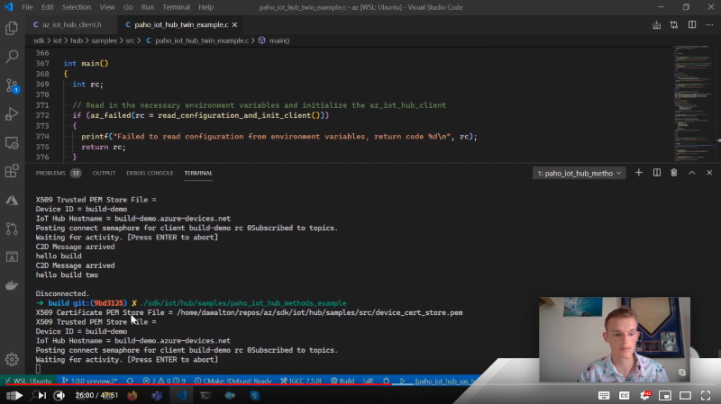

# Azure IoT Clients

This is the main page for the Azure SDK for Embedded C official IoT client libraries.

Here you will find everything you need to get devices connected to Azure.

## Getting Started

The Azure IoT Client library is created to facilitate connectivity to Azure IoT services alongside an MQTT and TLS stack of the user's choice. This means that this SDK is **NOT** a platform but instead is a true SDK library.


From a functional perspective, this means that the user's application code (not the SDK) calls directly to the MQTT stack of their choice. The SDK provides utilities (functions, default values, etc.) that help make the connection and feature set easier to use. Some examples of those utilities include:

- Publish topics to which messages can be sent.
- Subscription topics to which users can subscribe for incoming messages.
- Functions to parse incoming message topics, which populate structs with crucial message information.
- Default values for MQTT connect keep alive and connection port.

To better understand the responsibilities of the user application code and the Embedded C SDK, please take a look at the [State Machine diagram](https://github.com/Azure/azure-sdk-for-c/blob/main/sdk/docs/iot/mqtt_state_machine.md), which explains the high-level architecture, SDK components, and a clear view of SDK x Application responsibilities.

For more details about the Azure IoT Hub, see the following [Azure IoT Hub documentation](https://docs.microsoft.com/azure/iot-hub/).
For more details about the Azure IoT Device Provisioning Service (DPS), see the [Azure IOT DPS documentation](https://docs.microsoft.com/azure/iot-dps/).

**NOTE**: This Embedded C SDK requires a different programming model as compared to the earlier version of the [C SDK](https://github.com/Azure/azure-iot-sdk-c).

### Documentation

Please view the API documentation [here](https://azure.github.io/azure-sdk-for-c/). After following that link, you can find the IoT specific documentation by navigating to the **IoT** section on the left of your screen, pick a version of the SDK, click on **Files -> File List**, then choose any of the header files prefixed with `az_iot_`.

### Build

The Azure IoT library is compiled following the same steps listed on the root [Azure SDK for Embedded C README](https://github.com/Azure/azure-sdk-for-c/blob/main/README.md) documentation, under ["Getting Started Using the SDK"](https://github.com/Azure/azure-sdk-for-c/blob/main/README.md#getting-started-using-the-sdk).

The library targets made available via CMake are the following:

- `az::iot::hub` - For Azure IoT Hub features (API documentation found by following the above link and selecting `azure_iot_hub_client.h`).
- `az::iot::provisioning` - For Azure IoT Provisioning features (API documentation found by following the above link and selecting `azure_iot_provisioning_client.h`).

### Samples

View the [Azure Embedded C SDK IoT Samples README](https://github.com/Azure/azure-sdk-for-c/blob/main/sdk/samples/iot/README.md) to learn how to run samples for the Azure Embedded C SDK IoT Hub Client and the Provisioning Clients. The README will provide general prerequisites, environment setup instructions, sample descriptions, as well as directions on how to build and run all the samples on either a Linux or Windows environment.

For more detailed, step-by-step guides to setup and run the IoT Hub certificate samples from scratch, refer to these documents:

- Linux: [How to Setup and Run Azure SDK for Embedded C IoT Hub Certificate Samples on Linux](https://github.com/Azure/azure-sdk-for-c/blob/main/sdk/samples/iot/docs/how_to_iot_hub_samples_linux.md)

- Windows: [How to Setup and Run Azure SDK for Embedded C IoT Hub Certificate Samples on Microsoft Windows](https://github.com/Azure/azure-sdk-for-c/blob/main/sdk/samples/iot/docs/how_to_iot_hub_samples_windows.md)

- Realtek Ameba D: [How to Setup and Run Azure SDK for Embedded C IoT Hub Client on Realtek AmebaD](https://github.com/Azure/azure-sdk-for-c/blob/main/sdk/samples/iot/aziot_realtek_amebaD/readme.md)

- Espressif ESP8266: [How to Setup and Run Azure SDK for Embedded C IoT Hub Client on Esp8266 NodeMCU](https://github.com/Azure/azure-sdk-for-c/blob/main/sdk/samples/iot/aziot_esp8266/readme.md)

- Espressif ESP32: [How to Setup and Run Azure SDK for Embedded C IoT Hub Client on ESP32](https://github.com/Azure/azure-sdk-for-c/blob/main/sdk/samples/iot/aziot_esp32/readme.md)

- Azure Device Update with Espressif ESP32 on Arduino IDE: [How to Setup and Run Azure SDK for Embedded C ADU on Espressif ESP32](https://github.com/Azure/azure-sdk-for-c-arduino/blob/main/examples/Azure_IoT_Adu_ESP32/readme.md)

- VxWorks: [How to Setup and Run Azure SDK for Embedded C IoT Hub Client and Provisioning Client Samples on VxWorks](https://github.com/Azure/azure-sdk-for-c/blob/main/sdk/samples/iot/docs/how_to_iot_hub_samples_vxworks.md)

**Important Note on Linux and Windows Samples**: While Windows and Linux devices are not likely to be considered constrained, these samples enable developers to test the Azure SDK for Embedded C libraries, debug, and step through the code, even without a real device. We understand not everyone will have a real device to test and that sometimes these devices won't have debugging capabilities.

For extra guidance, please feel free to watch our Deep Dive Video below which goes over building the SDK, running the samples, and the architecture of the samples.

[](https://youtu.be/qdb3QIq8msg)

## Key Features

&radic; feature available  &radic;* feature partially available (see Description for details)  &times; feature planned but not supported

Feature | Azure SDK for Embedded C | Description
---------|----------|---------------------
 [Send device-to-cloud message](https://docs.microsoft.com/azure/iot-hub/iot-hub-devguide-messages-d2c) | &radic; | Send device-to-cloud messages to IoT Hub with the option to add custom message properties.
 [Receive cloud-to-device messages](https://docs.microsoft.com/azure/iot-hub/iot-hub-devguide-messages-c2d) | &radic; | Receive cloud-to-device messages and associated properties from IoT Hub.
 [Device Twins](https://docs.microsoft.com/azure/iot-hub/iot-hub-devguide-device-twins) | &radic; | IoT Hub persists a device twin for each device that you connect to IoT Hub.  The device can perform operations like get twin document, subscribe to desired property updates.
 [Direct Methods](https://docs.microsoft.com/azure/iot-hub/iot-hub-devguide-direct-methods) | &radic; | IoT Hub gives you the ability to invoke direct methods on devices from the cloud.
 [DPS - Device Provisioning Service](https://docs.microsoft.com/azure/iot-dps/) | &radic; | This SDK supports connecting your device to the Device Provisioning Service via, for example, [individual enrollment](https://docs.microsoft.com/azure/iot-dps/concepts-service#enrollment) using an [X.509 leaf certificate](https://docs.microsoft.com/azure/iot-dps/concepts-security#leaf-certificate).
 Protocol | MQTT | The Azure SDK for Embedded C supports only MQTT.
 Retry Policies | &radic;* | The Azure SDK for Embedded C provides guidelines for retries, but actual retries should be handled by the application.
 [IoT Plug and Play](https://docs.microsoft.com/azure/iot-pnp/overview-iot-plug-and-play) | &radic; | IoT Plug and Play enables solution builders to integrate smart devices with their solutions without any manual configuration.

## Size Chart

The following chart shows the RAM and ROM usage for the PIC24-IOT dev kit from Microchip found in https://github.com/Azure-Samples/Microchip-PIC-IoT-Wx compiled using Microchip’s XC16 version 1.60 compiler with the following compilation, preprocessor options: AZ_NO_LOGGING and AZ_NO_PRECONDITION_CHECKING.

The PIC24-IOT kit has two microcontrollers (MCUs):

 - Host MCU - A 16-bit **PIC24FJ128GA705** with 128 KB Flash Memory and 16 KB SRAM. This MCU runs the Embedded C SDK, the sample code, and the MQTT client provided by Microchip.
 - Wi-fi MCU, an **ATWINC**1510 Wi-Fi Module: this MCU runs the TLS and TCP stack.

The Pic24 sample includes both Hub and DPS services. The table below shows RAM/ROM sizes considering:

-  Embedded C SDK libraries only – which represent the baseline size.
-  Total size – which includes the Embedded C SDK and Microchip MQTT client (this Dev Kit has a separate Wi-Fi module which runs the TLS and TCP/IP stacks).

|  | Embedded C SDK size | | Total Size | |
|---------|----------|---------|---------|---------
|**Sample** | **Program/ROM** | **Data/RAM** | **Program/ROM** | **Data/RAM** |
| PIC24 (Hub + DPS + IoT Plug and Play) | 26.15KB | 0 | 103.61KB | 10.57KB
| PIC24 Telemetry only | 2.58KB | 0 | 74.16KB | 8.26KB

This table will be expanded as new hardware samples become available.

## Examples

These examples are scenario-focused and introduce you to the API calls for a few key features of the Embedded C SDK.

  - [IoT Hub Client Initialization](#iot-hub-client-initialization)
  - [IoT Message Properties](#iot-message-properties)
  - [IoT Telemetry](#iot-telemetry)

General [coding patterns](https://github.com/Azure/azure-sdk-for-c/blob/main/sdk/docs/iot/coding_patterns.md) that are MQTT stack agnostic are also available to view. These patterns can give you an overview of the API calls and structure needed to use the Azure IoT Embedded C SDK features.

For a more extensive demonstration of the API, please view and run the [sample code](https://github.com/Azure/azure-sdk-for-c/blob/main/sdk/samples/iot/), which uses Paho MQTT.

### IoT Hub Client Initialization

To use IoT Hub connectivity, the first action by a developer should be to initialize the client with the `az_iot_hub_client_init()` API. Once that is initialized, you may use the `az_iot_hub_client_get_user_name()` and `az_iot_hub_client_get_client_id()` to get the
user name and client id to establish a connection with IoT Hub.

An example use case is below.

```C
// FOR SIMPLICITY THIS DOES NOT HAVE ERROR CHECKING. IN PRODUCTION ENSURE PROPER ERROR CHECKING.

az_iot_hub_client my_client;
static az_span my_iothub_hostname = AZ_SPAN_LITERAL_FROM_STR("contoso.azure-devices.net");
static az_span my_device_id = AZ_SPAN_LITERAL_FROM_STR("contoso_device");

// Make sure to size the buffer to fit the client id (16 is an example)
static char my_mqtt_client_id[16];
static size_t my_mqtt_client_id_length;

// Make sure to size the buffer to fit the username (128 is an example)
static char my_mqtt_user_name[128];
static size_t my_mqtt_user_name_length;

int main(void)
{
  // Get the default IoT Hub options.
  az_iot_hub_client_options options = az_iot_hub_client_options_default();

  // Initialize the hub client with hostname, device id, and default connection options.
  az_iot_hub_client_init(&my_client, my_iothub_hostname, my_device_id, &options);

  // Get the MQTT client id used for the MQTT connection.
  az_iot_hub_client_get_client_id(
      &my_client, my_mqtt_client_id, sizeof(my_mqtt_client_id),  &my_mqtt_client_id_length);

  // Get the MQTT user name to connect.
  az_iot_hub_client_get_user_name(
      &my_client, my_mqtt_user_name, sizeof(my_mqtt_user_name), &my_mqtt_user_name_length);

  // At this point you are free to use my_mqtt_client_id and my_mqtt_user_name to connect using
  // your MQTT client.

  return 0;
}
```

### IoT Message Properties

Included in the Azure SDK for Embedded C are helper functions to form and manage message properties for Azure IoT Hub services. Implementation starts by using the `az_iot_message_properties_init()` API. The user is free to initialize using an empty, but appropriately sized, span to later append properties or an already populated span containing a properly formatted property buffer. "Properly formatted" properties follow the form `{key}={value}&{key}={value}`.

Below is an example use case of appending properties.

```C
//FOR SIMPLICITY THIS DOES NOT HAVE ERROR CHECKING. IN PRODUCTION ENSURE PROPER ERROR CHECKING.

void my_property_func(void)
{
  // Allocate a span to put the properties.
  uint8_t property_buffer[64];
  az_span property_span = AZ_SPAN_FROM_BUFFER(property_buffer);

  // Initialize the property struct with the span.
  az_iot_message_properties props;
  az_iot_message_properties_init(&props, property_span, 0);

  // Append properties.
  az_iot_message_properties_append(
      &props, AZ_SPAN_LITERAL_FROM_STR("key"), AZ_SPAN_LITERAL_FROM_STR("value"));

  // At this point, you are able to pass the `props` to other APIs with message property parameters.
}
```

Below is an example use case of initializing with an already populated property span.

```C
// FOR SIMPLICITY THIS DOES NOT HAVE ERROR CHECKING. IN PRODUCTION ENSURE PROPER ERROR CHECKING.

static az_span property_span = AZ_SPAN_LITERAL_FROM_STR("my_device=contoso&my_key=my_value");
void my_property_func(void)
{
  // Initialize the property struct with the span.
  az_iot_message_properties props;
  az_iot_message_properties_init(&props, property_span, az_span_size(property_span));

  // At this point, you are able to pass the `props` to other APIs with property parameters.
}
```

### IoT Telemetry

Telemetry functionality can be achieved by sending a user payload to a specific topic. In order to get the appropriate topic to which to send, use the `az_iot_hub_client_telemetry_get_publish_topic()` API. An example use case is below.

```C
// FOR SIMPLICITY THIS DOES NOT HAVE ERROR CHECKING. IN PRODUCTION ENSURE PROPER ERROR CHECKING.

static az_iot_hub_client my_client;
static az_span my_iothub_hostname = AZ_SPAN_LITERAL_FROM_STR("contoso.azure-devices.net");
static az_span my_device_id = AZ_SPAN_LITERAL_FROM_STR("contoso_device");

void my_telemetry_func(void)
{
  // Initialize the client to then pass to the telemetry API.
  az_iot_hub_client_init(&my_client, my_iothub_hostname, my_device_id, NULL);

  // Allocate a char buffer with capacity large enough to put the telemetry topic.
  char telemetry_topic[64];
  size_t telemetry_topic_length;

  // Get the NULL terminated topic and put in telemetry_topic to send the telemetry.
  az_iot_hub_client_telemetry_get_publish_topic(
      &my_client, NULL, telemetry_topic, sizeof(telemetry_topic), &telemetry_topic_length);
}
```

## Troubleshooting

- The error policy for the Embedded C SDK client library is documented [here](https://github.com/Azure/azure-sdk-for-c/blob/main/sdk/docs/iot/mqtt_state_machine.md#error-policy).
- File an issue via [Github Issues](https://github.com/Azure/azure-sdk-for-c/issues/new/choose).
- Check [previous questions](https://stackoverflow.com/questions/tagged/azure+c) or ask new ones on StackOverflow using the `azure` and `c` tags.

## Contributing

This project welcomes contributions and suggestions. Find more contributing details [here](https://github.com/Azure/azure-sdk-for-c/blob/main/CONTRIBUTING.md).

### License

Azure SDK for Embedded C is licensed under the [MIT](https://github.com/Azure/azure-sdk-for-c/blob/main/LICENSE) license.
