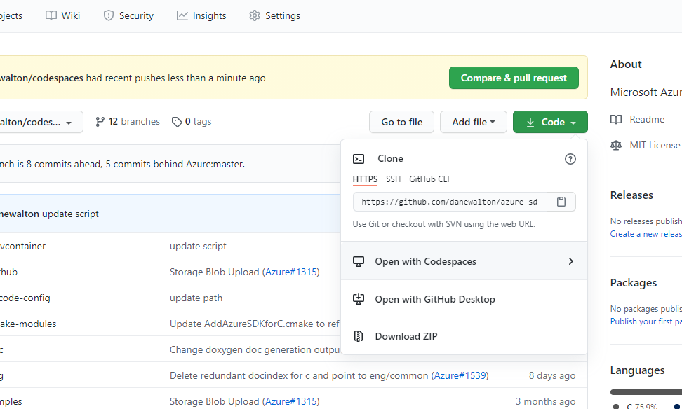

# Azure IoT Samples

## Table of Contents

- [Azure IoT Samples](#azure-iot-samples)
  - [Table of Contents](#table-of-contents)
  - [Introduction](#introduction)
  - [Github Codespaces](#github-codespaces)
  - [Prerequisites](#prerequisites)
  - [Getting Started](#getting-started)
    - [Create an Authenticated Device](#create-an-authenticated-device)
      - [Create a Device Using X.509 Self-Signed Certificate Authentication](#create-a-device-using-x509-self-signed-certificate-authentication)
        - [Linux Certificate Creation](#linux-certificate-creation)
        - [Windows Certificate Creation](#windows-certificate-creation)
        - [Create a device](#create-a-device)
      - [Create a Device Using Symmetric Key (SAS) Authentication](#create-a-device-using-symmetric-key-sas-authentication)
    - [Set Environment Variables](#set-environment-variables)
      - [All-Samples](#all-samples)
      - [IoT Hub X.509 Certificate Samples](#iot-hub-x509-certificate-samples)
      - [IoT Provisioning X.509 Certificate Sample](#iot-provisioning-x509-certificate-sample)
      - [IoT Hub Symetric Key (SAS) Sample](#iot-hub-symetric-key-sas-sample)
      - [IoT Provisioning Symmetric Key (SAS) Sample](#iot-provisioning-symmetric-key-sas-sample)
  - [Build and Run the Sample](#build-and-run-the-sample)
  - [Sample Descriptions](#sample-descriptions)
    - [IoT Hub C2D Sample](#iot-hub-c2d-sample)
    - [IoT Hub Methods Sample](#iot-hub-methods-sample)
    - [IoT Hub Telemetry Sample](#iot-hub-telemetry-sample)
    - [IoT Hub SAS Telemetry Sample](#iot-hub-sas-telemetry-sample)
    - [IoT Hub Twin Sample](#iot-hub-twin-sample)
    - [IoT Plug and Play Sample](#iot-plug-and-play-sample)
    - [IoT Plug and Play with Provisioning Sample](#iot-plug-and-play-with-provisioning-sample)
    - [IoT Plug and Play Multiple Component Sample](#iot-plug-and-play-multiple-component-sample)
    - [IoT Provisioning Certificate Sample](#iot-provisioning-certificate-sample)
    - [IoT Provisioning SAS Sample](#iot-provisioning-sas-sample)
  - [Using IoT Hub with an ECC Server Certificate Chain](#using-iot-hub-with-an-ecc-server-certificate-chain)
  - [Next Steps and Additional Documentation](#next-steps-and-additional-documentation)
  - [Troubleshooting](#troubleshooting)
  - [Contributing](#contributing)
    - [License](#license)

## Introduction

This document explains samples for the Azure Embedded C SDK IoT Hub Client and Device Provisioning Client.

Samples are designed to highlight the function calls required to connect with the Azure IoT Hub or the Azure IoT Hub Device Provisioning Service (DPS). These calls illustrate the happy path of the [mqtt state machine](https://github.com/Azure/azure-sdk-for-c/blob/main/sdk/docs/iot/mqtt_state_machine.md). As a result, **these samples are NOT designed to be used as production-level code**. Production code needs to incorporate other elements, such as connection retries and more extensive error-handling, which these samples do not include. These samples also utilize OpenSSL, which is **NOT recommended to use in production-level code on Windows or macOS**.

The samples' instructions include specifics for both Windows and Linux based systems. For Windows, the command line examples are based on PowerShell. The Linux examples are tailored to Debian/Ubuntu environments. Samples are also designed to work on macOS systems, but the instructions do not yet include specific command line examples for this environment. While Windows and Linux devices are not likely to be considered constrained, these samples enable developers to test the Azure SDK for Embedded C libraries, debug, and step through the code, even without a real device. We understand not everyone will have a real device to test and that sometimes these devices won't have debugging capabilities.

**WARNING: Samples are generic and should not be used in any production-level code.**

More detailed step-by-step guides on how to run an IoT Hub Client sample from scratch can be found below:

- Linux: [How to Setup and Run Azure SDK for Embedded C IoT Hub Certificate Samples on Linux](https://github.com/Azure/azure-sdk-for-c/blob/main/sdk/samples/iot/docs/how_to_iot_hub_samples_linux.md)

- Windows: [How to Setup and Run Azure SDK for Embedded C IoT Hub Certificate Samples on Microsoft Windows](https://github.com/Azure/azure-sdk-for-c/blob/main/sdk/samples/iot/docs/how_to_iot_hub_samples_windows.md)

- Realtek Ameba D: [How to Setup and Run Azure SDK for Embedded C IoT Hub Client on Realtek AmebaD](https://github.com/Azure/azure-sdk-for-c/blob/main/sdk/samples/iot/aziot_realtek_amebaD/readme.md)

- Espressif ESP8266: [How to Setup and Run Azure SDK for Embedded C IoT Hub Client on Esp8266 NodeMCU](https://github.com/Azure/azure-sdk-for-c/blob/main/sdk/samples/iot/aziot_esp8266/readme.md)

- Espressif ESP32: [How to Setup and Run Azure SDK for Embedded C IoT Hub Client on ESP32](https://github.com/Azure/azure-sdk-for-c/blob/main/sdk/samples/iot/aziot_esp32/readme.md)

- Espressif ESP32 Over the Air Update: [How to Setup and Run Azure SDK for Embedded C Azure Device Update on ESP32](https://github.com/Azure/azure-sdk-for-c-arduino/tree/main/examples/Azure_IoT_Adu_ESP32)

- VxWorks: [How to Setup and Run Azure SDK for Embedded C IoT Hub Client and Provisioning Client Samples on VxWorks](https://github.com/Azure/azure-sdk-for-c/blob/main/sdk/samples/iot/docs/how_to_iot_hub_samples_vxworks.md)

To view scenario-focused examples using the API calls, please view the Azure IoT Client [introductory examples](https://github.com/Azure/azure-sdk-for-c/blob/main/sdk/docs/iot/README.md#examples). General [coding patterns](https://github.com/Azure/azure-sdk-for-c/blob/main/sdk/docs/iot/coding_patterns.md) that are MQTT stack agnostic are also available to view.

## Github Codespaces

You can use Github Codespaces to be up and running quickly! Here are the steps to follow (assuming you already have an IoT Hub set up).

1. Select the "Open with Codespaces" prompt on Github and then "New codespace".



1. Once the Codespace is open, all required build tools, extensions, and debugging tools will be setup for you.
1. Hit Control-Shift-B on your keyboard to build the SDK and samples.
1. Navigate to the `cert/` directory and find the fingerprint for the certificate that was generated for you.
1. In the Azure IoT Hub portal, add a device using Self-Signed Cert authentication. Paste the fingerprint in for Primary and Secondary. Add the device.
1. Back in the Codespace, navigate to the "Run" tab on the left side (arrow with a bug).
1. Select any of the samples and hit the green run button.
1. Paste you Device ID and IoT Hub Hostname in the prompts that pop up. Hit enter and the sample should be running!
1. Note you can use the device explorer to monitor/interact with the samples.

## Prerequisites

To run the samples, ensure you have the following programs and tools installed on your system:

- Have an [Azure account](https://azure.microsoft.com/) created.
- Have an [Azure IoT Hub](https://docs.microsoft.com/azure/iot-hub/iot-hub-create-through-portal) created.

- Have the following build environment setup:

    <details><summary><i>Instructions:</i></summary>
    <p>

    Linux:

    ```bash
    sudo apt-get update
    sudo apt-get install build-essential curl unzip tar pkg-config
    ```

    Windows (PowerShell):

    - Have [Microsoft Visual Studio 2019](https://visualstudio.microsoft.com/downloads/) installed with [C and C++ support](https://docs.microsoft.com/cpp/build/vscpp-step-0-installation?view=vs-2019).

    </p>
    </details>

- Have [Git](https://git-scm.com/download) installed.
- Have Microsoft [vcpkg](https://github.com/microsoft/vcpkg) package manager and [Eclipse Paho MQTT C client](https://www.eclipse.org/paho/) installed. This installation may take an extended amount of time (~15-20 minutes).

    <details><summary><i>Instructions:</i></summary>
    <p>

    NOTE: For the correct vcpkg commit, see [vcpkg-commit.txt](https://github.com/Azure/azure-sdk-for-c/blob/main/eng/vcpkg-commit.txt).

    Linux:

    ```bash
    git clone https://github.com/Microsoft/vcpkg.git
    cd vcpkg
    git checkout <vcpkg commit> # Checkout the vcpkg commit per vcpkg-commit.txt above.
    ./bootstrap-vcpkg.sh
    ./vcpkg install --triplet x64-linux curl cmocka paho-mqtt
    ```

    Windows (PowerShell):

    ```powershell
    git clone https://github.com/Microsoft/vcpkg.git
    cd vcpkg
    git checkout <vcpkg commit> # Checkout the vcpkg commit per vcpkg-commit.txt above.
    .\bootstrap-vcpkg.bat
    .\vcpkg.exe install --triplet x64-windows-static curl[winssl] cmocka paho-mqtt # Update triplet per your system.
    ```

    </p>
    </details>

- Have OpenSSL installed.

    <details><summary><i>Instructions:</i></summary>
    <p>

    Linux:

    ```bash
    sudo apt-get install openssl libssl-dev
    ```

    Windows (PowerShell):

    - OpenSSL will be installed by vcpkg as a dependency for Eclipse Paho.

      **WARNING: It is NOT recommended to use OpenSSL in production-level code on Windows or macOS.**

      ```powershell
      # NOT RECOMMENDED to use for production-level code.
      $env:PATH=$env:PATH + ';<FULL PATH to vcpkg>\installed\x64-windows-static\tools\openssl' # Update complete path as needed.
      ```

    </p>
    </details>

- Have CMake installed. The minimum required is 3.10.

    <details><summary><i>Instructions:</i></summary>
    <p>

    Linux:

    - Ubuntu 18.04 or 20.04:

      ```bash
      sudo apt-get install cmake
      ```

    - Ubuntu 16.04: Download the latest version of [CMake](https://cmake.org/files).

      ```bash
      wget https://cmake.org/files/v3.18/cmake-3.18.3-Linux-x86_64.sh # Use latest version.
      sudo ./cmake-3.18.3-Linux-x86_64.sh --prefix=/usr
      ```
        - When prompted to include the default subdirectory, enter `n` so to install in `/usr/local`.

    Windows (PowerShell): Download the latest version of [CMake](https://cmake.org/download).

    - Use the Windows installer.

    </p>
    </details>

- Have the Azure SDK for Embedded C IoT repository cloned.

    NOTE: On Windows, due to the length of the repository filepaths, clone near the `C:\` root.

    ```bash
    git clone https://github.com/Azure/azure-sdk-for-c.git
    ```

- *Executable:* `paho_iot_pnp_with_provisioning_sample`
- If running a DPS sample: `paho_iot_provisioning_sample`, `paho_iot_pnp_with_provisioning_sample`.
  - Have an [Azure IoT Hub Device Provisioning Service (DPS)](https://docs.microsoft.com/azure/iot-dps/quick-setup-auto-provision) created.

- If running an IoT Plug and Play sample: `paho_iot_pnp_sample`, `paho_iot_pnp_with_provisioning_sample`, `paho_iot_pnp_component_sample`.
  - Have the most recent version of [Azure IoT Explorer](https://github.com/Azure/azure-iot-explorer/releases) installed and connected to your Azure IoT Hub. More instructions on can be found [here](https://docs.microsoft.com/azure/iot-pnp/howto-use-iot-explorer).


## Getting Started

### Create an Authenticated Device

Next you must create and connect an authenticated device. You can authenticate in one of two ways: via X.509 Self-Signed Certificate Authentication or Symmetric Key (SAS). You also must choose how you want to connect the device, either via Azure IoT Hub or via Azure IoT Hub Device Provisioning Service (DPS).

#### Create a Device Using X.509 Self-Signed Certificate Authentication

This approach must be used for the following samples: `paho_iot_hub_c2d_sample`, `paho_iot_hub_methods_sample`, `paho_iot_hub_telemetry_sample`, `paho_iot_hub_twin_sample`, `paho_iot_pnp_sample`, `paho_iot_pnp_component_sample`, `paho_iot_pnp_with_provisioning_sample`, `paho_iot_provisioning_sample`

As a convenience, we provide a series of commands below for you to create a temporary certificate in order to run the samples. These certificates expire after 30 days and are provided ONLY to help you easily understand CA Certificates. When productizing against CA Certificates, you will need to use your own security best practices for certificate creation and lifetime management.

**WARNING: Certificates created by these commands MUST NOT be used in production-level code.**

##### Linux Certificate Creation

1. Enter the directory `azure-sdk-for-c/sdk/samples/iot/`.
1. Run the following commands:

    ```bash
    openssl ecparam -out device_ec_key.pem -name prime256v1 -genkey
    openssl req -new -days 30 -nodes -x509 -key device_ec_key.pem -out device_ec_cert.pem -extensions client_auth -config x509_config.cfg -subj "/CN=paho-sample-device1"
    openssl x509 -noout -text -in device_ec_cert.pem

    rm -f device_cert_store.pem
    cat device_ec_cert.pem device_ec_key.pem > device_cert_store.pem

    openssl x509 -noout -fingerprint -in device_ec_cert.pem | sed 's/://g'| sed 's/\(SHA1 Fingerprint=\)//g' | tee fingerprint.txt

    export AZ_IOT_DEVICE_X509_CERT_PEM_FILE_PATH=$(pwd)/device_cert_store.pem
    ```

1. The resulting thumbprint will be placed in `fingerprint.txt` and the generated pem file is named `device_ec_cert.pem`.

##### Windows Certificate Creation

1. Enter the directory `azure-sdk-for-c\sdk\samples\iot\`.
1. Run the following commands:

    ```powershell
    openssl ecparam -out device_ec_key.pem -name prime256v1 -genkey
    openssl req -new -days 30 -nodes -x509 -key device_ec_key.pem -out device_ec_cert.pem -extensions client_auth -config x509_config.cfg -subj "/CN=paho-sample-device1"
    openssl x509 -noout -text -in device_ec_cert.pem

    Get-Content device_ec_cert.pem, device_ec_key.pem | Set-Content device_cert_store.pem

    openssl x509 -noout -fingerprint -in device_ec_cert.pem | % {$_.replace(":", "")} | % {$_.replace("SHA1 Fingerprint=", "")} | Tee-Object fingerprint.txt

    $env:AZ_IOT_DEVICE_X509_CERT_PEM_FILE_PATH=$(Resolve-Path device_cert_store.pem)
    ```

1. The resulting thumbprint will be placed in `fingerprint.txt` and the generated pem file is named `device_ec_cert.pem`.

##### Create a device

- To add a new device via Azure IoT Hub, see instructions [here](https://docs.microsoft.com/azure/iot-hub/iot-hub-security-x509-get-started#create-an-x509-device-for-your-iot-hub). However, **DO NOT** select X.509 CA Signed as the authentication type. Select **X.509 Self-Signed**. For the Thumbprint, use the recently generated fingerprint, which has been placed in the file `fingerprint.txt`.
- To add a new individual device enrollment via Azure IoT Hub DPS, see instructions [here](https://docs.microsoft.com/azure/iot-dps/quick-create-simulated-device-x509#create-a-device-enrollment-entry-in-the-portal). You will use the recently generated `device_ec_cert.pem` file. After creation, the Registration ID of your device should appear as `paho-sample-device1` in the Individual Enrollments tab.

#### Create a Device Using Symmetric Key (SAS) Authentication

This approach must be used for the following samples: `paho_iot_hub_sas_telemetry_sample`, `paho_iot_provisioning_sas_sample`,

- To add a new device via Azure IoT Hub, see instructions [here](https://docs.microsoft.com/azure/iot-hub/iot-hub-create-through-portal#register-a-new-device-in-the-iot-hub).
- To add a new individual device enrollment via Azure IoT Hub DPS, see instructions [here](https://docs.microsoft.com/azure/iot-dps/quick-create-simulated-device-symm-key#create-a-device-enrollment-entry-in-the-portal). After creation, the Registration ID of your device will appear in the Individual Enrollments tab.

### Set Environment Variables

Samples use environment variables for a variety of purposes, including filepaths and connection parameters. Please keep in mind, **every time a new terminal is opened, the environment variables will have to be reset**. Setting a variable will take the following form:

  Linux:

  ```bash
  export ENV_VARIABLE_NAME=VALUE
  ```

  Windows (PowerShell):

  ```powershell
  $env:ENV_VARIABLE_NAME='VALUE'
  ```

#### All-Samples

Set the following environment variables for all samples:

  1. Set the vcpkg environment variables.

      Refer to these [directions](https://github.com/Azure/azure-sdk-for-c#development-environment) for more detail.

      Linux:

      ```bash
      export VCPKG_DEFAULT_TRIPLET=x64-linux
      export VCPKG_ROOT=<FULL PATH to vcpkg>
      ```

      Windows (PowerShell):

      ```powershell
      $env:VCPKG_DEFAULT_TRIPLET='x64-windows-static' # Update triplet to match what was used during vcpkg install.
      $env:VCPKG_ROOT='<FULL PATH to vcpkg>'
      ```

  2. Set the trust pem filepath. **Only when testing on Windows or OSX.**

      _Important:_ We recommend using a managed trusted store for production deployments. Paho/OpenSSL on Windows is meant for testing purposes only.

      Create a PEM certificate file based store by concatenating the following files:

      * RSA Certificate Authority Roots:

        - [Baltimore CyberTrust Root](https://cacerts.digicert.com/BaltimoreCyberTrustRoot.crt.pem)
        - [DigiCert Global Root G2](https://cacerts.digicert.com/DigiCertGlobalRootG2.crt.pem)
        - [Microsoft RSA Root Certificate Authority 2017](https://www.microsoft.com/pkiops/certs/Microsoft%20RSA%20Root%20Certificate%20Authority%202017.crt)

      * ECC Certificate Authority Roots
        - [DigiCert Global Root G3](https://cacerts.digicert.com/DigiCertGlobalRootG3.crt.pem)
        - [Microsoft ECC Root Certificate Authority 2017](https://www.microsoft.com/pkiops/certs/Microsoft%20ECC%20Root%20Certificate%20Authority%202017.crt)

      Make sure the files are in PEM format. If they are not, use `openssl x509 -inform DER -outform PEM -in my_certificate.crt -out my_certificate.pem` to convert them to PEM format. Concatenate all the files into CAStore.pem.
      Configure the AZ_IOT_DEVICE_X509_TRUST_PEM_FILE_PATH to point to this PEM file.

       Windows (PowerShell):

      ```powershell
      $env:AZ_IOT_DEVICE_X509_TRUST_PEM_FILE_PATH='<FULL PATH TO>\CAStore.pem'
      ```

#### IoT Hub X.509 Certificate Samples

Set the following environment variables if running any of these samples: `paho_iot_hub_c2d_sample`, `paho_iot_hub_methods_sample`, `paho_iot_hub_telemetry_sample`, `paho_iot_hub_twin_sample`, `paho_iot_pnp_sample`, `paho_iot_pnp_component_sample`

<details><summary><i>Instructions to set environment variables for IoT Hub X.509 Certificate samples:</i></summary>
<p>

1. Retrieve variable information:

    Access your Azure IoT Hub from either your Azure Portal or Azure IoT Explorer.

    - `AZ_IOT_HUB_DEVICE_ID`: From the IoT devices tab, select your device. Copy its Device Id.
    - `AZ_IOT_HUB_HOSTNAME`: From the Overiview tab, copy your Azure IoT hub Hostname.

2. Set the variables:

   Linux:

   ```bash
   export AZ_IOT_HUB_DEVICE_ID=<device-id>
   export AZ_IOT_HUB_HOSTNAME=<hostname>
   ```

   Windows (PowerShell):

   ```powershell
   $env:AZ_IOT_HUB_DEVICE_ID='<device-id>'
   $env:AZ_IOT_HUB_HOSTNAME='<hostname>'
   ```

</p>
</details>

#### IoT Provisioning X.509 Certificate Sample

Set the following environment variables if running the sample:  `paho_iot_pnp_with_provisioning_sample`, `paho_iot_provisioning_sample`

<details><summary><i>Instructions to set environment variables for DPS X.509 Certificate sample:</i></summary>
<p>

1. Retrieve variable information:

    Access your Azure IoT Hub Device Provisioning Service from your Azure Portal.

    - `AZ_IOT_PROVISIONING_REGISTRATION_ID`: Set this to `paho-sample-device1`.
    - `AZ_IOT_PROVISIONING_ID_SCOPE`: From the Overview tab, copy the Id Scope.

2. Set the variables:

    Linux:

    ```bash
    export AZ_IOT_PROVISIONING_REGISTRATION_ID=<registration-id>
    export AZ_IOT_PROVISIONING_ID_SCOPE=<id-scope>
    ```

    Windows (PowerShell):

    ```powershell
    $env:AZ_IOT_PROVISIONING_REGISTRATION_ID='<registration-id>'
    $env:AZ_IOT_PROVISIONING_ID_SCOPE='<id-scope>'
    ```

</p>
</details>

#### IoT Hub Symetric Key (SAS) Sample

Set the following environment variables if running the sample:  `paho_iot_hub_sas_telemetry_sample`

<details><summary><i>Instructions to set environment variables for IoT Hub Symmetric Key sample:</i></summary>
<p>

1. Retrieve variable information:

    Access your Azure IoT Hub from either your Azure Portal or Azure IoT Explorer.

    - `AZ_IOT_HUB_SAS_DEVICE_ID`: From the IoT devices tab, select your device. Copy its Device Id.
    - `AZ_IOT_HUB_SAS_KEY`: From the same page, copy its Primary Key.
    - `AZ_IOT_HUB_HOSTNAME`: From the Overiview tab, copy your Azure IoT hub Hostname.

2. Set the variables:

    Linux:

    ```bash
    export AZ_IOT_HUB_SAS_DEVICE_ID=<sas-device-id>
    export AZ_IOT_HUB_SAS_KEY=<sas-key>
    export AZ_IOT_HUB_HOSTNAME=<hostname>
    ```

    Windows (PowerShell):

    ```powershell
    $env:AZ_IOT_HUB_SAS_DEVICE_ID='<sas-device-id>'
    $env:AZ_IOT_HUB_SAS_KEY='<sas-key>'
    $env:AZ_IOT_HUB_HOSTNAME='<hostname>'
    ```

</p>
</details>

#### IoT Provisioning Symmetric Key (SAS) Sample

Set the following environment variables if running the sample: `paho_iot_provisioning_sas_sample`

<details><summary><i>Instructions to set environment variables for DPS Symmetric Key sample:</i></summary>
<p>

1. Retrieve variable information:

    Access your Azure IoT Hub Device Provisioning Service from your Azure Portal.

    - `AZ_IOT_PROVISIONING_SAS_REGISTRATION_ID`: From the Manage enrollments tab, under Individual Enrollments, copy the Registration Id of your SAS device.
    - `AZ_IOT_PROVISIONING_SAS_KEY`: Under Individual Enrollments, select your SAS device. Copy its Primary Key.
    - `AZ_IOT_PROVISIONING_ID_SCOPE`: From the Overview tab, copy the Id Scope.

2. Set the variables:

    Linux:

    ```bash
    export AZ_IOT_PROVISIONING_SAS_REGISTRATION_ID=<sas-registration-id>
    export AZ_IOT_PROVISIONING_SAS_KEY=<sas-key>
    export AZ_IOT_PROVISIONING_ID_SCOPE=<id-scope>
    ```

    Windows (PowerShell):

    ```powershell
    $env:AZ_IOT_PROVISIONING_SAS_REGISTRATION_ID='<sas-registration-id>'
    $env:AZ_IOT_PROVISIONING_SAS_KEY='<sas-key>'
    $env:AZ_IOT_PROVISIONING_ID_SCOPE='<id-scope>'
      ```

</p>
</details>

## Build and Run the Sample

1. Build the Azure SDK for Embedded C directory structure.

    From the root of the SDK directory `azure-sdk-for-c`:

    ```bash
    mkdir build
    cd build
    cmake -DTRANSPORT_PAHO=ON ..
    ```

2. Compile and run the sample.

    Linux:

    ```bash
    cmake --build .
    ./sdk/samples/iot/<sample executable here>
    ```

    Windows (PowerShell):

    ```powershell
    .\az.sln
    ```


    - Navigate to the "Solution Explorer" panel and find the sample project you would like to run.
    - Right-click on the sample project, then click on "Set as Startup Project". (This makes it the default startup project.)
    - Build and run the project (`F5` on most installations).

## Sample Descriptions

This section provides an overview of the different samples available to run and what to expect from each.

### IoT Hub C2D Sample

- *Executable:* `paho_iot_hub_c2d_sample`

  This [sample](https://github.com/Azure/azure-sdk-for-c/blob/main/sdk/samples/iot/paho_iot_hub_c2d_sample.c) receives incoming cloud-to-device (C2D) messages sent from the Azure IoT Hub to the device. It will successfully receive up to 5 messages sent from the service. If a timeout occurs while waiting for a message, the sample will exit. X509 authentication is used.

  <details><summary><i>How to interact with the C2D sample:</i></summary>
  <p>

  <b>To send a C2D message:</b> Select your device's "Message to Device" tab in the Azure Portal for your IoT Hub. Enter a message in the "Message Body" and select "Send Message".

  </p>
  </details>

### IoT Hub Methods Sample

- *Executable:* `paho_iot_hub_methods_sample`

  This [sample](https://github.com/Azure/azure-sdk-for-c/blob/main/sdk/samples/iot/paho_iot_hub_methods_sample.c) receives incoming method commands invoked from the the Azure IoT Hub to the device. It will successfully receive up to 5 method commands sent from the service. If a timeout occurs while waiting for a message, the sample will exit. X509 authentication is used.

  <details><summary><i>How to interact with the Methods sample:</i></summary>
  <p>

  A method named `ping` is supported for this sample.

  <b>To invoke a method:</b> Select your device's "Direct Method" tab in the Azure Portal for your IoT Hub. Enter a method name and select "Invoke Method". If successful, the sample will return a JSON payload of the following:

  ```json
  {"response": "pong"}
  ```

  No other method commands are supported. If any other methods are attempted to be invoked, the log will report the method is not found.

  </p>
  </details>

### IoT Hub Telemetry Sample

- *Executable:* `paho_iot_hub_telemetry_sample`

  This [sample](https://github.com/Azure/azure-sdk-for-c/blob/main/sdk/samples/iot/paho_iot_hub_telemetry_sample.c) sends five telemetry messages to the Azure IoT Hub. X509 authentication is used.

### IoT Hub SAS Telemetry Sample

- *Executable:* `paho_iot_hub_sas_telemetry_sample`

  This [sample](https://github.com/Azure/azure-sdk-for-c/blob/main/sdk/samples/iot/paho_iot_hub_sas_telemetry_sample.c) sends five telemetry messages to the Azure IoT Hub. SAS authentication is used.

### IoT Hub Twin Sample

- *Executable:* `paho_iot_hub_twin_sample`

  This [sample](https://github.com/Azure/azure-sdk-for-c/blob/main/sdk/samples/iot/paho_iot_hub_twin_sample.c) utilizes the Azure IoT Hub to get the device twin document, send a reported property message, and receive up to 5 desired property messages. If a timeout occurs while waiting for a message from the Azure IoT Hub, the sample will exit. Upon receiving a desired property message, the sample will update the twin property locally and send a reported property message back to the service. X509 authentication is used.

  <details><summary><i>How to interact with the Twin sample:</i></summary>
  <p>

  A desired property named `device_count` is supported for this sample.

  <b>To send a device twin desired property message:</b> Select your device's "Device Twin" tab in the Azure Portal of your IoT Hub. Add the property `device_count` along with a corresponding value to the `desired` section of the JSON. Select "Save" to update the twin document and send the twin message to the device.

  ```json
  "properties": {
      "desired": {
          "device_count": 42,
      }
  }
  ```

  No other property names sent in a desired property message are supported. If any are sent, the log will report there is nothing to update.

  </p>
  </details>

### IoT Plug and Play Sample

  This [sample](https://github.com/Azure/azure-sdk-for-c/blob/main/sdk/samples/iot/paho_iot_pnp_sample.c) connects an IoT Plug and Play enabled device (a thermostat) with the Digital Twin Model ID (DTMI) detailed [here](https://github.com/Azure/opendigitaltwins-dtdl/blob/master/DTDL/v2/samples/Thermostat.json). If a timeout occurs while waiting for a message from the Azure IoT Explorer, the sample will continue. If 3 timeouts occur consecutively, the sample will disconnect. X509 authentication is used.

  <details><summary><i>How to interact with the IoT Plug and Play sample:</i></summary>

  The easiest way to interact with this sample from the service side is to use Azure IoT Explorer.  To use the sample:

  - Follow the initial setup instructions described above.
  - Install [Azure IoT Explorer](https://github.com/Azure/azure-iot-explorer/#plug-and-play).
  - Download [the Thermostat model](https://github.com/Azure/opendigitaltwins-dtdl/blob/master/DTDL/v2/samples/Thermostat.json) to a local directory.
  - Build and run `paho_iot_pnp_sample`.
  - Start Azure IoT Explorer and then:
    - [Configure your hub](https://github.com/Azure/azure-iot-explorer/#configure-an-iot-hub-connection).  Once you've created your thermostat device, you should see it listed in the UX.
    - Go to `IoT Plug and Play Settings` on the home screen, select `Local Folder` for the location of the model definitions, and point to the folder you downloaded the thermostat model.
    - Go to the devices list and select your thermostat device.  Now select `IoT Plug and Play components` and then `Default Component`.
    - You will now be able to interact with the IoT Plug and Play device.

  Additional instructions for Azure IoT Explorer, including screenshots, are available [here](https://github.com/Azure/azure-iot-explorer/#plug-and-play).

</details>

### IoT Plug and Play with Provisioning Sample

- *Executable:* `paho_iot_pnp_with_provisioning_sample`

  This [sample](https://github.com/Azure/azure-sdk-for-c/blob/main/sdk/samples/iot/paho_iot_pnp_with_provisioning_sample.c) has the same functionality as the `paho_iot_pnp_sample` but uses the Azure Device Provisioning Service for authentication. The same steps above should be followed for interacting with the sample in Azure IoT Explorer.

### IoT Plug and Play Multiple Component Sample

  This [sample](https://github.com/Azure/azure-sdk-for-c/blob/main/sdk/samples/iot/paho_iot_pnp_component_sample.c) connects an IoT Plug and Play enabled device simulating a temperature controller directly to Azure IoT Hub.  This device is described via the Digital Twin Model ID (DTMI) detailed [here](https://github.com/Azure/opendigitaltwins-dtdl/blob/master/DTDL/v2/samples/TemperatureController.json).  X509 authentication is used.
  
  This Temperature Controller is made up of multiple components.  These are implemented in the [./pnp](https://github.com/Azure/azure-sdk-for-c/blob/main/sdk/samples/iot/pnp) subdirectory.

  - [Device Info](https://devicemodels.azure.com/dtmi/azure/devicemanagement/deviceinformation-1.json)
  - [Temperature Sensor 1](https://github.com/Azure/opendigitaltwins-dtdl/blob/master/DTDL/v2/samples/Thermostat.json)
  - [Temperature Sensor 2](https://github.com/Azure/opendigitaltwins-dtdl/blob/master/DTDL/v2/samples/Thermostat.json)
  - The properties, commands, and telemetry of the Temperature Controller itself.

  <details><summary><i>How to interact with the IoT Plug and Play Multiple Component sample:</i></summary>

  The easiest way to interact with this sample from the service side is to use Azure IoT Explorer.  To use the sample:

  - Follow the initial setup instructions described above.
  - Install [Azure IoT Explorer](https://github.com/Azure/azure-iot-explorer/#plug-and-play).
  - Download [the Temperature Controller model](https://github.com/Azure/opendigitaltwins-dtdl/blob/master/DTDL/v2/samples/TemperatureController.json) to a local directory.
  - Build and run `paho_iot_pnp_component_sample`.
  - Start Azure IoT Explorer and then:
    - [Configure your hub](https://github.com/Azure/azure-iot-explorer/#configure-an-iot-hub-connection).  Once you've created your thermostat device, you should see it listed in the UX.
    - Go to `IoT Plug and Play Settings` on the home screen, select `Local Folder` for the location of the model definitions, and point to the folder you downloaded the thermostat model.
    - Go to the devices list and select your thermostat device.  Now select `IoT Plug and Play components` and then `Default Component`.
    - You will now be able to interact with the IoT Plug and Play device.

    Additional instructions for Azure IoT Explorer, including screenshots, are available [here](https://github.com/Azure/azure-iot-explorer/#plug-and-play).

  </details>

### IoT Provisioning Certificate Sample

- *Executable:* `paho_iot_provisioning_sample`

  This [sample](https://github.com/Azure/azure-sdk-for-c/blob/main/sdk/samples/iot/paho_iot_provisioning_sample.c) registers a device with the Azure IoT Device Provisioning Service. It will wait to receive the registration status before disconnecting. X509 authentication is used.

### IoT Provisioning SAS Sample

- *Executable:* `paho_iot_provisioning_sas_sample`

  This [sample](https://github.com/Azure/azure-sdk-for-c/blob/main/sdk/samples/iot/paho_iot_provisioning_sas_sample.c) registers a device with the Azure IoT Device Provisioning Service. It will wait to receive the registration status before disconnecting. SAS authentication is used.

## Using IoT Hub with an ECC Server Certificate Chain
To work with the new Azure Cloud ECC server certificate chain, the TLS stack must be configured to prevent RSA cipher-suites from being advertised, as described [here](https://docs.microsoft.com/azure/iot-hub/iot-hub-tls-support#elliptic-curve-cryptography-ecc-server-tls-certificate-preview).

When using Paho MQTT for C, modify the samples by adding the following TLS option:

```C
mqtt_ssl_options.enabledCipherSuites = "ECDH+ECDSA+HIGH";
```

## Next Steps and Additional Documentation

Start using the Azure Embedded C SDK IoT Clients in your solutions!

- A general overview of the Embedded C SDK and additional background on running samples can be found in the [Azure SDK for Embedded C README](https://github.com/Azure/azure-sdk-for-c#azure-sdk-for-embedded-c).
- More SDK details pertaining to the Azure IoT Client library can be found in the [Azure IoT Client README](https://github.com/Azure/azure-sdk-for-c/tree/main/sdk/docs/iot#azure-iot-clients).
- The [Azure IoT Client MQTT State Machine](https://github.com/Azure/azure-sdk-for-c/blob/main/sdk/docs/iot/mqtt_state_machine.md) provides a high-level architecture and API information.
- For extensive documentation on Azure IoT Hub, see the [Microsoft API reference documentation](https://docs.microsoft.com/azure/iot-hub/about-iot-hub).
- For extensive documentation on Azure IoT Hub Device Provisioning Service, see the [Microsoft API reference documentation](https://docs.microsoft.com/azure/iot-dps/).

## Troubleshooting

- The error policy for the Embedded C SDK client library is documented [here](https://github.com/Azure/azure-sdk-for-c/blob/main/sdk/docs/iot/mqtt_state_machine.md#error-policy).
- File an issue via [Github Issues](https://github.com/Azure/azure-sdk-for-c/issues/new/choose).
- Check [previous questions](https://stackoverflow.com/questions/tagged/azure+c) or ask new ones on StackOverflow using the `azure` and `c` tags.

## Contributing

This project welcomes contributions and suggestions. Find more contributing details [here](https://github.com/Azure/azure-sdk-for-c/blob/main/CONTRIBUTING.md).

### License

Azure SDK for Embedded C is licensed under the [MIT](https://github.com/Azure/azure-sdk-for-c/blob/main/LICENSE) license.
