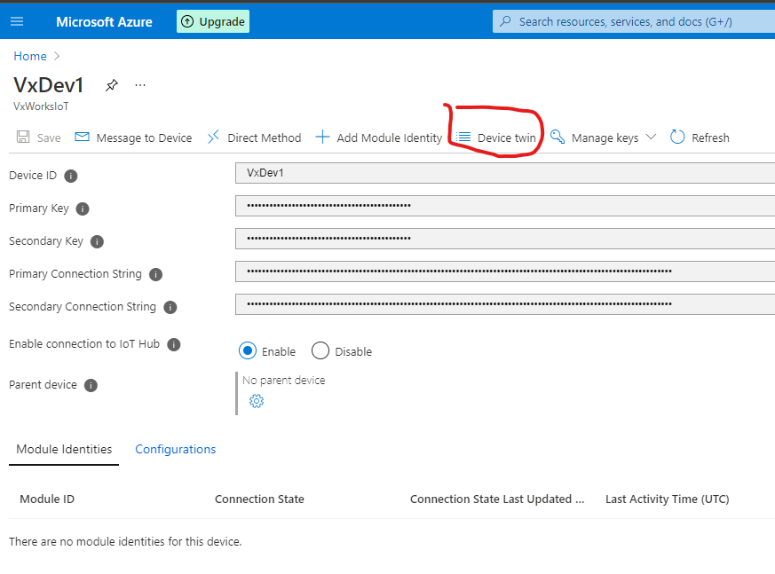
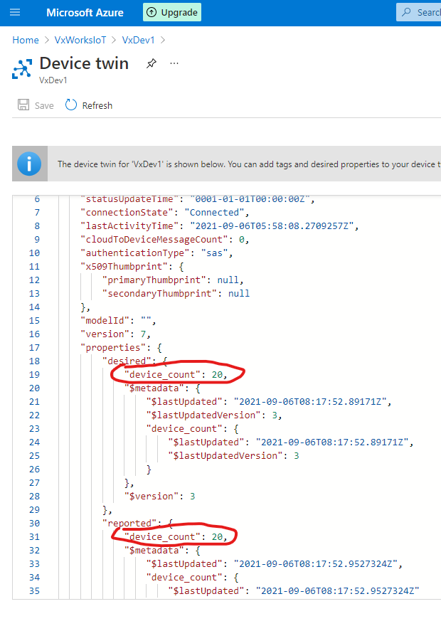
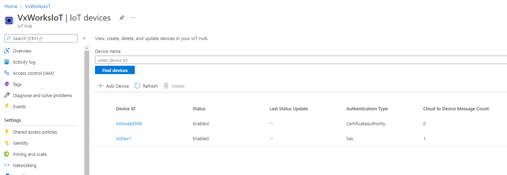
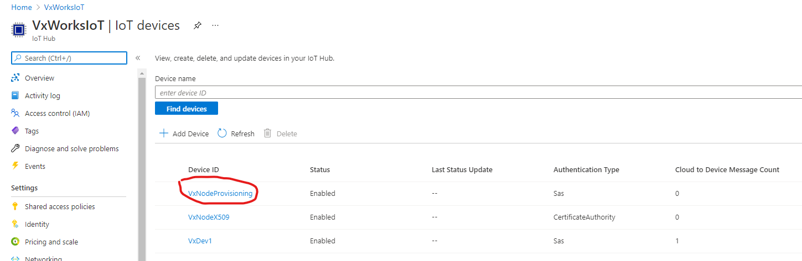

# How to Setup and Run Azure SDK for Embedded C IoT Hub Client and Provisioning Client Samples on VxWorks

- [How to Setup and Run Azure SDK for Embedded C IoT Hub Client and Provisioning Client Samples on VxWorks](#how-to-setup-and-run-azure-sdk-for-embedded-c-iot-hub-client-and-provisioning-client-samples-on-vxworks)
  - [Introduction](#introduction)
    - [What is Covered](#what-is-covered)
  - [Prerequisites](#prerequisites)
  - [Configure and Run the Samples](#configure-and-run-the-samples)
    - [Configure sample](#configure-sample)
    - [Create VxWorks Source Build Project](#create-vxworks-source-build-project)
    - [How to create a Real Time Process Project based on Azure SDK](#how-to-create-a-real-time-process-project-based-on-azure-sdk)
    - [Create VxWorks Image Project](#create-vxworks-image-project)
    - [Run samples](#run-samples)
    - [Azure CLI and GUI](#azure-cli-and-gui)
    - [Reference logs](#reference-logs)
  - [Support](#support)

## Introduction

This is a step-by-step guide of how to start from scratch and get the Azure SDK
for Embedded C IoT Hub and Provisioning Client samples running on
`VxWorks`.

Azure SDK for Embedded C has been ported to `VxWorks`. The two samples show
how to create Azure IoT Hub and Provisioning Client
applications for `VxWorks`.

- `azureClientSample.c` shows how to create an Azure IoT Hub Client
  1. Send telemetry (D2C) messages.
  2. Receive Cloud-to-Device (C2D) messages. After receiving 3 C2D messages,
     the sample will exit.
  3. Respond to device Method-Call from the cloud.
  4. Receive "desired property" changes and send "reported property" updates
     for Device Twin.
  5. Both SAS and X.509 authentications are supported.
- `azureProvisioningClientSample.c` shows how to create an Azure IoT Device
  Provisioning Client
  1. Provision a new device to an Azure IoT Hub with X.509 self-signed
     authentication.
  2. Provision a new device to an Azure IoT Hub with SAS authentication.

A device provisioned by `azureProvisioningClientSample.c` can be connected by
`azureClientSample.c`.

The two samples are complements to the existing samples which are based on
Eclipse Paho MQTT stack. On `VxWorks`, the `MQTT` stack is `Eclipse Mosquitto`. The `TLS`
stack is provided by `OpenSSL` and the `socket` layer is provided by `VxWorks`. These two samples
demonstrate how to use the Azure SDK for Embedded C, together with `Eclipse Mosquitto`,
`OpenSSL` and VxWorks' native socket to develop Azure IoT Hub applications.

The samples are designed to highlight the function calls required to connect with
the Azure IoT Hub. These calls illustrate the happy path of the
[mqtt state machine](https://github.com/Azure/azure-sdk-for-c/blob/main/sdk/docs/iot/mqtt_state_machine.md).
As a result,
**these samples are NOT designed to be used as production-level code**.
Production code needs to incorporate other elements, such as connection retries
and more extensive error-handling, which these samples do not include.

**WARNING: Samples are generic and should not be used in any production-level code.**

### What is Covered

- Set up Azure IoT Hub and Provisioning Services for these samples.
- Configure, build and run the samples.

## Prerequisites

1. Create a free [Azure account](https://azure.microsoft.com/).
2. Create an [Azure IoT Hub](https://docs.microsoft.com/azure/iot-hub/iot-hub-create-through-portal) named `VxWorksIoT` and [register a device](https://docs.microsoft.com/azure/iot-hub/iot-hub-create-through-portal#register-a-new-device-in-the-iot-hub) with symmetric key (SAS) authentication named `VxDev1`.
3. Create a device with [X.509 self-signed](https://docs.microsoft.com/azure/iot-hub/tutorial-x509-scripts#create-an-x509-device-for-your-iot-hub) authentication named
   `VxNodeX509`.
4. Create an [Azure IoT Hub Device Provisioning Service](https://docs.microsoft.com/azure/iot-dps/quick-setup-auto-provision) named `VxWorksProvisioning`.
5. Create a device enrollment entry with [SAS](https://docs.microsoft.com/azure/iot-dps/quick-create-simulated-device-symm-key) named `symm-key-node` in Azure IoT Hub Device Provisioning Service created by step 4.
6. Create a device enrollment entry with [X.509](https://docs.microsoft.com/azure/iot-dps/quick-create-simulated-device-x509) named `VxNodeProvisioningX509` in Azure IoT Device Provisioning Service created by step 4. Follow step 3 to create the required X.509 certificate.
7. Select your device's "Device Twin" tab in the Azure Portal of your IoT Hub.
   Add the property `device_count` along with a corresponding value to
   the `desired` section of the JSON. Select "Save" to update the twin
   document and send the twin message to the device.

  ```json
  "properties": {
      "desired": {
          "device_count": 42,
      }
  }
  ```

**Note**

*Above names of IoT Hub, devices and enrollments are just for example purposes. Please
configure the samples according to your IoT Hub configuration.*

## Configure and Run the Samples

Below steps are based on the Wind River Workbench IDE for `VxWorks`. The BSP is Intel architecture 64-bit. The VxWorks version must be 21.11 or higher.
They cover:

1. Configure sample code according to the Azure IoT Hub configurations.
2. Create and build VxWorks Source Build Project (VSB).
3. Create and build VxWorks Real Time Process Project.
4. Create and build VxWorks Image Project (VIP).
5. How to run the samples on `VxWorks`.
6. How to use Azure CLI and Azure GUI to communicate with the samples.

### Configure sample

The sample code needs to be modified according to the information created
in the previous steps.

For `azureClientSample.c`:

```C
/*
 * This definition has to be updated according to the name of
 * your Azure IoT Hub
 */
#define IOT_HUB_NAME "VxWorksIoT"

/*
 * Define X509_CERTIFICATE to use user-generated Root Certificate.
 * If you only want to use SAS, undefine or comment out this macro.
 */
#define X509_CERTIFICATE

/*
 * Connect to provisioned devices
 * If you want to connect to devices which are not provisioned in your hub,
 * undefine or comment out this macro.
 */
#define USE_PROVISIONING

/* Update Device ID */
#ifdef X509_CERTIFICATE
#ifdef USE_PROVISIONING
#define DEVICE_ID "[Provisioned X509 Device ID]"
#else /* USE_PROVISIONING */
#define DEVICE_ID "[Non-Provisioned X509 Device ID]"
#endif /* USE_PROVISIONING */
#else /* X509_CERTIFICATE */
#ifdef USE_PROVISIONING
#define DEVICE_ID "[Provisioned SAS Device ID]"
#else /* USE_PROVISIONING */
#define DEVICE_ID "[Non-Provisioned SAS Device ID]"
#endif /* USE_PROVISIONING */
#endif /* X509_CERTIFICATE */

/*
 * Server certificate file path. It can be found in:
 * https://github.com/Azure/azure-iot-sdk-c/blob/master/certs/certs.c
 *
 * Copy all the sections beginning with “-----BEGIN CERTIFICATE-----” and
 * ending with “-----END CERTIFICATE-----” into a file with an extension “pem”
 * like “certs.pem”. Remove all the beginning and ending double quotes and
 * “\r\n”.
 * -----BEGIN CERTIFICATE-----
 * MIIDdzCCAl+gAwIBAgIEAgAAuTANBgkqhkiG9w0BAQUFADBaMQswCQYDVQQGEwJJ
 * RTESMBAGA1UEChMJQmFsdGltb3JlMRMwEQYDVQQLEwpDeWJlclRydXN0MSIwIAYD
 * …………………………………………………………………………..
 * …………………………………………………………………………..
 * Epn3o0WC4zxe9Z2etciefC7IpJ5OCBRLbf1wbWsaY71k5h+3zvDyny67G7fyUIhz
 * ksLi4xaNmjICq44Y3ekQEe5+NauQrz4wlHrQMz2nZQ/1/I6eYs9HRCwBXbsdtTLS
 * R9I4LtD+gdwyah617jzV/OeBHRnDJELqYzmp
 * -----END CERTIFICATE-----
 */
#define CERT_FILE "/romfs/certs/cert.pem"

/* X509 certificate file and private key file paths */
/*
 * X509 user-generated Root Certificate guide:
 * https://github.com/Azure/azure-iot-sdk-c/blob/master/tools
 * /CACertificates/CACertificateOverview.md
 */
#ifdef X509_CERTIFICATE
#ifdef USE_PROVISIONING
#define X509_CERT_FILE "/romfs/certs/[Provisioned X509 certificate].pem"
#define X509_KEY_FILE "/romfs/certs/[Provisioned X509 Private Key].pem"
#else /* USE_PROVISIONING */
#define X509_CERT_FILE "/romfs/certs/[Non-Provisioned X509 certificate].pem"
#define X509_KEY_FILE "/romfs/certs/[Non-Provisioned X509 Private Key].pem"
#endif /* USE_PROVISIONING */
#else /* X509_CERTIFICATE */
#define X509_CERT_FILE NULL
#define X509_KEY_FILE NULL
/*
 * Primary Key is only needed by SAS device.
 * It can be found via:
 * Azure IoT Hub Service -> IoT devices -> one specific enrollment
 *  -> Primary Key
 *
 * For a provisioned device, its primary key is the same as its enrollment's.
 */
#ifdef USE_PROVISIONING
static char primaryKey[] = "[Device's Primary Key]";
#else /* USE_PROVISIONING */
static char primaryKey[] = "[Provisioned Device's Primary Key]";
#endif /* USE_PROVISIONING */
#endif /* X509_CERTIFICATE */
```

For `azureProvisioningClientSample.c`:

```C
/*
 * Define X509_CERTIFICATE to use user-generated Root Certificate.
 * If you only want to use SAS, undefine or comment out this macro.
 */
#define X509_CERTIFICATE

/*
 * Host name can be found via:
 * Azure IoT Hub Provisioning Service -> Overview -> Global device endpoint
 */
#define HOST "global.azure-devices-provisioning.net"

/*
 * Server certificate file path. It can be found in:
 * https://github.com/Azure/azure-iot-sdk-c/blob/master/certs/certs.c
 *
 * Copy all the sections beginning with “-----BEGIN CERTIFICATE-----” and
 * ending with “-----END CERTIFICATE-----” into a file with an extension “pem”
 * like “certs.pem”. Remove all the beginning and ending double quotes and
 * “\r\n”.
 * -----BEGIN CERTIFICATE-----
 * MIIDdzCCAl+gAwIBAgIEAgAAuTANBgkqhkiG9w0BAQUFADBaMQswCQYDVQQGEwJJ
 * RTESMBAGA1UEChMJQmFsdGltb3JlMRMwEQYDVQQLEwpDeWJlclRydXN0MSIwIAYD
 * …………………………………………………………………………..
 * …………………………………………………………………………..
 * Epn3o0WC4zxe9Z2etciefC7IpJ5OCBRLbf1wbWsaY71k5h+3zvDyny67G7fyUIhz
 * ksLi4xaNmjICq44Y3ekQEe5+NauQrz4wlHrQMz2nZQ/1/I6eYs9HRCwBXbsdtTLS
 * R9I4LtD+gdwyah617jzV/OeBHRnDJELqYzmp
 * -----END CERTIFICATE-----
 */
#define CERT_FILE "/romfs/certs/cert.pem"

/* X509 certificate file and private key file paths */
/*
 * X509 user-generated Root Certificate guide:
 * https://github.com/Azure/azure-iot-sdk-c/blob/master/tools
 * /CACertificates/CACertificateOverview.md
 */
#ifdef X509_CERTIFICATE
#define X509_CERT_FILE "/romfs/certs/[X509 certificate].pem"
#define X509_KEY_FILE "/romfs/certs/[X509 Private Key].pem"
#else
#define X509_CERT_FILE NULL
#define X509_KEY_FILE NULL
#endif

/*
 * Registration ID is the name of each enrollment. Can be found via:
 * Azure IoT Hub Provisioning Service -> Manage Enrollments
 *  -> Individual Enrollment
 */
#ifdef X509_CERTIFICATE
static az_span const provisioningRegId =
    AZ_SPAN_LITERAL_FROM_STR ("[Registration ID with X509]");
#else
static az_span const provisioningRegId =
    AZ_SPAN_LITERAL_FROM_STR ("[Registration ID with SAS]");
#endif /* X509_CERTIFICATE */

/*
 * ID Scope can be found via:
 * Azure IoT Hub Provisioning Service -> Overview -> ID Scope
 */
static az_span const provisioningIdScope =
    AZ_SPAN_LITERAL_FROM_STR ("[ID Scope string]");

/*
 * Global Endpoint can be found via:
 * Azure IoT Hub Provisioning Service -> Overview -> Global device endpoint
 * and add prefix "ssl://" as well as suffix ":8883"
 */
static char provisioningGlobalEndpoint[] =
    "ssl://global.azure-devices-provisioning.net:8883";

/*
 * Primary Key is only needed by SAS enrollment.
 * It can be found via:
 * Azure IoT Hub Provisioning Service -> Manage Enrollments
 *  -> Individual Enrollment -> one specific enrollment -> Primary Key
 */
static char provisioningPrimaryKey[] = "ch/EsBKjGNEHLc1h...";
```

### Create VxWorks Source Build Project

VSB Option: `AZURE_SDK_FOR_C`

1. Create a VxWorks Source Build Project
2. Set your project name
3. Project Setup:
   1. Select itl_generic as BSP
   2. Select CORE as Active CPU
   3. Debug mode: On, and compiler optimization disabled
4. Set MOSQUITTO as "y"
5. Set AZURE_SDK_FOR_C as "y"
6. Build VSB

The SDK is built into several User Space static libraries (libaz_*.a) which are
distributed to `[VSB_DIR]/usr/lib/common`. They are all prefixed with `libaz_`.

The public header files of the Azure SDK needed by applications are distributed to
`[VSB_DIR]/usr/h/public/azure`. An application needs to include them as

```C
#include <azure/xxx.h>
```

### How to create a Real Time Process Project based on Azure SDK

To develope an Azure IoT application, the developer should know:

- Header file

  ```C
  /* Moquitto MQTT APIs */
  #include <mosquitto.h>

  /* Azure SDK APIs */
  #include <azure/az_core.h>
  #include <azure/az_iot.h>

  /* OpenSSL APIs for SAS token generation */
  #include <openssl/bio.h>
  #include <openssl/hmac.h>
  #include <openssl/evp.h>
  #include <openssl/buffer.h>
  ```

- Library

  ```Makefile
  -lc                         # C standard library
  -lnet                       # Network library
  -lssl -lcrypto              # SSL library
  -lmosquitto                 # Mosquitto library
  -laz_core -laz_iot_common   # Azure SDK common libraries
  -laz_iot_provisioning       # Azure IoT Hub Provisioning Client library
  -laz_iot_hub                # Azure IoT Hub Client library
  ```

Here are the steps to create an Azure IoT Hub application with samples:

1. Create a `VxWorks Real Time Process Project`
2. Set you project name
3. Project Setup:
   1. Select `a source build project` for `Based on`
   2. Select your VSB project for `Project`
4. A source file "rtp.c" will be automatically generated. Replace the file
   content with the content of `azureClientSample.c` or
   `azureProvisioningClientSample.c`.
5. Set `Build target name` and `Binary output name` to the sample's name:
   `azureClientSample` or `azureProvisioningClientSample`
   Set `Build tool` as `Linker`
6. Right click on the project and select `Properties`
7. Click `Build Properties` on the left list.
8. Click `Libraries` tab
9. Click `Add...` button
10. Select `Add library search patch (-L)`, add `[VSB_DIR]/usr/lib/common` and
   click `OK` button
11. Click `Add...` button
12. Select `Add library file (-l)`, add needed libraries and click `OK` button
13. Write code
14. Build the project

### Create VxWorks Image Project

VIP Component: `INCLUDE_AZURE_IOT_CLIENT_SUPPORT`

1. Create a `VxWorks Image Project`
2. Set your project name
3. Project Setup:
   1. Select `a source build project` for `Based on`
   2. Select your VSB project for `Project`
4. Include `INCLUDE_AZURE_IOT_CLIENT_SUPPORT` to add all the dependencies of
   Azure SDK for Embedded C
5. Include `INCLUDE_IPCOM_USE_TIME_CMD` to add date and time setting commands
6. Include `INCLUDE_ROMFS` to add ROMFS to store sample executables and
   certificate files
   1. Create a `VxWorks ROMFS File System Project`
   2. Set your project name and Choose `Create project in workspace` for `Location`
   3. Check `Add reference to you VIP name`
   4. Choose the certificate files and sample executable files.
7. `INCLUDE_DISK_UTIL_SHELL_CMD` and `INCLUDE_DISK_UTIL` to
   add filesystem commands
8. Include `INCLUDE_SHELL` `INCLUDE_STANDALONE_DTB` and
   `INCLUDE_STANDALONE_SYM_TBL` for the convenient usage.
9. Set the parameter `DNSC_PRIMARY_NAME_SERVER` to a suitable name server
10. Build VIP
11. The VxWorks image can be found in `[VIP_DIR]/default/vxWorks`

### Run samples

**Note**

*Before running the samples, make sure the target has Internet access.*

Running the sample is very simple. In the VxWorks command shell,

```sh
-> cmd
[vxWorks *]# cd /romfs
[vxWorks *]# ./azureProvisioningClientSample
[vxWorks *]# ./azureClientSample
```

When the sample tries to connect to Azure IoT Hub, it must verify the server
certificate. It needs the system time to be the current time. Otherwise,
the certificate verification will fail. VIP component INCLUDE_IPCOM_USE_TIME_CMD provides
"date" and "time" commands to set the current date and time as below for the following date `Mon Sep 6 17:00:01 2021`.

```sh
[vxWorks *]# date 2021-09-06
ok
[vxWorks *]# time 17:00:00
ok
[vxWorks *]# date
Mon Sep  6 17:00:01 2021
```

### Azure CLI and GUI

There are some Azure CLI commands and GUI operations which can be used to
collaborate with the two samples.

- Monitor telemetry messages (D2C) from the device by Azure CLI.

  ```sh
  az iot hub monitor-events --hub-name [IoT Hub Name] --output table
  ```

- Send C2D messages to the device by Azure CLI.

  ```sh
  az iot device c2d-message send --device-id [Device ID] --hub-name [IoT Hub Name] --data "hello world"
  ```

- Call Device's method by Azure CLI.

  ```sh
  az iot hub invoke-device-method --device-id [Device ID] --hub-name [IoT Hub Name] --method-name testMethod
  ```

- Modify "desired property" and monitor "reported property" changes on GUI.

  Click “Device twin” tab of a device definition in Azure IoT Hub.
  

  Change the value “device_count” of “desired” then click “Save” button.
  You will see the change logs on `VxWorks`. Click “Refresh” button, you will
  see the value “device_count” of “reported” is changed to the same value.
  

### Reference logs

- azureClientSample.c

  VxWorks outputs:

  ```sh
  _________            _________
  \........\          /......../
   \........\        /......../
    \........\      /......../
     \........\    /......../
      \........\   \......./
       \........\   \...../              VxWorks SMP 64-bit
        \........\   \.../
         \........\   \./     Release version: 21.11
          \........\   -      Build date: Sep  6 2021 13:56:31
           \........\
            \......./         Copyright Wind River Systems, Inc.
             \...../   -                 1984-2021
              \.../   /.\
               \./   /...\
                -   -------

                    Board: x86_64 Processor (ACPI_BOOT_OP) SMP/SMT
                CPU Count: 8
           OS Memory Size: ~2046MB
         ED&R Policy Mode: Deployed


  Adding 11424 symbols for standalone.

  -> cmd
  [vxWorks *]# date 2021-09-06
  ok
  [vxWorks *]# time 17:00:00
  ok
  [vxWorks *]# date
  Mon Sep  6 17:00:01 2021

  [vxWorks *]# cd /romfs
  [vxWorks *]# ./azureClientSample
  Launching process './azureClientSample' ...
  Process './azureClientSample' (process Id = 0xffff8000000dd840) launched.
  az_iot_hub_client_init OK!az_iot_hub_client_get_client_id OK: VxDev1
  az_iot_hub_client_get_user_name OK: VxWorksIoT.azure-devices.net/VxDev1/?api-version=2020-09-30&  DeviceClientType=c%2F1.1.0
  mosquitto_lib_init() OK
  mosquitto_new OK!
  mosquitto_username_pw_set OK!
  mosquitto_tls_opts_set OK!
  mosquitto_tls_set OK!
  mosquitto_tls_insecure_set OK!
  mosquitto_opts_set(MOSQ_OPT_PROTOCOL_VERSION) OK
  mosquitto_connect OK!
  mosquitto_subscribe C2D OK!
  mosquitto_subscribe Method OK!
  mosquitto_subscribe Twin Patch OK!
  mosquitto_subscribe Twin Response OK!
  az_iot_hub_client_twin_document_get_publish_topic OK!
  mosquitto_publish: 5 OK!
  az_iot_hub_client_telemetry_get_publish_topic OK!
  mosquitto_publish: 6 OK!
  mosquitto_publish: 7 OK!

  mosquitto_publish: 8 OK!
  connect OK! # successfully connect to Azure IoT Hub
  Message: 5 is sent!
  Twin response: GET
  payload: {"desired":{"device_count":20,"$version":3},"reported":{"device_count":0,"$version":5}} #   successfully get device twin document
  az_iot_hub_client_twin_patch_get_publish_topic OK!
  mosquitto_publish: 9 OK!
  Message: 9 is sent!
  Twin response: REPORTED PROPERTIES
  Message: 6 is sent!
  Message: 7 is sent!
  Message: 8 is sent!
  testMethod is invoked # successful method call
  az_iot_hub_client_methods_response_get_publish_topic OK!
  mosquitto_publish: 10 OK!
  Message: 10 is sent!
  Twin response: DESIRED PROPERTIES
  payload: {"device_count":100,"$version":4} # receive desired property
                                               change
  az_iot_hub_client_twin_patch_get_publish_topic OK!
  mosquitto_publish: 11 OK!
  Message: 11 is sent!
  Twin response: REPORTED PROPERTIES # successfully send reported property
  C2D Topic: devices/VxDev1/messages/devicebound/%24.mid=ee06e90f-0c0c-4f85-b060-a4974d22d225&%24.  to=%2Fdevices%2FVxDev1%2Fmessages%2Fdevicebound&%24.ce=utf-e
  C2D Payload: hello world # receive C2D message
  C2D Topic: devices/VxDev1/messages/devicebound/%24.mid=bbc363aa-468f-4802-95b3-14197384637e&%24.  to=%2Fdevices%2FVxDev1%2Fmessages%2Fdevicebound&%24.ce=utf-e
  C2D Payload: hello world # receive C2D message
  C2D Topic: devices/VxDev1/messages/devicebound/%24.mid=23ec332b-224f-44e7-b9e8-0b2989434526&%24.  to=%2Fdevices%2FVxDev1%2Fmessages%2Fdevicebound&%24.ce=utf-e
  C2D Payload: hello world # receive C2D message
  mosquitto_loop_forever OK!
  Azure Client Sample done!
  ```

  Azure CLI outputs:

  ```sh
  # D2C messages
  guishan_qin@Azure:~$ az iot hub monitor-events --hub-name VxWorksIoT --output table
  Starting event monitor, use ctrl-c to stop...
  event:
    component: ''
    interface: ''
    module: ''
    origin: VxDev1
    payload: 'Hello world!: 1'

  event:
    component: ''
    interface: ''
    module: ''
    origin: VxDev1
    payload: 'Hello world!: 6'

  event:
    component: ''
    interface: ''
    module: ''
    origin: VxDev1
    payload: 'Hello world!: 7'

  ^CStopping event monitor...

  # Method-Call
  guishan_qin@Azure:~$ az iot hub invoke-device-method --device-id VxDev1 --hub-name VxWorksIoT   --method-name testMethod
  {
    "payload": {
      "response": "OK"
    },
    "status": 200
  }

  # C2D messages
  guishan_qin@Azure:~$ az iot device c2d-message send --device-id VxDev1 --hub-name VxWorksIoT --data   "hello world"
  guishan_qin@Azure:~$ az iot device c2d-message send --device-id VxDev1 --hub-name VxWorksIoT --data   "hello world"
  guishan_qin@Azure:~$ az iot device c2d-message send --device-id VxDev1 --hub-name VxWorksIoT --data   "hello world"
  ```

  Device Twin document:

  ```json
  {
     "deviceId": "VxDev1",
     "etag": "AAAAAAAAAAQ=",
     "deviceEtag": "NjU4ODE3NDIy",
     "status": "enabled",
     "statusUpdateTime": "0001-01-01T00:00:00Z",
     "connectionState": "Connected",
     "lastActivityTime": "2021-09-06T08:49:54.8803577Z",
     "cloudToDeviceMessageCount": 0,
     "authenticationType": "sas",
     "x509Thumbprint": {
         "primaryThumbprint": null,
         "secondaryThumbprint": null
     },
     "modelId": "",
     "version": 11,
     "properties": {
         "desired": {
             "device_count": 100,
             "$metadata": {
                 "$lastUpdated": "2021-09-06T08:52:44.9300429Z",
                 "$lastUpdatedVersion": 4,
                 "device_count": {
                     "$lastUpdated": "2021-09-06T08:52:44.9300429Z",
                     "$lastUpdatedVersion": 4
                 }
             },
             "$version": 4
         },
         "reported": {
             "device_count": 100,
             "$metadata": {
                 "$lastUpdated": "2021-09-06T08:52:44.9962991Z",
                 "device_count": {
                     "$lastUpdated": "2021-09-06T08:52:44.9962991Z"
                 }
             },
             "$version": 7
         }
     },
     "capabilities": {
         "iotEdge": false
     }
  }
  ```

- azureProvisioningClientSample.c

  Take SAS as an example.

  VxWorks outputs:

  ```sh
  _________            _________
   \........\          /......../
    \........\        /......../
     \........\      /......../
      \........\    /......../
       \........\   \......./
        \........\   \...../              VxWorks SMP 64-bit
         \........\   \.../
          \........\   \./     Release version: 21.11
           \........\   -      Build date: Sep  6 2021 18:16:32
            \........\
             \......./         Copyright Wind River Systems, Inc.
              \...../   -                 1984-2021
               \.../   /.\
                \./   /...\
                 -   -------

                     Board: x86_64 Processor (ACPI_BOOT_OP) SMP/SMT
                 CPU Count: 8
            OS Memory Size: ~2046MB
          ED&R Policy Mode: Deployed


   Adding 11424 symbols for standalone.

  -> cmd
  [vxWorks *]# date 2021-09-06
  ok
  [vxWorks *]# time 17:00:00
  ok
  [vxWorks *]# date
  Mon Sep  6 17:00:01 2021

  [vxWorks *]# cd /romfs
  [vxWorks *]# ./azureProvisioningClientSample
  Launching process './azureProvisioningClientSample' ...
  Process './azureProvisioningClientSample' (process Id = 0xffff8000000dd850) launched.
  az_iot_provisioning_client_init OK!az_iot_provisioning_client_get_client_id OK: symm-key-node
  az_iot_provisioning_client_get_user_name OK: 0ne0038B9D7/registrations/symm-key-node/  api-version=2019-03-31
  mosquitto_lib_init() OK
  mosquitto_new OK!
  mosquitto_username_pw_set OK!
  mosquitto_tls_opts_set OK!
  mosquitto_tls_set OK!
  mosquitto_tls_insecure_set OK!
  mosquitto_opts_set(MOSQ_OPT_PROTOCOL_VERSION) OK
  mosquitto_connect OK!
  mosquitto_subscribe Provisioning Client Register OK!
  az_iot_provisioning_client_register_get_publish_topic OK
  mosquitto_publish: 2 OK!
  connect OK!
  Message: 2 is sent!
  Device registration is in progress!
  Retry, after recommended 3 seconds
  mosquitto_publish: 3 OK!
  Message: 3 is sent!
  Device registration is completed!
  Device is successfully provisioned! # The device is successfully
                                      # provisioned
  mosquitto_loop_forever OK!
  Azure Provisioning Client Sample done!

  ```

  Azure IoT Hub GUI:

  Before provisioning:
  

  After provisioning:
  

## Support

Should you have questions and comments, please contact your local Wind River representative or, alternatively, Yabing Liu ([yabing.liu@windriver.com](mailto:yabing.liu@windriver.com)) who is maintaining this document and associated code.
