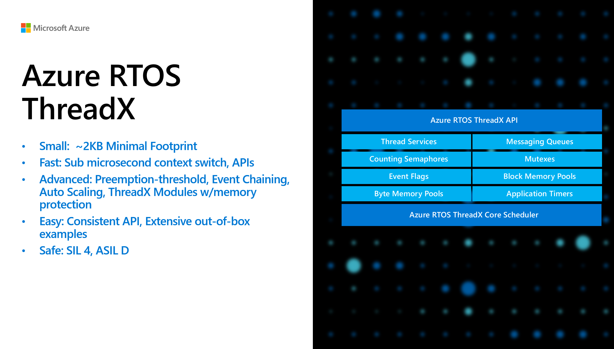

# Azure RTOS ThreadX

This advanced real-time operating system (RTOS) is designed specifically for deeply embedded applications. Among the multiple benefits it provides are advanced scheduling facilities, message passing, interrupt management, and messaging services. Azure RTOS ThreadX has many advanced features, including picokernel architecture, preemption threshold, event chaining, and a rich set of system services.

Here are the key features and modules of ThreadX:



## Getting Started

Azure RTOS has been integrated to the semiconductor's SDKs and development environment. You can develop using the tools of choice from [STMicroelectronics](https://www.st.com/content/st_com/en/campaigns/x-cube-azrtos-azure-rtos-stm32.html), [NXP](https://www.nxp.com/design/software/embedded-software/azure-rtos-for-nxp-microcontrollers:AZURE-RTOS), [Renesas](https://github.com/renesas/azure-rtos) and [Microchip](https://mu.microchip.com/get-started-simplifying-your-iot-design-with-azure-rtos).

We also provide [getting started guide](https://github.com/azure-rtos/getting-started) and [samples](https://github.com/azure-rtos/samples) using hero development boards from semiconductors you can build and test with.

See [Overview of Azure RTOS ThreadX](https://learn.microsoft.com/en-us/azure/rtos/threadx/overview-threadx) for the high-level overview, and all documentation and APIs can be found in: [Azure RTOS ThreadX documentation](https://learn.microsoft.com/en-us/azure/rtos/threadx/). 

Also there is dedicated [learning path of Azure RTOS ThreadX](https://learn.microsoft.com/training/paths/azure-rtos-threadx/) for learning systematically.


## Repository Structure and Usage
### Directory layout

    .
    ├── cmake                        # CMakelist files for building the project
    ├── common                       # Core ThreadX files
    ├── common_modules               # Core ThreadX module files
    ├── common_smp                   # Core ThreadX SMP files
    ├── docs                         # Documentation supplements
    ├── ports                        # Architecture and compiler specific files. See below for directory breakdown     
    │   ├── cortex_m7     
    │   │   ├── iar                  # Example IAR compiler sample project
    │   │   │   ├── example build    # IAR workspace and sample project files
    │   │   │   ├── inc              # tx_port.h for this architecture
    │   │   │   └── src              # Source files for this architecture
    │   │   ├── ac6                  # Example ac6/Keil sample project
    │   │   ├── gnu                  # Example gnu sample project
    │   │   └── ...
    │   └── ...        
    ├── ports_modules                # Architecture and compiler specific files for threadX modules
    ├── ports_smp                    # Architecture and compiler specific files for threadX SMP
    ├── samples                      # demo_threadx.c
    └── utility                      # Test cases and utilities


## Branches & Releases

The master branch has the most recent code with all new features and bug fixes. It does not represent the latest General Availability (GA) release of the library. Each official release (preview or GA) will be tagged to mark the commit and push it into the Github releases tab, e.g. `v6.2-rel`.

## Supported Architecture Ports

### ThreadX
```
arc_em      cortex_a12        cortex_m0     cortex_r4
arc_hs      cortex_a15        cortex_m23    cortex_r5
arm11       cortex_a17        cortex_m3     cortex_r7
arm9        cortex_a34        cortex_m33    
c667x       cortex_a35        cortex_m4    
linux       cortex_a5         cortex_m55
risc-v32    cortex_a53        cortex_m7
rxv1        cortex_a55        cortex_m85
rxv2        cortex_a57
rxv3        cortex_a5x
win32       cortex_a65
xtensa      cortex_a65ae
            cortex_a7
            cortex_a72
            cortex_a73
            cortex_a75
            cortex_a76
            cortex_a76ae
            cortex_a77
            cortex_a8
            cortex_a9
```

### ThreadX Modules
[Azure RTOS ThreadX Modules](https://learn.microsoft.com/azure/rtos/threadx-modules/chapter1) component provides an infrastructure for applications to dynamically load modules that are built separately from the resident portion of the application.
```
cortex_a35
cortex_a35_smp
cortex_a7
cortex_m0+
cortex_m23
cortex_m3
cortex_m33
cortex_m4
cortex_m7
cortex_r4
rxv2
```

### ThreadX SMP
[Azure RTOS ThreadX SMP](https://learn.microsoft.com/azure/rtos/threadx/threadx-smp/chapter1) is a high-performance real-time SMP kernel designed specifically for embedded applications.
```
arc_hs_smp
cortex_a34_smp
cortex_a35_smp
cortex_a53_smp
cortex_a55_smp
cortex_a57_smp
cortex_a5x_smp
cortex_a5_smp
cortex_a65ae_smp
cortex_a65_smp
cortex_a72_smp
cortex_a73_smp
cortex_a75_smp
cortex_a76ae_smp
cortex_a76_smp
cortex_a77_smp
cortex_a78_smp
cortex_a7_smp
cortex_a9_smp
linux
```

## Adaptation layer for ThreadX

Azure RTOS ThreadX is an advanced real-time operating system (RTOS) designed specifically for deeply embedded applications. To help ease application migration to Azure RTOS, ThreadX provides [adaption layers](https://github.com/azure-rtos/threadx/tree/master/utility/rtos_compatibility_layers) for various legacy RTOS APIs (FreeRTOS, POSIX, OSEK, etc.).

## Component dependencies

The main components of Azure RTOS are each provided in their own repository, but there are dependencies between them, as shown in the following graph. This is important to understand when setting up your builds.


> You will have to take the dependency graph above into account when building anything other than ThreadX itself.

### Building and using the library

Instruction for building the ThreadX as static library using Arm GNU Toolchain and CMake. If you are using toolchain and IDE from semiconductor, you might follow its own instructions to use Azure RTOS components as explained in the [Getting Started](#getting-started) section.

1. Install the following tools:

    * [CMake](https://cmake.org/download/) version 3.0 or later
    * [Arm GNU Toolchain for arm-none-eabi](https://developer.arm.com/downloads/-/arm-gnu-toolchain-downloads)
    * [Ninja](https://ninja-build.org/)

1. Cloning the repo

    ```bash
    $ git clone https://github.com/azure-rtos/threadx.git
    ```

1. Define the features and addons you need in `tx_user.h` and build together with the component source code. You can refer to [`tx_user_sample.h`](https://github.com/azure-rtos/threadx/blob/master/common/inc/tx_user_sample.h) as an example.

1. Building as a static library

    Each component of Azure RTOS comes with a composable CMake-based build system that supports many different MCUs and host systems. Integrating any of these components into your device app code is as simple as adding a git submodule and then including it in your build using the CMake `add_subdirectory()`.

    While the typical usage pattern is to include ThreadX into your device code source tree to be built & linked with your code, you can compile this project as a standalone static library to confirm your build is set up correctly.

    An example of building the library for Cortex-M4:

    ```bash
    $ cmake -Bbuild -GNinja -DCMAKE_TOOLCHAIN_FILE=cmake/cortex_m4.cmake .

    $ cmake --build ./build
    ```

## Professional support

[Professional support plans](https://azure.microsoft.com/support/options/) are available from Microsoft. For community support and others, see the [Resources](#resources) section below.

## Licensing

License terms for using Azure RTOS are defined in the LICENSE.txt file of this repo. Please refer to this file for all definitive licensing information. No additional license fees are required for deploying Azure RTOS on hardware defined in the LICENSED-HARDWARE.txt file. If you are using hardware not defined in the LICENSED-HARDWARE.txt file or have licensing questions in general, please contact Microsoft directly at https://aka.ms/azrtos-license.

## Resources

The following are references to additional Azure RTOS resources:

- **Product introduction and white papers**: https://azure.com/rtos
- **General technical questions**: https://aka.ms/QnA/azure-rtos
- **Product issues and bugs, or feature requests**: https://github.com/azure-rtos/threadx/issues
- **Licensing and sales questions**: https://aka.ms/azrtos-license
- **Product roadmap and support policy**: https://aka.ms/azrtos/lts
- **Blogs and videos**: http://msiotblog.com and https://aka.ms/iotshow
- **Azure RTOS TraceX Installer**: https://aka.ms/azrtos-tracex-installer

You can also check [previous questions](https://stackoverflow.com/questions/tagged/azure-rtos+threadx) or ask new ones on StackOverflow using the `azure-rtos` and `threadx` tags.

## Security

Azure RTOS provides OEMs with components to secure communication and to create code and data isolation using underlying MCU/MPU hardware protection mechanisms. It is ultimately the responsibility of the device builder to ensure the device fully meets the evolving security requirements associated with its specific use case.

## Contribution

Please follow the instructions provided in the [CONTRIBUTING.md](./CONTRIBUTING.md) for the corresponding repository.