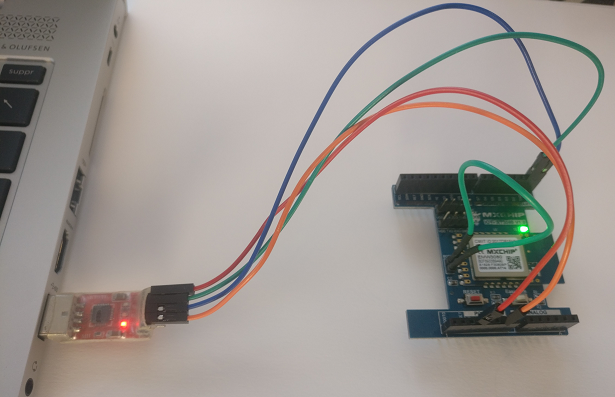
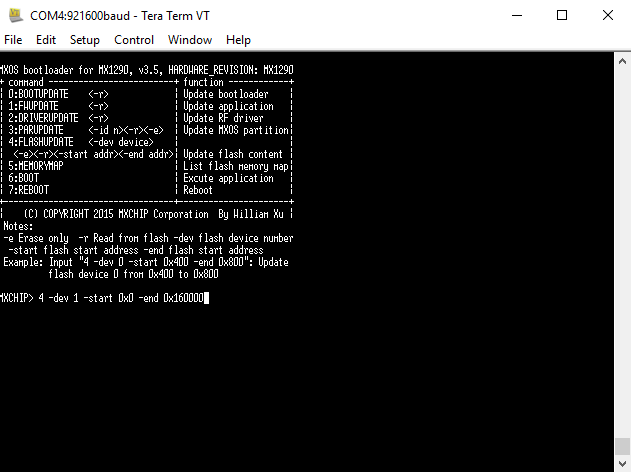
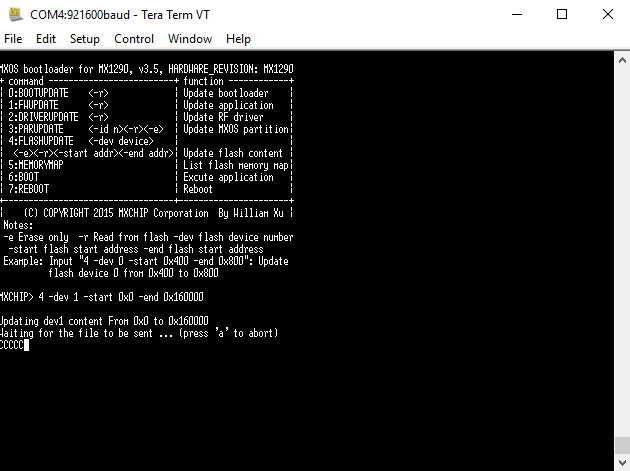
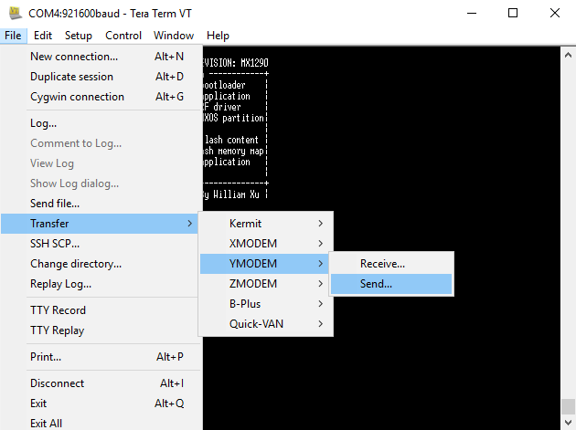
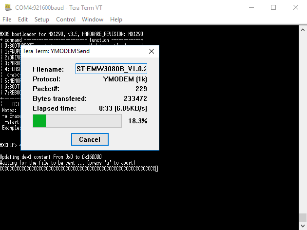
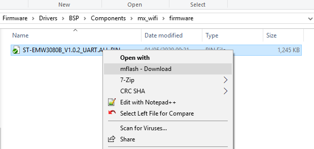
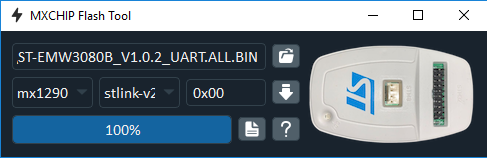

::: {.row}
::: {.col-sm-12 .col-lg-4}

::: {.card .fluid}
::: {.sectione .dark}

# <small>Release Notes for</small> <mark>MX_WIFI Component Driver</mark>
Copyright &copy; 2020 STMicroelectronics\
Microcontrollers Division - Application Team

{.logo}

:::
:::

# License

Licensed by ST under BSD 3-Clause  (the "License"). You may not use this package except in compliance with the License.

You may obtain a copy of the License at: [BSD-3-Clause](https://opensource.org/licenses/BSD-3-Clause)

# Purpose

This directory contains the MX_WIFI component driver.
:::

::: {.col-sm-12 .col-lg-8}
# Update History
::: {.collapse}
<input type="checkbox" id="collapse-section1" checked aria-hidden="false">
<label for="collapse-section1" aria-hidden="true">V1.0.4 / 15-May-2020 </label>

## Main changes
  - First official release of MX_WIFI WiFi component.

:::

# Firmware update (click to expand)
::: {.collapse}

<input type="checkbox" id="collapse-section30" aria-hidden="true">
<label for="collapse-section30" aria-hidden="true">Update via UART</label>

This section provides you with a step by step procedure to upload the MXCHIP firmware of an MXCHIP Arduino shield using the MXCHIP UART interface.

Prerequisites: 

  - The steps described in this document use Tera Term as a terminal emulator. For the firmware update, you should not use a version more recent than 4.85 as you may encounter some issues when using YModem.
  - The material you need to have is:
    - a USB to TTL connector
    - 4 male to female cables with PCX connectors
    - 1 female to female cable with PCX connectors
  

Connect the TTL signals to the MXCHIP Arduino shield: 3.3 V, GND, Tx and Rx and loop the Boot MXCHIP Arduino shield – See the below picture:  

  
Check that the version of your Tera Term is not more recent than 4.85 using the “Help/About Tera Term” … menu:

  
Open the Setup/Serial port… and set the Port com correcponding to your setup and the other values as follows:

  
Press the “Reset” button of the MXCHIP Arduino shield. A menu will be displayed in the Tera Term window as in the below picture:

  
You have to enter this command: 4 -dev 1 -start 0x0 -end 0x160000:

  
The board is ready to receive the new firmware:

 
Select YMODEM Sending:

  
Then select the firmware available under Firmware\\Drivers\\BSP\\Components\\mx_wifi\\firmware or Firmware\\Drivers\\BSPv2\\Components\\mx_wifi\\firmware (one option only will be available in your package).

  
The firmware download is about to start. It takes up to around 30 seconds.

  
The firmware upgrade is started:

  
The firmware upgrade is completed:

 
More documentation on the MXCHIP bootloader can be found at <https://en.docs.mxchip.com/#/docs/mxoscharacter/1.Bootloader>

:::

::: {.collapse}
<input type="checkbox" id="collapse-section31" aria-hidden="true">
<label for="collapse-section31" aria-hidden="true">Update via SWD</label>

This section provides you with a step by step procedure to upload the MXCHIP firmware of an MXCHIP Arduino shield using the SWD interface.

The MXCHIP-FlashTool is a software tool running on PC in order to download a MXCHIP firmware using the SWD interface.

The MXCHIP-FlashTool is supported on these PC OS:

  - Windows 7/10
  - MacOS
  - Linux

And with these debug probes:

  - J-LINK
  - ST-LINK_V2
  - ST-LINK_V2-1

Prerequisites:

  - The MXCHIP-Flash tool is to be installed as described into the below "Tool installation" section.
  - The material you need to have is:
    - A debug probe
    - 4 female to female cables with PCX connectors
    - A 3.3 V generator. Another board can be used as shown in the below picture supplying the power via 2 male to male cables with PCX connectors
Tool installation:

  - Python3 installation:
    - Goto the official website to download python: <https://www.python.org/>

  - Download and install the MXCHIP-Flash tool with pip3
    - run this command: pip3 install mflash -i https://pypi.tuna.tsinghua.edu.cn/simple

  - For Windows only, install the needed USB driver
    - Download zadig from <https://zadig.akeo.ie>
    - Run zadig with administrator rights
      - Select: Options / List All Devices / Bulk interface / Replace Driver

Connect the debug probe to the MXCHIP board

  - Debug probe VCC to MXCHIP VDD
  - Debug probe DIO to MXCHIP DIO
  - Debug probe SCK to MXCHIP CLK
  - Debug probe GND to MXCHIP GND

Connect the +3.3 V and GND MXCHIP board to a power supply.

{width=60%}

  

USB driver verification. Opening your Device Manager (on Windows) you should see the USB driver as per the below picture

{.center}
  

Download your image

  - Right click on your bin file to download, select mflash-Download, see next picture
    - The image to be downloaded shall have the ALL.BIN suffix

  

  - Select chip: mx1290
  - Select interface: stlink-v2 (or stlink-v2-1/j-link depend on your hardware)
  - Set address: 0

  

  - Click download button to start.
  - Wait until the progress bar reaches 100%.

  

:::

:::
:::

<footer class="sticky">
For complete documentation on <mark>STM32</mark> microcontrollers please visit <http://www.st.com/stm32>
</footer>
